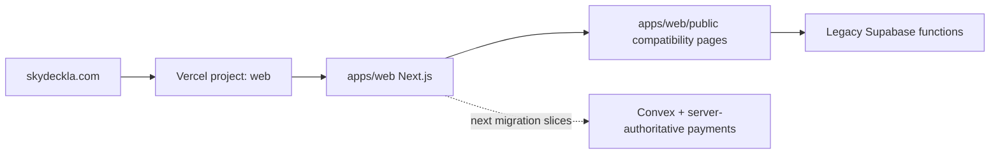

# Skyla

Skyla is organized as a Turborepo with a Next.js application on Vercel. The
production domain is served by `apps/web`; old root-level static copies have
been removed so the repository root is project control-plane space again.

## Repository Layout

```text
apps/web            Next.js App Router application for Vercel
packages/config     Shared site/business constants
packages/payments   Server-authoritative pricing and order draft contracts
packages/ui         Shared UI primitives and icons
convex/             Target Convex backend schema and future functions
docs/               Migration plan, runbooks, architecture notes
docs/audits         Discovery notes and implementation evidence
docs/decisions      Lightweight architecture decision records
docs/marketing      Campaign launch notes and import templates
supabase/functions  Legacy Supabase Edge Functions kept until Convex cutover
scripts/            Smoke, security, setup, and migration helpers
```

Static compatibility pages and active image assets live under
`apps/web/public`. They keep current public routes working while the App Router,
Convex, checkout, admin, and POS rebuilds happen route-by-route.



## Current Hosting State

As of July 1, 2026:

- Vercel project `junyen-enterprises/web` deploys `apps/web` from `main`.
- Recorded verified application production deployment:
  `https://web-61n76njga-junyen-enterprises.vercel.app` from merge commit
  `97f42be824797f681f9a7b0e6e71b4ee4fa5302c`.
- Vercel custom domains `skydeckla.com` and `www.skydeckla.com` are attached and Vercel reports both domains as configured correctly.
- Nameservers now resolve to Vercel DNS: `ns1.vercel-dns.com` and `ns2.vercel-dns.com`.
- Custom-domain smoke tests pass on both the apex domain and `www` without DNS overrides.
- The Next app serves the new homepage, checkout route, and `/pos-next` draft
  review route. It bridges legacy routes from `/about`, `/cafe`,
  `/experiences`, `/members`, `/privacy`, `/terms`, `/admin`, and `/pos` to
  static compatibility pages in `apps/web/public`. The old checkout remains
  available at `/checkout.html` during the payment cutover.

## Current Bun And Cleanup State

- pnpm has been replaced with Bun canary and a committed text `bun.lock`.
- Repo-owned Vercel install/build commands live under `apps/web/vercel.json`.
- Duplicate root GitHub Pages static files have been removed from the active tree after Vercel custom-domain cutover verification.
- Keeps app-owned compatibility files in `apps/web/public`.
- Uses Vercel deployment rollback for hosting rollback.

## Local Development

Use Bun canary. The last locally verified version is
`1.4.0-canary.1+52a1ddf07`.

```bash
bun upgrade --canary
bun install --frozen-lockfile
bun run web:dev
```

Use Node `24.x`; `.node-version` is included for version managers. The app runs
from `apps/web`.

## Build And Checks

```bash
bun run lint
bun run typecheck
bun run test:unit
bun run build
bun run convex:schema:typecheck
bun run convex:functions:typecheck
bun run security:artifacts
bun run security:audit
```

For a full local gate that matches the migration baseline:

```bash
bun run check
SMOKE_BASE_URL=https://skydeckla.com bun run test:smoke
SMOKE_BASE_URL=https://www.skydeckla.com bun run test:smoke
```

## Current Bridge Notes

- Google Ads conversion tracking is configured through Vercel public environment variables rendered by `/ads-config.js`; `apps/web/public/ads-tracking.js` stays inert when those vars are unset.
- Google Ads launch materials live in [docs/marketing/google-ads](docs/marketing/google-ads), including CSV templates intentionally allowed by the tracked-artifact guard.
- Stripe Terminal reader registration now requires `SKYLA_TERMINAL_SETUP_TOKEN` in the legacy Supabase Edge Function and a manager setup token in the POS UI. Legacy browser-authoritative card charging is disabled in the Vercel-served repo code; `/pos-next` still needs staff auth, Convex envs, and reader collection wiring before it replaces the live register.
- `@skyla/payments`, `convex/schema.ts`, and `/api/order-drafts/checkout`
  establish the first server-authoritative pricing/order spine. This route
  calculates draft totals from selections only and persists Convex order drafts
  when `NEXT_PUBLIC_CONVEX_URL` plus `idempotencyKey` are present.
- `convex/payments.ts` adds the next Stripe Checkout action. It creates Stripe
  sessions from stored `orderRef` records only. `convex/http.ts` adds the
  Stripe webhook route. `/api/payments/stripe-checkout` and the App Router
  `/checkout` page are wired for this path, but live card payment still needs
  real Convex envs, Stripe envs, and Stripe dashboard endpoint setup.
- `/api/order-drafts/pos` and `/pos-next` add a native POS draft review path.
  It prices ticket, cafe, and custom POS lines on the server and ignores browser
  totals. The backend now creates Stripe Terminal intents and sends them to the
  stored reader from stored `saleRef` records only, but live Terminal payment
  remains blocked until Vercel/Convex envs, staff auth, test-reader acceptance,
  and final Stripe paid-state reconciliation are complete.
- Supabase functions remain legacy transition surfaces until Convex, server-authoritative payment creation, admin, and POS replacements are verified.

Useful operator references:

- [Environment Reference](docs/reference/environment.md)
- [Production Readiness Checklist](docs/runbooks/production-readiness-checklist.md)
- [Stripe Checkout Cutover Runbook](docs/runbooks/stripe-checkout-cutover.md)
- [Convex Deployment Runbook](docs/runbooks/convex-deployment.md)

## Deployment Direction

Target host: Vercel.

Target Vercel project root: `apps/web`.

Recommended Vercel commands after project linking:

```bash
cd ../.. && bash scripts/setup/vercel-install-bun-canary.sh
cd ../.. && export PATH="$HOME/.bun/bin:$PATH" && bun --revision && bun run web:build
```

Those commands assume Vercel runs them from the configured `apps/web` project root. If Vercel is configured to run from the repository root instead, omit `cd ../..`.

The Vercel production route matrix passes on the custom domains. Keep previous
Vercel deployments available as rollback while the App Router, Convex, payment,
admin, and POS migrations continue. See [docs/phase-2-roadmap.md](docs/phase-2-roadmap.md)
and [docs/runbooks/domain-cutover.md](docs/runbooks/domain-cutover.md) before
changing domains or disabling legacy backend surfaces.

## Sensitive Artifacts

`output/`, `tmp/`, logs, local env files, generated PDFs, and generated CSVs must not be committed. Some existing local artifacts may include PII, invoice links, payment data, or passport form drafts.
