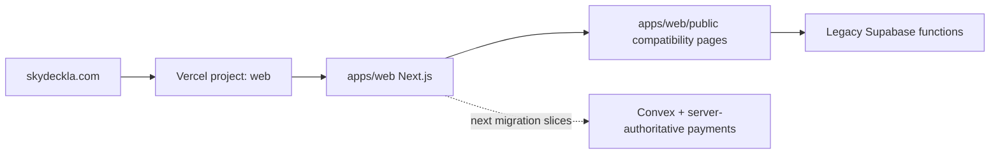

# Skyla

Skyla is organized as a Turborepo with a Next.js application on Vercel. The
production domain is served by `apps/web`; old root-level static copies have
been removed so the repository root is project control-plane space again.

## Repository Layout

```text
apps/web            Next.js App Router application for Vercel
packages/config     Shared site/business constants
packages/ui         Shared UI primitives and icons
docs/               Migration plan, runbooks, architecture notes
docs/audits         Discovery notes and implementation evidence
docs/decisions      Lightweight architecture decision records
supabase/functions  Legacy Supabase Edge Functions kept until Convex cutover
scripts/            Smoke, security, setup, and migration helpers
```

Static compatibility pages and active image assets live under
`apps/web/public`. They keep current public routes working while the App Router,
Convex, checkout, admin, and POS rebuilds happen route-by-route.



## Current Hosting State

As of June 30, 2026:

- Vercel project `junyen-enterprises/web` deploys `apps/web` from `main`.
- The most recently verified production deployment is `https://web-8rstxz73f-junyen-enterprises.vercel.app` from merge commit `b321c4b70d13116bfd95b4fa0f4c39bb811f8fcc`.
- Vercel custom domains `skydeckla.com` and `www.skydeckla.com` are attached and Vercel reports both domains as configured correctly.
- Nameservers now resolve to Vercel DNS: `ns1.vercel-dns.com` and `ns2.vercel-dns.com`.
- Custom-domain smoke tests pass on both the apex domain and `www` without DNS overrides.
- The Next app serves the new homepage and bridges legacy routes from `/about`, `/cafe`, `/experiences`, `/checkout`, `/members`, `/privacy`, `/terms`, `/admin`, and `/pos` to static compatibility pages in `apps/web/public`.

## Current Bun And Cleanup State

- pnpm has been replaced with Bun canary and a committed text `bun.lock`.
- Repo-owned Vercel install/build commands live under `apps/web/vercel.json`.
- Duplicate root GitHub Pages static files have been removed from the active tree after Vercel custom-domain cutover verification.
- Keeps app-owned compatibility files in `apps/web/public`.
- Uses Vercel deployment rollback for hosting rollback.

## Local Development

Use Bun canary. The last locally verified version is
`1.4.0-canary.1+ffea69ae7`.

```bash
bun upgrade --canary
bun install --frozen-lockfile
bun run web:dev
```

Use Node `24.x`; `.node-version` is included for version managers. The app runs
from `apps/web`.

## Build And Checks

```bash
bun run lint
bun run typecheck
bun run test:unit
bun run build
bun run security:artifacts
bun run security:audit
```

For a full local gate that matches the migration baseline:

```bash
bun run check
SMOKE_BASE_URL=https://skydeckla.com bun run test:smoke
SMOKE_BASE_URL=https://www.skydeckla.com bun run test:smoke
```

## Deployment Direction

Target host: Vercel.

Target Vercel project root: `apps/web`.

Recommended Vercel commands after project linking:

```bash
cd ../.. && bash scripts/setup/vercel-install-bun-canary.sh
cd ../.. && export PATH="$HOME/.bun/bin:$PATH" && bun --revision && bun run web:build
```

Those commands assume Vercel runs them from the configured `apps/web` project root. If Vercel is configured to run from the repository root instead, omit `cd ../..`.

The Vercel production route matrix passes on the custom domains. Keep previous
Vercel deployments available as rollback while the App Router, Convex, payment,
admin, and POS migrations continue. See [docs/phase-2-roadmap.md](docs/phase-2-roadmap.md)
and [docs/runbooks/domain-cutover.md](docs/runbooks/domain-cutover.md) before
changing domains or disabling legacy backend surfaces.

## Sensitive Artifacts

`output/`, `tmp/`, logs, local env files, generated PDFs, and generated CSVs must not be committed. Some existing local artifacts may include PII, invoice links, payment data, or passport form drafts.
