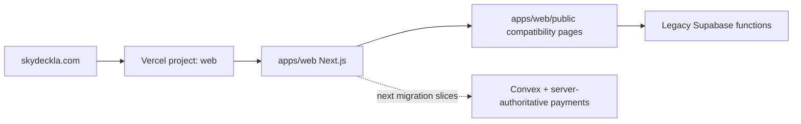

# Skyla

Skyla is organized as a Turborepo with a Next.js application on Vercel. The
production domain is served by `apps/web`; old root-level static copies have
been removed so the repository root is project control-plane space again.

## Repository Layout

```text
apps/web            Next.js App Router application for Vercel
packages/config     Shared site/business constants
packages/payments   Server-authoritative pricing and order draft contracts
packages/ui         Shared UI primitives and icons
convex/             Target Convex backend schema and future functions
docs/               Migration plan, runbooks, architecture notes
docs/audits         Discovery notes and implementation evidence
docs/decisions      Lightweight architecture decision records
docs/marketing      Campaign launch notes and import templates
supabase/functions  Legacy Supabase Edge Functions kept until Convex cutover
scripts/            Smoke, security, setup, and migration helpers
```

Static compatibility pages and active image assets live under
`apps/web/public`. They keep current public routes working while the App Router,
Convex, checkout, admin, and POS rebuilds happen route-by-route.


```mermaid
flowchart LR
  domain["skydeckla.com"]
  vercel["Vercel project: web"]
  web["apps/web Next.js"]
  bridge["apps/web/public compatibility pages"]
  legacyBackend["Legacy Supabase functions"]
  future["Convex + server-authoritative payments"]

  domain --> vercel --> web
  web --> bridge
  bridge --> legacyBackend
  web -. next migration slices .-> future
```

## Current Hosting State

As of July 5, 2026:

- Vercel project `junyen-enterprises/web` deploys `apps/web` from `main`.
- Latest verified app-code production deployment:
  `https://web-7s20mwxo9-junyen-enterprises.vercel.app` from merge commit
  `1a4b52a0993ba8c69ad20456716246dc3d24370b` (PR #67,
  deployment `dpl_AVbzMd2HR6bKp8JLDWcaM2BvSBjk`).
- Docs-only follow-up merges can create newer Vercel deployment URLs with the
  same app behavior. Use the Vercel dashboard or `vercel ls` for the newest
  deployment before recording fresh evidence.
- Vercel custom domains `skydeckla.com` and `www.skydeckla.com` are attached and Vercel reports both domains as configured correctly.
- Nameservers now resolve to Vercel DNS: `ns1.vercel-dns.com` and `ns2.vercel-dns.com`.
- Custom-domain smoke tests pass on both the apex domain and `www` without DNS overrides.
- GitHub `main` is protected. Merges require the `ci-build`,
  `Analyze JavaScript and TypeScript`, and `Vercel` checks to pass; force
  pushes, branch deletion, and unresolved conversations are blocked.
- GitHub CodeQL open alerts checked on July 5, 2026: none open.
- GitHub repo homepage points to `https://skydeckla.com`; Dependabot
  vulnerability alerts and automated security fixes are enabled.
- GitHub Pages was disabled on July 2, 2026 after Vercel custom-domain
  production was verified, so the old `github.io` surface is no longer an
  active host.
- Vercel environment variables checked on July 5, 2026: none are configured
  yet for `junyen-enterprises/web`, so Convex/Stripe execution stays
  fail-closed until dashboard setup is finished.
- Production still behaves as Convex-unconfigured. That is why payment execution
  intentionally stops with `convex_unconfigured` until the real Convex and
  Stripe dashboard setup is finished. `vercel env ls` for
  `junyen-enterprises/web` found no project environment variables on July 5,
  2026.
- The Next app serves the new homepage, `/about`, `/cafe`, `/experiences`,
  `/members`, `/privacy`, `/terms`, checkout route, `/admin`, `/pos`, and the
  older `/pos-next` draft review URL through App Router. `/pos.html` remains as
  the explicit static compatibility fallback during the remaining POS cutover.
  The old `.html` URLs remain available during route-by-route cutover.

## Current Bun And Cleanup State

- pnpm has been replaced with Bun canary and a committed text `bun.lock`.
- Repo-owned Vercel install/build commands live under `apps/web/vercel.json`.
- Duplicate root GitHub Pages static files have been removed from the active tree after Vercel custom-domain cutover verification.
- Keeps app-owned compatibility files in `apps/web/public`.
- Uses Vercel deployment rollback for hosting rollback.

## Local Development

Use Bun canary. The last locally verified version is
`1.4.0-canary.1+fb50cce92`.

```bash
bun upgrade --canary
bun install --frozen-lockfile
bun run web:dev
```

Use Node `24.x`; `.node-version` is included for version managers. The app runs
from `apps/web`.

## Build And Checks

```bash
bun run lint
bun run typecheck
bun run test:unit
bun run build
bun run convex:schema:typecheck
bun run convex:functions:typecheck
bun run security:artifacts
bun run security:audit
```

For a full local gate that matches the migration baseline:

```bash
bun run check
SMOKE_BASE_URL=https://skydeckla.com bun run test:smoke
SMOKE_BASE_URL=https://www.skydeckla.com bun run test:smoke
PAYMENT_SMOKE_BASE_URL=https://skydeckla.com bun run test:payments
PAYMENT_SMOKE_BASE_URL=https://www.skydeckla.com bun run test:payments
```

## Current Bridge Notes

- Google Ads conversion tracking is configured through Vercel public environment variables rendered by `/ads-config.js`; `apps/web/public/ads-tracking.js` stays inert when those vars are unset.
- Google Ads launch materials live in [docs/marketing/google-ads](docs/marketing/google-ads), including CSV templates intentionally allowed by the tracked-artifact guard.
- Native `/about` is a server-rendered content route. Native `/cafe` renders
  active menu items from `@skyla/payments`, the same catalog source used by
  checkout and POS. Their `.html` compatibility copies no longer load
  `shared-data.js`.
- Native `/members` is an App Router page with a server-gated application
  form. It posts to `/api/members/applications` with an idempotency key and
  only shows success after Convex accepts the mutation. Until Convex/Vercel envs
  are linked, the form reports the safe `convex_unconfigured` pause instead of
  saving to browser localStorage or Supabase. `/members.html` remains as a
  compatibility artifact during the transition.
- Native `/experiences` is an App Router page with a server-gated event inquiry
  form. It posts to `/api/experiences/inquiries` with an idempotency key and
  only fires lead tracking after the server accepts the inquiry. Until
  Convex/Vercel envs are linked, the form reports the safe
  `convex_unconfigured` pause instead of saving to browser localStorage or
  Supabase. `/experiences.html` remains as a compatibility artifact during the
  transition.
- Legacy Stripe Terminal reader registration is retired in repo code. `/pos.html`
  no longer calls the old `setup-reader` bridge, and the repo copy of the
  Supabase Terminal function returns `410` for every old bridge action. Native
  `/pos` still needs staff auth, Convex envs, Stripe dashboard webhook setup,
  `SKYLA_POS_TERMINAL_ACCEPTANCE=enabled`, and test-reader acceptance before
  live card-present payment is allowed.
- `@skyla/payments`, `convex/schema.ts`, and `/api/order-drafts/checkout`
  establish the first server-authoritative pricing/order spine. This route
  calculates draft totals from selections only and persists Convex order drafts
  when `NEXT_PUBLIC_CONVEX_URL` plus `idempotencyKey` are present.
- `convex/payments.ts` adds the next Stripe Checkout action. It creates Stripe
  sessions from stored `orderRef` records only. `convex/http.ts` adds the
  Stripe webhook route. `/api/payments/stripe-checkout` and the App Router
  `/checkout` page are wired for this path, but live card payment still needs
  real Convex envs, Stripe envs, and Stripe dashboard endpoint setup. Convex
  also requires `SKYLA_STRIPE_MODE` so test keys/webhooks and live
  keys/webhooks cannot be mixed silently.
- `/api/order-drafts/pos` and native `/pos` add a POS draft review path. The
  older `/pos-next` URL still renders the same native shell during rollout.
  It prices ticket, cafe, and custom POS lines on the server and ignores browser
  totals. The backend now creates Stripe Terminal intents and sends them to the
  stored reader from stored `saleRef` records only. Signed Stripe
  `payment_intent.*` webhooks now reconcile final POS payment state from the
  stored Terminal payment event. Live Terminal payment remains gated until
  Vercel/Convex envs, staff auth, Stripe dashboard endpoint setup, and
  test-reader acceptance are complete.
- Legacy browser-authoritative Kaskade/crypto checkout is retired from the
  public compatibility checkout and in the repo copy of the Supabase functions.
- Public static page CTAs now point to `/checkout`, the App Router checkout
  path; `/checkout.html` is only a compatibility handoff to the native
  checkout route and no longer ships the old checkout script or stylesheet.
- Supabase functions remain legacy transition surfaces until Convex,
  server-authoritative payment creation, admin, and POS replacements are
  verified and the dashboard deployments are disabled or redeployed from the
  fail-closed repo copies.

Useful operator references:

- [Environment Reference](docs/reference/environment.md)
- [Production Readiness Checklist](docs/runbooks/production-readiness-checklist.md)
- [Stripe Checkout Cutover Runbook](docs/runbooks/stripe-checkout-cutover.md)
- [Convex Deployment Runbook](docs/runbooks/convex-deployment.md)

## Deployment Direction

Target host: Vercel.

Target Vercel project root: `apps/web`.

Recommended Vercel commands after project linking:

```bash
cd ../.. && bash scripts/setup/vercel-install-bun-canary.sh
cd ../.. && export PATH="$HOME/.bun/bin:$PATH" && bun --revision && bun run web:build
```

Those commands assume Vercel runs them from the configured `apps/web` project root. If Vercel is configured to run from the repository root instead, omit `cd ../..`.

The Vercel production route matrix passes on the custom domains. Keep previous
Vercel deployments available as rollback while the App Router, Convex, payment,
admin, and POS migrations continue. See [docs/phase-2-roadmap.md](docs/phase-2-roadmap.md)
and [docs/runbooks/domain-cutover.md](docs/runbooks/domain-cutover.md) before
changing domains or disabling legacy backend surfaces.

## Sensitive Artifacts

`output/`, `tmp/`, logs, local env files, generated PDFs, and generated CSVs must not be committed. Some existing local artifacts may include PII, invoice links, payment data, or passport form drafts.
