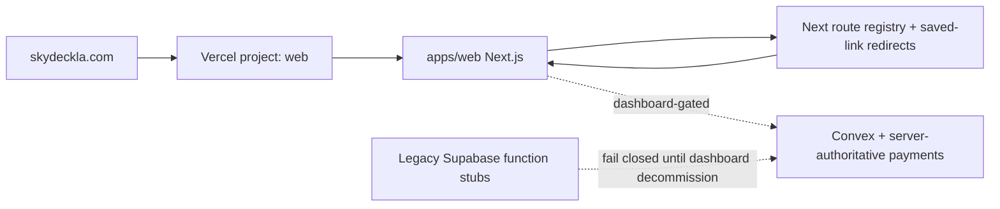

# Skyla

Skyla is organized as a Turborepo with a Next.js application on Vercel. The
production domain is served by `apps/web`; old root-level static copies have
been removed so the repository root is project control-plane space again.

## Repository Layout

```text
apps/web            Next.js App Router application for Vercel
packages/config     Shared site/business constants
packages/payments   Server-authoritative pricing and order draft contracts
packages/ui         Shared UI primitives and icons
convex/             Target Convex backend schema and future functions
docs/               Migration plan, runbooks, architecture notes
docs/audits         Discovery notes and implementation evidence
docs/decisions      Lightweight architecture decision records
docs/marketing      Campaign launch notes and import templates
supabase/functions  Legacy Supabase Edge Functions kept until Convex cutover
scripts/            Smoke, security, setup, and migration helpers
```

Active image assets and the ads helper live under `apps/web/public`. Saved
`.html` URLs are centralized as permanent redirects in
`apps/web/site-routes.mjs`; duplicate compatibility pages are no longer shipped.


```mermaid
flowchart LR
  domain["skydeckla.com"]
  vercel["Vercel project: web"]
  web["apps/web Next.js"]
  redirects["Next route registry + saved-link redirects"]
  convex["Convex + server-authoritative payments"]
  supabase["Legacy Supabase function stubs"]

  domain --> vercel --> web
  web --> redirects --> web
  web -. "dashboard-gated" .-> convex
  supabase -. "fail closed until dashboard decommission" .-> convex
```

## Current Hosting State

As of July 12, 2026:

- Vercel project `junyen-enterprises/web` deploys `apps/web` from `main`.
- Latest production deployment evidence recorded here:
  `https://web-k4sx362fp-junyen-enterprises.vercel.app` from merge commit
  `c6a13e5bdba0e3410aa2657cd6c3889c35013228` (PR #125, deployment
  `dpl_8a3zSvT4o9XT3rRjukd44magVr41`, status `READY`). This identifies the current deployment;
  it does not mean the Supabase-to-Convex data migration has run.
- `bun run vercel:project:check` confirms the linked Vercel dashboard project
  is still `junyen-enterprises/web`, rooted at `apps/web`, on Next.js and Node
  `24.x`; `apps/web/vercel.json` remains the source of truth for Bun canary
  install/build commands even when the dashboard settings page shows defaults.
- PR #96 added `bun run vercel:env:check`, a safe Vercel dashboard checker for
  the remaining Convex/Stripe env setup. PR #121 extends it with Clerk gates.
  It reports only env names/scopes and fails until
  `NEXT_PUBLIC_CONVEX_URL`, `NEXT_PUBLIC_CLERK_PUBLISHABLE_KEY`, and
  `CLERK_SECRET_KEY` are in Preview/Production. It still rejects misplaced
  Stripe, staff-bootstrap, and Terminal secrets; the Clerk secret is the
  intentional server-side Vercel exception.
- Future docs-only or tooling merges may create newer production URLs with the
  same app behavior. Use Vercel project `junyen-enterprises/web` or
  `vercel ls web --scope junyen-enterprises` before recording fresh
  operational evidence.
- Vercel custom domains `skydeckla.com` and `www.skydeckla.com` are attached and Vercel reports both domains as configured correctly.
- Nameservers now resolve to Vercel DNS: `ns1.vercel-dns.com` and `ns2.vercel-dns.com`.
- Custom-domain smoke tests pass on both the apex domain and `www` without DNS overrides.
- GitHub `main` is protected. Merges require the `ci-build`,
  `Analyze JavaScript and TypeScript`, and `Vercel` checks to pass; force
  pushes, branch deletion, and unresolved conversations are blocked. This was
  rechecked through the GitHub API on July 6, 2026.
- CodeQL PR checks are passing. The Code Scanning open-alert API returned
  `404` for the local `gh` token during the latest check, so use the GitHub
  Security tab to confirm the current open-alert count.
- GitHub repo homepage points to `https://skydeckla.com`; Dependabot
  vulnerability alerts and automated security fixes are enabled. The GitHub API
  returned `204` for vulnerability alerts and `{ "enabled": true,
  "paused": false }` for automated security fixes on July 6, 2026.
- GitHub Pages was disabled on July 2, 2026 after Vercel custom-domain
  production was verified, so the old `github.io` surface is no longer an
  active host.
- Vercel environment variables checked on July 12, 2026: none are configured
  yet for `junyen-enterprises/web`, so Convex/Stripe execution stays
  fail-closed until dashboard setup is finished. After adding Vercel envs, run
  `bun run vercel:project:check` and `bun run vercel:env:check` to verify the
  Vercel project shape plus Convex URL and Clerk-key scopes. After Vercel,
  Clerk, and Convex dashboard edits, run `bun run dashboard:readiness` for one
  safe JSON summary of the remaining dashboard actions before linked Preview
  acceptance.
- Production still behaves as Convex-unconfigured. That is why payment execution
  intentionally stops with `convex_unconfigured` until the real Convex and
  Stripe dashboard setup is finished. `vercel env ls` for
  `junyen-enterprises/web` found no project environment variables on July 12,
  2026.
- Payment API audit and smoke checks on July 12, 2026 found no raw card
  collection or storage, no public `clientSecret` response exposure, and
  server-owned checkout/POS amount authority. Live payment acceptance is still
  dashboard-gated until Convex and Stripe test-mode dashboard setup is done.
- Payment execution responses are non-cacheable. Stripe Checkout responses use
  `Cache-Control: no-store`; staff-gated Stripe Terminal responses also use
  `Vary: Authorization`.
- Payment route failures use stable public error codes/messages so raw
  Stripe/Convex/provider details and env names are not returned to browsers.
- Vercel production runtime checks found no `error` or `fatal` logs in the
  checked post-merge window for the recorded PR #125 deployment. The observed
  non-200 responses were expected staff-auth `401` and Convex-unconfigured
  `503` gates from the smoke probes. See
  [docs/current-state-simple.md](docs/current-state-simple.md) for the latest
  deployment ID and evidence.
- The Next app serves the homepage, `/about`, `/cafe`, `/experiences`,
  `/members`, `/privacy`, `/terms`, checkout route, `/admin`, `/pos`, and the
  older `/pos-next` draft review URL through App Router. Saved public and staff
  `.html` URLs redirect at the Next.js routing layer to their native routes; no
  duplicate HTML applications are shipped from `apps/web/public`.

## Current Bun And Cleanup State

- pnpm has been replaced with Bun canary and a committed text `bun.lock`.
- Repo-owned Vercel install/build commands live under `apps/web/vercel.json`.
- Duplicate root GitHub Pages static files have been removed from the active tree after Vercel custom-domain cutover verification.
- Keeps saved-link compatibility in the checked route registry instead of
  duplicate files.
- Uses Vercel deployment rollback for hosting rollback.

## Local Development

Use Bun canary. The last locally verified version is
`1.4.0-canary.1+2e2230a81`. Bun's documented canary upgrade command is
`bun upgrade --canary`; installs should still use `bun install --frozen-lockfile`.

```bash
bun upgrade --canary
bun install --frozen-lockfile
bun run web:dev
```

Use Node `24.x`; `.node-version` is included for version managers. The app runs
from `apps/web`.

## Build And Checks

```bash
bun run lint
bun run typecheck
bun run test:unit
bun run build
bun run convex:schema:typecheck
bun run convex:functions:typecheck
bun run security
```

For a full local gate that matches the migration baseline:

```bash
bun run check
SMOKE_BASE_URL=https://skydeckla.com bun run test:smoke
SMOKE_BASE_URL=https://www.skydeckla.com bun run test:smoke
PAYMENT_SMOKE_BASE_URL=https://skydeckla.com bun run test:payments
PAYMENT_SMOKE_BASE_URL=https://www.skydeckla.com bun run test:payments
```

For dashboard setup progress, run this separately. It is expected to fail until
the Vercel, Clerk, and Convex dashboard gates are ready for linked Preview
acceptance:

```bash
bun run vercel:project:check
bun run dashboard:readiness
```

## Current Bridge Notes

- PR #121 removed raw pasted staff-token fields from Admin and POS in production.
  Route-scoped Clerk v7 handles human sign-in, while `staffFetch` requests a
  short-lived `convex` JWT for each protected API call. Convex `staffUsers` and
  `requireStaffUser` remain role authority; the bearer API contract remains for
  controlled automation. The deployed UI remains in its setup-required state
  until Vercel Preview/Production have `NEXT_PUBLIC_CONVEX_URL`,
  `NEXT_PUBLIC_CLERK_PUBLISHABLE_KEY`, and `CLERK_SECRET_KEY`, Convex has
  `CLERK_JWT_ISSUER_DOMAIN`, and the first Clerk user ID is bootstrapped as the
  staff `subject` before the temporary bootstrap token is removed. See
  [ADR 0034](docs/decisions/0034-clerk-convex-staff-auth.md).
- Google Ads conversion tracking is configured through Vercel public environment variables rendered by `/ads-config.js`; `apps/web/public/ads-tracking.js` stays inert when those vars are unset.
- Google Ads launch materials live in [docs/marketing/google-ads](docs/marketing/google-ads), including CSV templates intentionally allowed by the tracked-artifact guard.
- Native `/about` is a server-rendered content route. Native `/cafe` renders
  active menu items from `@skyla/payments`, the same catalog source used by
  checkout and POS. Their saved `.html` URLs redirect through the shared route
  registry.
- Native `/members` is an App Router page with a server-gated application
  form. It posts to `/api/members/applications` with an idempotency key and
  only shows success after Convex accepts the mutation. Until Convex/Vercel envs
  are linked, the form reports the safe `convex_unconfigured` pause instead of
  saving to browser localStorage or Supabase. `/members.html` redirects to the
  native page.
- Native `/experiences` is an App Router page with a server-gated event inquiry
  form. It posts to `/api/experiences/inquiries` with an idempotency key and
  only fires lead tracking after the server accepts the inquiry. Until
  Convex/Vercel envs are linked, the form reports the safe
  `convex_unconfigured` pause instead of saving to browser localStorage or
  Supabase. `/experiences.html` redirects to the native page.
- Legacy Stripe Terminal reader registration is retired in repo code. The old
  staff browser assets have been removed from `apps/web/public`, `/pos.html`
  redirects to native `/pos`, and the repo copy of the Supabase Terminal
  function returns `410` for every old bridge action. Native `/pos` still needs
  staff auth, Convex envs, Stripe dashboard webhook setup,
  `SKYLA_POS_TERMINAL_ACCEPTANCE=enabled`, and test-reader acceptance before
  live card-present payment is allowed.
- `@skyla/payments`, `convex/schema.ts`, and `/api/order-drafts/checkout`
  establish the first server-authoritative pricing/order spine. This route
  calculates draft totals from selections only and persists Convex order drafts
  when `NEXT_PUBLIC_CONVEX_URL` plus `idempotencyKey` are present.
- `convex/payments.ts` adds the next Stripe Checkout action. It creates Stripe
  sessions from stored `orderRef` records only. `convex/http.ts` adds the
  Stripe webhook route. `/api/payments/stripe-checkout` and the App Router
  `/checkout` page are wired for this path. Public payment responses are
  allowlisted so accidental Stripe `clientSecret` fields are not returned to
  the browser. A reconciled paid webhook atomically creates one confirmed
  booking from the stored email, visit date, entry time, and ticket lines;
  replayed Stripe events reuse that booking. The Checkout return page polls a
  non-cacheable status endpoint that uses the Stripe Session ID as a bearer
  capability, derives its order from the stored ledger, and shows confirmed
  only when the paid order, paid
  ledger, and booking agree. Live card payment still needs real
  Convex envs, Stripe envs, and Stripe dashboard endpoint setup. Convex also
  requires `SKYLA_STRIPE_MODE` so test keys/webhooks and live keys/webhooks
  cannot be mixed silently.
- `/api/order-drafts/pos` and native `/pos` add a POS draft review path. The
  older `/pos-next` URL still renders the same native shell during rollout.
  It prices ticket, cafe, and custom POS lines on the server and ignores browser
  totals. The backend now creates Stripe Terminal intents and sends them to the
  stored reader from stored `saleRef` records only. Signed Stripe
  `payment_intent.*` webhooks now reconcile final POS payment state from the
  stored Terminal payment event. Live Terminal payment remains gated until
  Vercel/Convex envs, staff auth, Stripe dashboard endpoint setup, and
  test-reader acceptance are complete.
- Signed Stripe refund events now reconcile read-only against the paid Checkout
  or Terminal PaymentIntent and its still-paid order/POS sale. Native Admin can
  display the normalized result, but it cannot initiate refunds and refund
  events do not automatically cancel bookings or sales. Enable the Dashboard
  refund subscriptions only after deployment, historical PaymentIntent-linkage
  review, and linked test-mode acceptance described in ADR 0033.
- Legacy browser-authoritative Kaskade/crypto checkout is retired from the
  public compatibility checkout and in the repo copy of the Supabase functions.
- Public CTAs point to `/checkout`, the App Router checkout path;
  `/checkout.html` permanently redirects there and no longer has a static
  compatibility document.
- `robots.txt` and `sitemap.xml` are generated by App Router metadata routes
  from the same checked route registry used by redirects and smoke tests.
- The July 12 dependency sweep upgraded `@types/node` to `26.1.1`. TypeScript
  `7.0.2` passes direct project typechecks but Next.js `16.2.10` rejects it
  during `next build`, so production remains on TypeScript `6.0.3`. ESLint 10
  remains blocked by the current React/Next lint plugin stack.
- Supabase functions remain legacy transition surfaces until Convex,
  server-authoritative payment creation, admin, and POS replacements are
  verified and the dashboard deployments are disabled or redeployed from the
  fail-closed repo copies. `bun run security:supabase-retired` now guards the
  repo copies so Stripe/Kaskade/Supabase helper calls cannot quietly return to
  those retired functions. After dashboard changes, use
  `bun run test:supabase-retired:live` with
  `SKYLA_SUPABASE_RETIREMENT_BASE_URL` and
  `SKYLA_SUPABASE_RETIREMENT_LIVE=1` to prove deployed legacy endpoints are
  disabled or redeployed from the retired stubs.
- A ledgered migration path now exists for legacy `bookings`, `members`, and
  `inquiries`. It uses immutable Supabase exports, deterministic SHA-256
  manifests, quarantine, development-first HTTPS apply, reconciliation, and
  per-batch rollback. It deliberately excludes config, Supabase Auth/passwords,
  orders, and payment events. No cloud data migration has been performed.

Useful operator references:

- [Environment Reference](docs/reference/environment.md)
- [Production Readiness Checklist](docs/runbooks/production-readiness-checklist.md)
- [Plain-English Current State](docs/current-state-simple.md)
- [Stripe Checkout Cutover Runbook](docs/runbooks/stripe-checkout-cutover.md)
- [Convex Deployment Runbook](docs/runbooks/convex-deployment.md)
- [Supabase To Convex Data Migration Runbook](docs/runbooks/supabase-convex-data-migration.md)

## Deployment Direction

Target host: Vercel.

Target Vercel project root: `apps/web`.

Recommended Vercel commands after project linking:

```bash
cd ../.. && bash scripts/setup/vercel-install-bun-canary.sh
cd ../.. && export PATH="$HOME/.bun/bin:$PATH" && bun --revision && bun run web:build
```

Those commands assume Vercel runs them from the configured `apps/web` project root. If Vercel is configured to run from the repository root instead, omit `cd ../..`.

The Vercel production route matrix passes on the custom domains. Keep previous
Vercel deployments available as rollback while the App Router, Convex, payment,
admin, and POS migrations continue. See [docs/phase-2-roadmap.md](docs/phase-2-roadmap.md)
and [docs/runbooks/domain-cutover.md](docs/runbooks/domain-cutover.md) before
changing domains or disabling legacy backend surfaces.

## Sensitive Artifacts

`output/`, `tmp/`, logs, local env files, generated PDFs, and generated CSVs must not be committed. Some existing local artifacts may include PII, invoice links, payment data, or passport form drafts.
