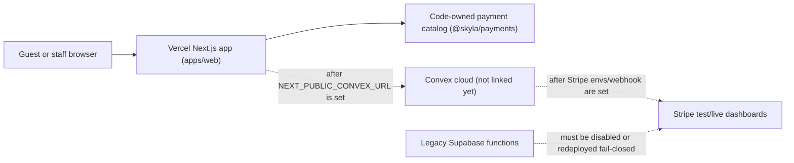

# Skyla Current State

Last checked: 2026-07-06.

This is the plain-English handoff for people, plus enough raw detail for future
agents to keep going safely.

## Simple Summary

Skyla is now a Next.js app in a Turborepo and is hosted on Vercel. The public
domain works on Vercel, and the code is set up so checkout and POS prices are
calculated by trusted server-side code instead of browser-submitted totals.

Real card charging is still intentionally blocked. That is good for now. The
site needs the real Convex project, Vercel environment variable, Stripe test
webhook, seeded staff account, and Stripe test-reader setup before checkout or
POS should run a real payment flow.

Admin and POS staff screens use white text on black staff surfaces. The current
catalog is code-owned in `@skyla/payments`; Convex now has code paths for
versioned catalog seeding and audited rollback, but admin cannot edit prices
yet.

## Architecture

## What Works Now

- Vercel production deployment is ready for PR #87 merge commit `c6f9301`.
- `skydeckla.com` and `www.skydeckla.com` are attached to the Vercel project.
- Public routes, native checkout, native members, native experiences, native
  admin, native POS, and compatibility handoff routes smoke-test successfully.
- Checkout and POS no-write probes replace browser-supplied totals with
  server-owned totals.
- Stripe execution routes fail closed while Convex and Stripe dashboards are not
  configured.
- Public Stripe Checkout and Terminal routes return allowlisted response
  shapes, so accidental `clientSecret` or `client_secret` fields from a lower
  layer are stripped before reaching the browser.
- Admin CSV exports, booking lookup, booking/member status actions,
  announcement/hours config, voucher redemption, and POS reader selection are
  native Next/Convex-shaped flows.
- Catalog versioning is modeled in Convex code: admins can seed the code-owned
  catalog, store immutable snapshots, and activate a previous version for
  rollback after the real Convex project is linked.
- Admin and POS staff pages render high-contrast white text on dark surfaces.
- Bun canary is the package manager and frozen install makes no lockfile
  changes.

## Current Payment Rule

Do not use a real credit card for migration verification yet.

Use Stripe test cards and a Stripe test Terminal reader only after Convex and
Stripe test-mode environment variables are present. Until then, a `503`
`convex_unconfigured` response from payment execution routes is the correct
safe behavior.

## Dashboard Checklist

- [ ] Link or create the real Skyla Convex cloud project.
- [ ] Add `NEXT_PUBLIC_CONVEX_URL` to Vercel Preview and Production.
- [ ] Add Convex deployment details locally only when needed for linked codegen.
- [ ] Set Convex `SKYLA_STRIPE_MODE=test`.
- [ ] Set Convex `STRIPE_SECRET_KEY` with a test key first.
- [ ] Create a Stripe test webhook endpoint for Convex.
- [ ] Set Convex `STRIPE_WEBHOOK_SECRET`.
- [ ] Set Convex `SKYLA_PAYMENT_RETURN_ORIGINS` to the Vercel preview and
      production origins.
- [ ] Seed initial staff with the bootstrap mutation.
- [ ] Remove or unset `SKYLA_STAFF_BOOTSTRAP_TOKEN` after staff is seeded.
- [ ] Seed the code-owned catalog through `POST /api/admin/catalog` with
      `{"action":"seedCodeOwnedCatalog"}` and a valid admin staff token.
- [ ] Set Convex `SKYLA_TERMINAL_READER_REGISTRY` with test reader IDs.
- [ ] Keep `SKYLA_POS_TERMINAL_ACCEPTANCE` unset until no-write preflight,
      webhook setup, and reader registry checks pass; then enable it only for
      the controlled test-reader attempt.
- [ ] Run `bun run test:acceptance:preflight` against the Vercel Preview branch
      alias to verify staff auth, remote readiness, and reader gating without
      writing test records.
- [ ] Verify `/members` writes to Convex in preview.
- [ ] Verify `/experiences` writes to Convex in preview.
- [ ] Verify checkout creates a Stripe Checkout session in test mode.
- [ ] Verify POS sends a stored `saleRef` total to a Stripe test reader.
- [ ] Verify Stripe webhooks reconcile checkout and Terminal final states.
- [ ] Disable or redeploy old Supabase Stripe/Kaskade functions so any live
      legacy endpoints return the repo's fail-closed behavior.
- [ ] Only after all preview checks pass, repeat acceptance on production.

## Latest Evidence

| Check | Result |
| --- | --- |
| Vercel project | `web`, framework `nextjs`, Node `24.x` |
| Latest production verification | PR #87, merged to `main` on July 6, 2026 |
| Verified production deployment | `dpl_HPqZptoZ36XiU6vTBL6XHAGgdnMv`, status `READY` |
| Verified production URL | `https://web-ll86xe2or-junyen-enterprises.vercel.app` |
| Verified production commit | `c6f9301f48d7a9a25700381b9931846c5b9d22f8` |
| Domains | `skydeckla.com`, `www.skydeckla.com` |
| Bun | `1.4.0-canary.1+d37f52067` |
| `bun upgrade --canary` | Vercel install script and GitHub Actions use Bun canary; local revision checked as `1.4.0-canary.1+d37f52067` |
| `bun install --frozen-lockfile` | Passed, no lockfile changes |
| `bun audit --audit-level=high` | No vulnerabilities found |
| Dependency sweep | `bun outdated` produced no upgrade table; Dependabot covers Bun and GitHub Actions weekly |
| `bun run test:smoke` | Passed on `https://skydeckla.com` after PR #87 |
| `bun run test:payments` | Passed on `https://skydeckla.com`; no real Stripe charge |
| `bun run test:production-readiness` | Passed on `https://skydeckla.com` and `https://www.skydeckla.com`; production remains dashboard-gated |
| `bun run convex:env:check` | Failed as expected because dashboard envs are absent |
| `bun run check` | Passed on PR #87; focused Stripe route tests passed for this follow-up |
| Payment API audit | No card PAN/CVC collection or storage; no public client secret exposure; server-owned amount authority |
| Helium visual QA | Production `/admin` and `/pos` render white-on-black staff screens; this follow-up keeps active staff controls white-on-dark too |
| Staff/admin APIs | `401` without auth and `503 convex_unconfigured` with fake auth; shared staff JSON responses use `no-store` and `Vary: Authorization` |
| Catalog versioning local gate | PR #83 merged; focused tests, Convex schema typecheck, Convex function typecheck, and anonymous Convex validation passed |

Vercel creates a new production URL after every merge. Query Vercel before
recording fresh operational evidence, then rerun the route/payment smoke checks
against the custom domain.

## Next Code Work

1. Keep runtime catalog/pricing code-owned until linked Convex acceptance passes.
2. After dashboard setup, seed the code-owned catalog into Convex and verify
   `/api/admin/catalog` shows an active version.
3. Only then design admin catalog/pricing edits on top of versioned drafts.
4. Finish refunds with Stripe reconciliation and audit events.
5. Finish destructive admin actions only with typed validators and rollback
   runbooks.
6. Run no-write linked acceptance preflight after dashboard setup.
7. Run linked Convex/Stripe write acceptance after the preflight passes.
8. Keep the Stripe public response allowlists and `clientSecret` regression
   tests in place for any future payment route changes.
