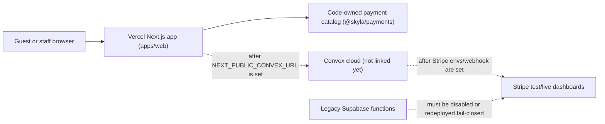

# Skyla Current State

Last checked: 2026-07-05.

This is the plain-English handoff for people, plus enough raw detail for future
agents to keep going safely.

## Simple Summary

Skyla is now a Next.js app in a Turborepo and is hosted on Vercel. The public
domain works on Vercel, and the code is set up so checkout and POS prices are
calculated by trusted server-side code instead of browser-submitted totals.

Real card charging is still intentionally blocked. That is good for now. The
site needs the real Convex project, Vercel environment variable, Stripe test
webhook, seeded staff account, and Stripe test-reader setup before checkout or
POS should run a real payment flow.

Admin and POS staff screens use white text on black staff surfaces. The current
catalog is code-owned in `@skyla/payments`; admin can view it but cannot edit
prices yet.

## Architecture

## What Works Now

- Vercel production deployment is ready for PR #81 merge commit `7d93c36`.
- `skydeckla.com` and `www.skydeckla.com` are attached to the Vercel project.
- Public routes, native checkout, native members, native experiences, native
  admin, native POS, and compatibility handoff routes smoke-test successfully.
- Checkout and POS no-write probes replace browser-supplied totals with
  server-owned totals.
- Stripe execution routes fail closed while Convex and Stripe dashboards are not
  configured.
- Admin CSV exports, booking lookup, booking/member status actions,
  announcement/hours config, voucher redemption, and POS reader selection are
  native Next/Convex-shaped flows.
- Admin and POS staff pages render high-contrast white text on dark surfaces.
- Bun canary is the package manager and frozen install makes no lockfile
  changes.

## Current Payment Rule

Do not use a real credit card for migration verification yet.

Use Stripe test cards and a Stripe test Terminal reader only after Convex and
Stripe test-mode environment variables are present. Until then, a `503`
`convex_unconfigured` response from payment execution routes is the correct
safe behavior.

## Dashboard Checklist

- [ ] Link or create the real Skyla Convex cloud project.
- [ ] Add `NEXT_PUBLIC_CONVEX_URL` to Vercel Preview and Production.
- [ ] Add Convex deployment details locally only when needed for linked codegen.
- [ ] Set Convex `SKYLA_STRIPE_MODE=test`.
- [ ] Set Convex `STRIPE_SECRET_KEY` with a test key first.
- [ ] Create a Stripe test webhook endpoint for Convex.
- [ ] Set Convex `STRIPE_WEBHOOK_SECRET`.
- [ ] Set Convex `SKYLA_PAYMENT_RETURN_ORIGINS` to the Vercel preview and
      production origins.
- [ ] Seed initial staff with the bootstrap mutation.
- [ ] Remove or unset `SKYLA_STAFF_BOOTSTRAP_TOKEN` after staff is seeded.
- [ ] Set Convex `SKYLA_TERMINAL_READER_REGISTRY` with test reader IDs.
- [ ] Keep `SKYLA_POS_TERMINAL_ACCEPTANCE` unset until the test reader flow
      passes.
- [ ] Verify `/members` writes to Convex in preview.
- [ ] Verify `/experiences` writes to Convex in preview.
- [ ] Verify checkout creates a Stripe Checkout session in test mode.
- [ ] Verify POS sends a stored `saleRef` total to a Stripe test reader.
- [ ] Verify Stripe webhooks reconcile checkout and Terminal final states.
- [ ] Disable or redeploy old Supabase Stripe/Kaskade functions so any live
      legacy endpoints return the repo's fail-closed behavior.
- [ ] Only after all preview checks pass, repeat acceptance on production.

## Latest Evidence

| Check | Result |
| --- | --- |
| Vercel project | `web`, framework `nextjs`, Node `24.x` |
| Latest app-code production verification | PR #81, merged `2026-07-05T22:49:52Z` |
| Verified production deployment | `dpl_4PTqPnqrwyJjm8hFX3T1FZN2UfQn`, status `READY` |
| Verified production URL | `https://web-2e5u36ye7-junyen-enterprises.vercel.app` |
| Verified production commit | `7d93c3600d23f5df2ca449d2ef441066c735fab4` |
| Domains | `skydeckla.com`, `www.skydeckla.com` |
| Bun | `1.4.0-canary.1+d37f52067` |
| `bun install --canary --frozen-lockfile` | Passed, no changes |
| `bun audit --audit-level=low` | No vulnerabilities found |
| `bun outdated --recursive` | Only ESLint `9.39.4 -> 10.6.0`, intentionally deferred |
| `bun run test:smoke` | Passed on deployment, apex, and `www` |
| `bun run test:payments` | Passed on deployment, apex, and `www`; no real Stripe charge |
| `bun run test:production-readiness` | Passed on deployment, apex, and `www` |
| `bun run convex:env:check` | Failed as expected because dashboard envs are absent |
| `bun run check` | Passed |
| Helium visual QA | Production `/admin` and `/pos` render white-on-black staff screens |
| Admin export API | `401` without auth and `503 convex_unconfigured` with fake auth, both `no-store` and `Vary: Authorization` |

Vercel will create newer production URLs for docs-only commits. Treat the
deployment above as the latest checked app-code behavior, then query Vercel for
the newest deployment before recording fresh operational evidence.

## Next Code Work

1. Keep catalog/pricing code-owned until Convex catalog versioning exists.
2. Add Convex catalog seeding/versioning, audit history, and rollback rules.
3. Only then add admin catalog/pricing edits.
4. Finish refunds with Stripe reconciliation and audit events.
5. Finish destructive admin actions only with typed validators and rollback
   runbooks.
6. Run linked Convex/Stripe acceptance after dashboard setup.
