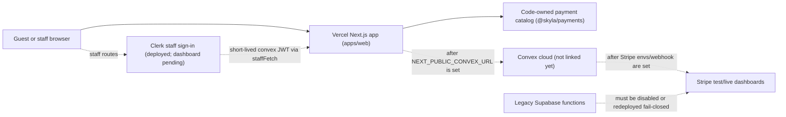

# Skyla Current State

Last checked: 2026-07-12.

This is the plain-English handoff for people, plus enough raw detail for future
agents to keep going safely.

## Simple Summary

Skyla is now a Next.js app in a Turborepo and is hosted on Vercel. The public
domain works on Vercel, and the code is set up so checkout and POS prices are
calculated by trusted server-side code instead of browser-submitted totals.
The linked acceptance harness also checks that payment creation reuses the
stored draft idempotency keys, so Stripe Checkout and Terminal cannot drift
away from the server-owned order or POS sale draft.
Convex payment snapshots now also refuse to start or process Stripe Checkout
if its stored email, date, time, or ticket lines are incomplete, and Checkout
and Terminal both reject missing or spoofed code-owned catalog provenance.

Real card charging is still intentionally blocked. That is good for now. The
site needs the real Convex project, Vercel environment variable, Stripe test
webhook, seeded staff account, and Stripe test-reader setup before checkout or
POS should run a real payment flow.

The signed paid Checkout webhook now reconciles the payment ledger, marks the
order paid, and creates exactly one confirmed booking in the same Convex
mutation. Stripe retries reuse the booking instead of duplicating it. This code
still needs a linked test-mode Convex/Stripe acceptance run before cards are
enabled. Payment creation also rejects past dates, dates over 365 days away,
and entry times outside the shared server-owned slot list.
The Checkout return page no longer trusts `?stripe=success`: it checks the
Stripe Session against Convex's server-created payment ledger, derives the
order there, and shows confirmed only
when the paid ledger, paid order, and booking all agree.

Signed Stripe refund events now have a read-only reconciliation path. A refund
must match a paid Checkout or Terminal PaymentIntent, amount, currency, and the
still-paid order or POS sale. Admin can see the normalized refund in Payments,
but Skyla cannot initiate a refund and does not automatically cancel a booking
or sale. This code still needs linked Stripe test-mode acceptance before refund
events are enabled in the Dashboard.

A ledgered migration path is now implemented for legacy bookings, members, and
inquiries. It has immutable export, SHA-256 manifest, quarantine,
development-first apply, summary reconciliation, and per-batch rollback
controls. It does not migrate config, Supabase Auth/passwords, orders, or
payment events, and historical bookings do not create financial records. No
Supabase export has been applied to a cloud Convex deployment.

Admin and POS staff screens use white text on black staff surfaces. The current
catalog is code-owned in `@skyla/payments`; Convex now has code paths and
native admin controls for versioned catalog seeding and audited rollback, but
admin cannot edit prices yet. Checkout and POS catalog lines also carry
code-owned catalog provenance metadata so stored drafts can show which catalog
version, source, authority, and item hash produced each priced line.

In production, the Admin and POS interfaces no longer show a raw pasted
staff-token field. PR #121 shipped route-scoped Clerk v7 for human staff, and a
shared `staffFetch` wrapper obtains a short-lived `convex` JWT only when it makes
a protected request. Convex `staffUsers` records and `requireStaffUser` remain
the role authority, and the bearer API contract remains available for
controlled automation. Clerk/Convex/Vercel dashboard setup is still pending, so
the deployed sign-in path remains in its fail-closed setup-required state.

## Architecture

## What Works Now

- Current production deployment evidence points to PR #125 merge commit
  `c6a13e5bdba0e3410aa2657cd6c3889c35013228` and READY deployment
  `dpl_8a3zSvT4o9XT3rRjukd44magVr41`.
- `skydeckla.com` and `www.skydeckla.com` are attached to the Vercel project.
- Public routes, native checkout, native members, native experiences, native
  admin, native POS, and saved `.html` compatibility routes smoke-test
  successfully. The compatibility layer is now a centralized Next.js redirect
  registry rather than duplicate static pages.
- Checkout, Members, Experiences, and Privacy use customer-facing language.
  Temporary fallback messages provide an email next step without exposing
  internal migration, framework, database, or dashboard status.
- Checkout and POS no-write probes replace browser-supplied totals with
  server-owned totals.
- Stripe execution routes fail closed while Convex and Stripe dashboards are not
  configured.
- Checkout webhook reconciliation now refuses late failed/canceled events after
  an order is already paid, recording the webhook as failed instead of adding a
  contradictory failed payment event.
- Public Stripe Checkout and Terminal routes return allowlisted response
  shapes, so accidental `clientSecret` or `client_secret` fields from a lower
  layer are stripped before reaching the browser.
- Public Stripe Checkout responses now set `Cache-Control: no-store`; staff
  Stripe Terminal responses also set `Vary: Authorization`.
- Admin CSV exports, booking lookup, booking/member status actions,
  announcement/hours config, voucher redemption, and POS reader selection are
  native Next/Convex-shaped flows.
- In production, Admin/POS raw token inputs are removed and the staff pages use
  route-scoped Clerk through `staffFetch`. Without the required Clerk and
  Convex envs it shows
  setup-required and protected calls fail closed.
- Convex continues to authorize roles through `staffUsers` and
  `requireStaffUser`. A Clerk account is not automatically Skyla staff, and API
  bearer authentication remains supported for acceptance tooling.
- Catalog versioning is modeled in Convex code: admins can seed the code-owned
  catalog from native `/admin`, store immutable snapshots, and activate a
  previous version for rollback after the real Convex project is linked. The
  current `products` mirror deletes SKUs omitted from the active snapshot, while
  historical `productSnapshots` remain for audits.
- Catalog-priced checkout and POS lines carry flat provenance metadata:
  `catalogVersion`, `catalogSource`, `catalogAuthority`, and
  `catalogContentHash`. Custom POS lines keep only the staff-entered reason.
- Stripe Checkout, Terminal PaymentIntent creation, and Terminal reader
  processing now re-check the stored line provenance before contacting Stripe.
- Terminal PaymentIntent creation also refuses stored POS sales that do not
  already have a trusted Terminal reader saved on the sale.
- Admin and POS staff pages render high-contrast white text on dark surfaces.
- Bun canary is the package manager and frozen install makes no lockfile
  changes.

## Current Payment Rule

Do not use a real credit card for migration verification yet.

Use Stripe test cards and a Stripe test Terminal reader only after Convex and
Stripe test-mode environment variables are present. Until then, a `503`
`convex_unconfigured` response from payment execution routes is the correct
safe behavior.

## Credit Card Safety Checklist

- [ ] Do not use a real credit card for migration verification.
- [ ] Keep Stripe in test mode until Preview acceptance, production acceptance,
      live webhook setup, rollback planning, and explicit live cutover approval
      are complete.
- [ ] Keep `safeToUseRealCards: false` from `bun run dashboard:readiness`
      during this migration phase.
- [ ] Put Stripe secret keys, webhook secrets, staff bootstrap tokens, and
      Terminal reader registry values in Convex, not Vercel.
- [ ] Create the Stripe webhook endpoint against the Convex HTTP URL, not old
      Supabase function URLs.
- [ ] After this refund code is deployed and older paid rows are checked for
      PaymentIntent linkage, subscribe that endpoint to `refund.created`,
      `refund.updated`, and `refund.failed`.
- [ ] Confirm old Supabase Stripe/Kaskade webhook endpoints are disabled or
      redeployed fail-closed before live payment acceptance.

## Dashboard Checklist

- [ ] Link or create the real Skyla Convex cloud project.
- [ ] Follow
      `docs/runbooks/supabase-convex-data-migration.md` for the separate legacy
      bookings/members/inquiries migration; do not improvise a dashboard copy.
- [ ] Verify the physical Supabase tables and export only `id`, `data`, and
      `created_at` into an immutable, timestamped, SHA-256-recorded snapshot.
- [ ] Dry-run to zero unresolved quarantine, apply to Convex development,
      reconcile counts and samples, and record explicit production approval.
- [ ] Set a temporary random 32+ character `SKYLA_DATA_MIGRATION_TOKEN` only in
      the selected Convex deployment and operator shell, then remove it after
      summary reconciliation or rollback.
- [ ] Run `bun run vercel:project:check` before dashboard changes. It should
      pass with project `junyen-enterprises/web`, root `apps/web`, Next.js,
      Node `24.x`, and the Bun canary commands in `apps/web/vercel.json`.
- [ ] Add `NEXT_PUBLIC_CONVEX_URL` to Vercel Preview and Production.
- [ ] Add `NEXT_PUBLIC_CLERK_PUBLISHABLE_KEY` and `CLERK_SECRET_KEY` to Vercel
      Preview and Production; keep only the publishable key public.
- [ ] Add `CLERK_JWT_ISSUER_DOMAIN` to the matching Convex deployments and
      deploy the Convex auth config.
- [ ] Run `bun run vercel:env:check` after Vercel env setup. It should pass
      only when the Convex URL and both Clerk keys are present in
      Preview/Production and misplaced Stripe/staff-bootstrap/Terminal secrets
      are absent from Vercel.
- [ ] Run `bun run dashboard:readiness` to get one safe JSON summary of the
      Vercel, Clerk, and Convex dashboard state plus the next dashboard
      actions. Its Clerk gates and the later payment gates must pass before
      linked Preview acceptance; it still says real cards are not allowed for
      migration verification.
- [ ] Add Convex deployment details locally only when needed for linked codegen.
- [ ] Set Convex `SKYLA_STRIPE_MODE=test`.
- [ ] Set Convex `STRIPE_SECRET_KEY` with a test key first.
- [ ] Create a Stripe test webhook endpoint for Convex.
- [ ] Before adding refund event subscriptions, verify every existing paid
      Checkout/Terminal ledger row has `providerPaymentIntentId`; resolve any
      older row explicitly rather than guessing its Stripe identity.
- [ ] Subscribe the test endpoint to `refund.created`, `refund.updated`, and
      `refund.failed` only after the refund code is deployed.
- [ ] Set Convex `STRIPE_WEBHOOK_SECRET`.
- [ ] Set Convex `SKYLA_PAYMENT_RETURN_ORIGINS` to the Vercel preview and
      production origins.
- [ ] Seed initial staff with the bootstrap mutation, using the Clerk user ID
      as `subject`.
- [ ] Remove or unset `SKYLA_STAFF_BOOTSTRAP_TOKEN` after staff is seeded.
- [ ] Seed the code-owned catalog from native `/admin`, or through
      `POST /api/admin/catalog` with `{"action":"seedCodeOwnedCatalog"}`, using
      a valid admin staff token.
- [ ] Set Convex `SKYLA_TERMINAL_READER_REGISTRY` with test reader IDs.
- [ ] Keep `SKYLA_POS_TERMINAL_ACCEPTANCE` unset until no-write preflight,
      webhook setup, and reader registry checks pass; then enable it only for
      the controlled test-reader attempt.
- [ ] Run `bun run test:acceptance:preflight` against the Vercel Preview branch
      alias to verify staff auth, remote readiness, and reader gating without
      writing test records.
- [ ] Verify `/members` writes to Convex in preview.
- [ ] Verify `/experiences` writes to Convex in preview.
- [ ] Verify checkout creates a Stripe Checkout session in test mode.
- [ ] Verify a signed paid Checkout webhook creates one confirmed booking and a
      replay creates no duplicate in linked Convex test mode.
- [ ] Verify POS sends a stored `saleRef` total to a Stripe test reader.
- [ ] Verify Stripe webhooks reconcile checkout and Terminal final states.
- [ ] In test mode, verify partial, full, failed, duplicate, and out-of-order
      refund events appear read-only in Admin without changing a booking, order,
      or POS sale.
- [ ] Disable or redeploy old Supabase Stripe/Kaskade functions so any live
      legacy endpoints return the repo's fail-closed behavior.
- [ ] Run `bun run test:supabase-retired:live` with
      `SKYLA_SUPABASE_RETIREMENT_BASE_URL=https://<project-ref>.supabase.co/functions/v1`
      and `SKYLA_SUPABASE_RETIREMENT_LIVE=1` after Supabase dashboard changes.
      Passing means every old function returns retired `410` with the expected
      marker. Disabled `404` only passes with
      `SKYLA_SUPABASE_RETIREMENT_ALLOW_DISABLED=1` after confirming the project
      and function names; `401`/`403` is inconclusive.
- [ ] Only after all preview checks pass, repeat acceptance on production.

## Latest Evidence

| Check | Result |
| --- | --- |
| Vercel project | `web`, framework `nextjs`, Node `24.x` |
| Latest production deployment evidence recorded here | PR #125, merged to `main` on July 12, 2026 |
| Evidence deployment | `dpl_8a3zSvT4o9XT3rRjukd44magVr41`, status `READY` |
| Evidence URL | `https://web-k4sx362fp-junyen-enterprises.vercel.app` |
| Evidence commit | `c6a13e5bdba0e3410aa2657cd6c3889c35013228` |
| App/payment behavior verification | PR #125 post-merge readiness and payment smokes passed on apex, `www`, and the immutable deployment without a real charge. All three served the same deployment ID. |
| Legacy data migration | Implementation and local tests exist for bookings, members, and inquiries; no cloud apply has occurred. |
| Domains | `skydeckla.com`, `www.skydeckla.com` |
| GitHub governance | Rechecked July 6, 2026: `main` requires strict `ci-build`, `Analyze JavaScript and TypeScript`, and `Vercel` checks; admins are enforced; force pushes, branch deletion, and unresolved conversations are blocked; Dependabot vulnerability alerts and automated security fixes are enabled |
| Bun | `1.4.0-canary.1+2e2230a81` locally on July 12, 2026 |
| `bun upgrade --canary` | Vercel install script and GitHub Actions intentionally use the moving Bun canary channel; build logs must record `bun --revision` because the revision can change without a version-string change |
| `bun install --frozen-lockfile` | Passed, no lockfile changes |
| `bun audit --audit-level=high` | No vulnerabilities found |
| Dependency sweep | July 12: upgraded `@types/node` to `26.1.1`. TypeScript `7.0.2` passes direct typechecks but Next.js `16.2.10` rejects it during `next build`, so TypeScript stays on `6.0.3`. ESLint `10.7.0` remains deferred because the current React/Next lint plugin stack is incompatible. |
| `bun run test:smoke` | Passed within the PR #125 production-readiness run on apex, `www`, and the immutable deployment with centralized `.html` redirect assertions |
| `bun run test:payments` | Passed after PR #125 on apex, `www`, and the immutable deployment; no real Stripe charge; checks exact catalog provenance and canonical amounts |
| `bun run test:production-readiness` | Passed after PR #125 on `https://skydeckla.com`, `https://www.skydeckla.com`, and `https://web-k4sx362fp-junyen-enterprises.vercel.app`; production remains dashboard-gated and no-write. |
| Convex payment snapshot provenance gate | PR #105 adds unit coverage proving Checkout snapshots reject missing catalog metadata and Terminal reader processing rejects spoofed catalog hashes before Stripe handoff |
| Terminal reader gate | Added unit coverage proving Terminal PaymentIntent snapshots fail before Stripe when the stored POS sale has no trusted Terminal reader |
| `bun run convex:env:check` | Failed as expected because dashboard envs are absent |
| `bun run vercel:project:check` | Passed against `junyen-enterprises/web`: project ID, root `apps/web`, Next.js, Node `24.x`, local Vercel link, and repo Bun canary install/build config are aligned |
| `bun run vercel:env:check` | Production-dashboard evidence on July 12 failed as expected with `envCount: 0`, `readyForConvexUrl: false`, `readyForStaffAuth: false`, and `safeSecretPlacement: true`. |
| `bun run dashboard:readiness` | Includes the Vercel project-shape, Clerk-key, and Convex issuer gates. It remains non-zero until Clerk, Convex, Vercel, and Stripe dashboard setup is complete. |
| Clerk staff auth | PR #121 removed raw pasted staff-token UI and deployed route-scoped Clerk v7; `staffUsers` and `requireStaffUser` remain role authority. Dashboard configuration and linked Preview acceptance are pending. |
| `bun run check` | Passed for PR #125 with Turbo `2.10.4`, Bun `1.4.0-canary.1+2e2230a81`, 25 web test files/126 tests, 20 Convex test files/143 tests, 10 script files/39 tests, both Convex typechecks, the Next production build, artifact guard, and legacy Supabase retirement guard. |
| `bun run security:supabase-retired` | Guards all five legacy Supabase payment/webhook function stubs so they stay HTTP-410 retired surfaces without Supabase helper or Stripe/Kaskade API calls |
| `bun run test:supabase-retired:live` | Operator smoke exists for dashboard verification; it is not run until a Supabase project function base URL is supplied. PR #92 made the smoke require retired `410` markers, or explicit operator approval for disabled `404` results. |
| Payment API audit | No card PAN/CVC collection or storage; no public client secret exposure; server-owned amount authority |
| Refund reconciliation | PR #119 shipped the web/backend bundle that correlates signed Stripe refund events to paid PaymentIntents, handles Stripe's reversible succeeded lifecycle, enforces final failed/canceled and cumulative amount guards, and exposes server-masked read-only Admin rows. The real Convex deployment and linked test-mode acceptance are still pending. |
| Stripe API version pin | Requests send `Stripe-Version: 2026-02-25.clover`. Stripe currently documents `2026-06-24.dahlia` as the current API version, but this crosses a named major release and should be upgraded only with a Workbench/webhook endpoint version plan and linked acceptance tests. |
| Staff visual QA | Helium confirmed production `/admin`, `/pos`, and `/pos-next` render white-on-black staff screens on July 6, 2026; `apps/web/staff-contrast.test.ts` still passes. A fresh July 12 Helium pass is pending because the Mac was locked. |
| Vercel runtime evidence | No error or fatal logs were reported for the checked post-merge window after PR #125. |
| Staff/admin APIs | `401` without auth and `503 convex_unconfigured` with fake auth; shared staff JSON responses use `no-store` and `Vary: Authorization` |
| Catalog versioning local gate | PR #83 merged; focused tests, Convex schema typecheck, Convex function typecheck, and anonymous Convex validation passed |
| Admin catalog controls | Native `/admin` now exposes admin-only code-owned catalog seed and version activation controls; UI guard tests keep browser price payload/edit controls out of the staff surface |
| Payment response cache guard | Current code sets `Cache-Control: no-store` on public payment routes and `Vary: Authorization` on staff Terminal payment routes; keep verifying this on preview and production smokes |
| Vercel runtime evidence | After PR #113 smoke probes, Vercel reported no runtime errors in the checked seven-day window; non-200 production responses remain expected `401` staff gates and `503` Convex-unconfigured gates |

Vercel creates a new production URL after every merge, including docs-only
merges. Treat the app/payment behavior above as the most recent full smoke
evidence recorded in this document, then query Vercel and rerun route/payment
smoke checks before recording fresh exact-deployment evidence.

## Next Code Work

1. Keep runtime catalog/pricing code-owned until linked Convex acceptance passes.
2. After dashboard setup, seed the code-owned catalog into Convex from native
   `/admin` and verify `/api/admin/catalog` shows an active version.
3. Confirm seeded `productSnapshots.contentHash` values match stored
   checkout/POS line `catalogContentHash` values before moving runtime reads to
   Convex catalog data.
4. Only then design admin catalog/pricing edits on top of versioned drafts.
5. Run linked Stripe test-mode refund acceptance and verify older paid rows have
   PaymentIntent linkage before enabling refund subscriptions.
6. Finish destructive admin actions only with typed validators and rollback
   runbooks.
7. Run no-write linked acceptance preflight after dashboard setup.
8. Run linked Convex/Stripe write acceptance after the preflight passes; the
   harness now checks persisted checkout/POS line provenance before optional
   Stripe Checkout or Terminal legs.
9. Keep Convex payment snapshot provenance and fulfillment gates in place so stored draft
   replays cannot drop or spoof catalog identity before Stripe handoff.
10. Keep the Stripe public response allowlists and `clientSecret` regression
   tests in place for any future payment route changes.
11. Run the reviewed Supabase-to-Convex bookings/members/inquiries migration
    only after a cloud Convex development deployment is linked; keep Supabase
    read-only after production reconciliation.
