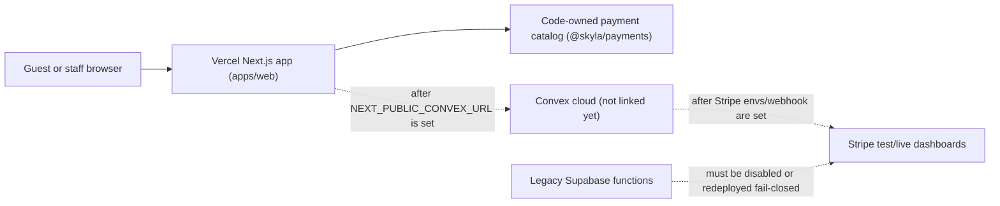

# Skyla Current State

Last checked: 2026-07-06.

This is the plain-English handoff for people, plus enough raw detail for future
agents to keep going safely.

## Simple Summary

Skyla is now a Next.js app in a Turborepo and is hosted on Vercel. The public
domain works on Vercel, and the code is set up so checkout and POS prices are
calculated by trusted server-side code instead of browser-submitted totals.
The linked acceptance harness also checks that payment creation reuses the
stored draft idempotency keys, so Stripe Checkout and Terminal cannot drift
away from the server-owned order or POS sale draft.
Convex payment snapshots now also refuse to start or process Stripe Checkout
and Terminal payments if stored catalog-priced lines are missing or spoofing
the code-owned catalog provenance.

Real card charging is still intentionally blocked. That is good for now. The
site needs the real Convex project, Vercel environment variable, Stripe test
webhook, seeded staff account, and Stripe test-reader setup before checkout or
POS should run a real payment flow.

Admin and POS staff screens use white text on black staff surfaces. The current
catalog is code-owned in `@skyla/payments`; Convex now has code paths and
native admin controls for versioned catalog seeding and audited rollback, but
admin cannot edit prices yet. Checkout and POS catalog lines also carry
code-owned catalog provenance metadata so stored drafts can show which catalog
version, source, authority, and item hash produced each priced line.

## Architecture

## What Works Now

- Vercel production deployment is ready for PR #105 merge commit `3648ee4`.
- `skydeckla.com` and `www.skydeckla.com` are attached to the Vercel project.
- Public routes, native checkout, native members, native experiences, native
  admin, native POS, and compatibility handoff routes smoke-test successfully.
- Checkout and POS no-write probes replace browser-supplied totals with
  server-owned totals.
- Stripe execution routes fail closed while Convex and Stripe dashboards are not
  configured.
- Checkout webhook reconciliation now refuses late failed/canceled events after
  an order is already paid, recording the webhook as failed instead of adding a
  contradictory failed payment event.
- Public Stripe Checkout and Terminal routes return allowlisted response
  shapes, so accidental `clientSecret` or `client_secret` fields from a lower
  layer are stripped before reaching the browser.
- Admin CSV exports, booking lookup, booking/member status actions,
  announcement/hours config, voucher redemption, and POS reader selection are
  native Next/Convex-shaped flows.
- Catalog versioning is modeled in Convex code: admins can seed the code-owned
  catalog from native `/admin`, store immutable snapshots, and activate a
  previous version for rollback after the real Convex project is linked. The
  current `products` mirror deletes SKUs omitted from the active snapshot, while
  historical `productSnapshots` remain for audits.
- Catalog-priced checkout and POS lines carry flat provenance metadata:
  `catalogVersion`, `catalogSource`, `catalogAuthority`, and
  `catalogContentHash`. Custom POS lines keep only the staff-entered reason.
- Stripe Checkout, Terminal PaymentIntent creation, and Terminal reader
  processing now re-check the stored line provenance before contacting Stripe.
- Admin and POS staff pages render high-contrast white text on dark surfaces.
- Bun canary is the package manager and frozen install makes no lockfile
  changes.

## Current Payment Rule

Do not use a real credit card for migration verification yet.

Use Stripe test cards and a Stripe test Terminal reader only after Convex and
Stripe test-mode environment variables are present. Until then, a `503`
`convex_unconfigured` response from payment execution routes is the correct
safe behavior.

## Dashboard Checklist

- [ ] Link or create the real Skyla Convex cloud project.
- [ ] Add `NEXT_PUBLIC_CONVEX_URL` to Vercel Preview and Production.
- [ ] Run `bun run vercel:env:check` after Vercel env setup. It should pass
      only when `NEXT_PUBLIC_CONVEX_URL` is present in Preview/Production and
      Stripe/staff/Terminal secrets are absent from Vercel.
- [ ] Run `bun run dashboard:readiness` to get one safe JSON summary of the
      Vercel and Convex dashboard state plus the next dashboard actions. It
      should pass before linked Preview acceptance; it still says real cards
      are not allowed for migration verification.
- [ ] Add Convex deployment details locally only when needed for linked codegen.
- [ ] Set Convex `SKYLA_STRIPE_MODE=test`.
- [ ] Set Convex `STRIPE_SECRET_KEY` with a test key first.
- [ ] Create a Stripe test webhook endpoint for Convex.
- [ ] Set Convex `STRIPE_WEBHOOK_SECRET`.
- [ ] Set Convex `SKYLA_PAYMENT_RETURN_ORIGINS` to the Vercel preview and
      production origins.
- [ ] Seed initial staff with the bootstrap mutation.
- [ ] Remove or unset `SKYLA_STAFF_BOOTSTRAP_TOKEN` after staff is seeded.
- [ ] Seed the code-owned catalog from native `/admin`, or through
      `POST /api/admin/catalog` with `{"action":"seedCodeOwnedCatalog"}`, using
      a valid admin staff token.
- [ ] Set Convex `SKYLA_TERMINAL_READER_REGISTRY` with test reader IDs.
- [ ] Keep `SKYLA_POS_TERMINAL_ACCEPTANCE` unset until no-write preflight,
      webhook setup, and reader registry checks pass; then enable it only for
      the controlled test-reader attempt.
- [ ] Run `bun run test:acceptance:preflight` against the Vercel Preview branch
      alias to verify staff auth, remote readiness, and reader gating without
      writing test records.
- [ ] Verify `/members` writes to Convex in preview.
- [ ] Verify `/experiences` writes to Convex in preview.
- [ ] Verify checkout creates a Stripe Checkout session in test mode.
- [ ] Verify POS sends a stored `saleRef` total to a Stripe test reader.
- [ ] Verify Stripe webhooks reconcile checkout and Terminal final states.
- [ ] Disable or redeploy old Supabase Stripe/Kaskade functions so any live
      legacy endpoints return the repo's fail-closed behavior.
- [ ] Run `bun run test:supabase-retired:live` with
      `SKYLA_SUPABASE_RETIREMENT_BASE_URL=https://<project-ref>.supabase.co/functions/v1`
      and `SKYLA_SUPABASE_RETIREMENT_LIVE=1` after Supabase dashboard changes.
      Passing means every old function returns retired `410` with the expected
      marker. Disabled `404` only passes with
      `SKYLA_SUPABASE_RETIREMENT_ALLOW_DISABLED=1` after confirming the project
      and function names; `401`/`403` is inconclusive.
- [ ] Only after all preview checks pass, repeat acceptance on production.

## Latest Evidence

| Check | Result |
| --- | --- |
| Vercel project | `web`, framework `nextjs`, Node `24.x` |
| Most recent full production evidence recorded here | PR #105, merged to `main` on July 6, 2026 |
| Evidence deployment | `dpl_HmrWjRmM3jt5kEpt5oqwQrUzjyAX`, status `READY` |
| Evidence URL | `https://web-d3k2cd65i-junyen-enterprises.vercel.app` |
| Evidence commit | `3648ee4e4c5b99d4e31639650a620f7fb729ff80` |
| App/payment behavior verification | PR #105 post-merge smoke checks, rerun on July 6, 2026 |
| Domains | `skydeckla.com`, `www.skydeckla.com` |
| Bun | `1.4.0-canary.1+d37f52067` |
| `bun upgrade --canary` | Vercel install script and GitHub Actions use Bun canary; local revision checked as `1.4.0-canary.1+d37f52067` |
| `bun install --frozen-lockfile` | Passed, no lockfile changes |
| `bun audit --audit-level=low` | No vulnerabilities found |
| Dependency sweep | `bun outdated` produced no upgrade table; direct registry checks found Next, React, Motion, Convex, Turbo, TypeScript, Vitest, and PostCSS current. ESLint 10 remains intentionally deferred because the current Next lint plugin stack still peers against ESLint 9 in key packages. `bun update --latest --dry-run` made no manifest or lockfile change. |
| `bun run test:smoke` | Passed on `https://web-d3k2cd65i-junyen-enterprises.vercel.app` and `https://skydeckla.com` after PR #105 |
| `bun run test:payments` | Passed on `https://skydeckla.com`; no real Stripe charge; now checks exact catalog line provenance metadata and canonical line amounts |
| `bun run test:production-readiness` | Passed on `https://skydeckla.com` and `https://www.skydeckla.com`; production remains dashboard-gated; now includes exact catalog provenance and line amounts in payment no-write probes |
| Convex payment snapshot provenance gate | PR #105 adds unit coverage proving Checkout snapshots reject missing catalog metadata and Terminal reader processing rejects spoofed catalog hashes before Stripe handoff |
| `bun run convex:env:check` | Failed as expected because dashboard envs are absent |
| `bun run vercel:env:check` | Failed as expected against the real `junyen-enterprises/web` dashboard with `envCount: 0`, `readyForConvexUrl: false`, and `safeSecretPlacement: true` |
| `bun run dashboard:readiness` | Added as the combined safe dashboard summary; fails until Vercel and Convex/Stripe dashboard gates are shaped for linked Preview preflight |
| `bun run check` | Passed locally on July 6, 2026 for the payment snapshot provenance branch |
| `bun run security:supabase-retired` | Guards all five legacy Supabase payment/webhook function stubs so they stay HTTP-410 retired surfaces without Supabase helper or Stripe/Kaskade API calls |
| `bun run test:supabase-retired:live` | Operator smoke exists for dashboard verification; it is not run until a Supabase project function base URL is supplied. PR #92 made the smoke require retired `410` markers, or explicit operator approval for disabled `404` results. |
| Payment API audit | No card PAN/CVC collection or storage; no public client secret exposure; server-owned amount authority |
| Stripe API version pin | Requests send `Stripe-Version: 2026-02-25.clover`. Stripe currently documents `2026-06-24.dahlia` as the current API version, but this crosses a named major release and should be upgraded only with a Workbench/webhook endpoint version plan and linked acceptance tests. |
| Staff visual QA | Production `/admin` and `/pos` render white-on-black staff screens; `apps/web/staff-contrast.test.ts` now guards that admin/POS text stays white on dark staff surfaces |
| Staff/admin APIs | `401` without auth and `503 convex_unconfigured` with fake auth; shared staff JSON responses use `no-store` and `Vary: Authorization` |
| Catalog versioning local gate | PR #83 merged; focused tests, Convex schema typecheck, Convex function typecheck, and anonymous Convex validation passed |
| Admin catalog controls | Native `/admin` now exposes admin-only code-owned catalog seed and version activation controls; UI guard tests keep browser price payload/edit controls out of the staff surface |
| Vercel runtime evidence | After PR #105 smoke probes, Vercel reported no error logs for `dpl_HmrWjRmM3jt5kEpt5oqwQrUzjyAX`; non-200 production responses were expected `401` staff gates and `503` Convex-unconfigured gates |

Vercel creates a new production URL after every merge, including docs-only
merges. Treat the app/payment behavior above as the most recent full smoke
evidence recorded in this document, then query Vercel and rerun route/payment
smoke checks before recording fresh exact-deployment evidence.

## Next Code Work

1. Keep runtime catalog/pricing code-owned until linked Convex acceptance passes.
2. After dashboard setup, seed the code-owned catalog into Convex from native
   `/admin` and verify `/api/admin/catalog` shows an active version.
3. Confirm seeded `productSnapshots.contentHash` values match stored
   checkout/POS line `catalogContentHash` values before moving runtime reads to
   Convex catalog data.
4. Only then design admin catalog/pricing edits on top of versioned drafts.
5. Finish refunds with Stripe reconciliation and audit events.
6. Finish destructive admin actions only with typed validators and rollback
   runbooks.
7. Run no-write linked acceptance preflight after dashboard setup.
8. Run linked Convex/Stripe write acceptance after the preflight passes; the
   harness now checks persisted checkout/POS line provenance before optional
   Stripe Checkout or Terminal legs.
9. Keep Convex payment snapshot provenance gates in place so stored draft
   replays cannot drop or spoof catalog identity before Stripe handoff.
10. Keep the Stripe public response allowlists and `clientSecret` regression
   tests in place for any future payment route changes.
