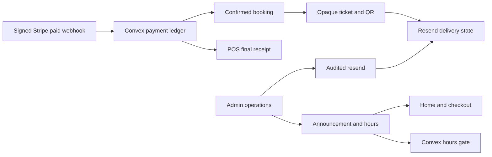
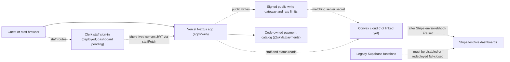

# Skyla Current State

Last checked: 2026-07-13.

This is the plain-English handoff for people, plus enough raw detail for future
agents to keep going safely.

## Current Deployment Identity

This is the single current deployment identity for operator documents:

`6146622` -> `dpl_BiwoKDeCQDVXvEcjH48AEBH6vgLB` ->
`https://web-ei0ntoks8-junyen-enterprises.vercel.app`

The commit is `6146622af1a97cd566109c518bfc3545f1279190`, the PR #127
functionality and security merge. This is both the current deployment identity
and the latest full behavior evidence: post-merge route, payment, and
production-readiness smokes passed on the immutable deployment, apex, and
`www` without a real charge.

## Simple Summary

Skyla is now a Next.js app in a Turborepo and is hosted on Vercel. The public
domain works on Vercel, and the code is set up so checkout and POS prices are
calculated by trusted server-side code instead of browser-submitted totals.
The linked acceptance harness also checks that payment creation reuses the
stored draft idempotency keys, so Stripe Checkout and Terminal cannot drift
away from the server-owned order or POS sale draft.
Convex payment snapshots now also refuse to start or process Stripe Checkout
if its stored email, date, time, or ticket lines are incomplete, and Checkout
and Terminal both reject missing or spoofed code-owned catalog provenance.

Real card charging is still intentionally blocked. That is good for now. The
site needs the real Convex project, Vercel environment variable, Stripe test
webhook, seeded staff account, and Stripe test-reader setup before checkout or
POS should run a real payment flow.

The signed paid Checkout webhook now reconciles the payment ledger, marks the
order paid, and creates exactly one confirmed booking in the same Convex
mutation. Stripe retries reuse the booking instead of duplicating it. This code
still needs a linked test-mode Convex/Stripe acceptance run before cards are
enabled. Payment creation also rejects past dates, dates over 365 days away,
and entry times outside the shared server-owned slot list.
The Checkout return page no longer trusts `?stripe=success`: it checks the
Stripe Session against Convex's server-created payment ledger, derives the
order there, and shows confirmed only
when the paid ledger, paid order, and booking all agree.

## Current Production Improvements

PR #127 merged and deployed the remaining operations loop after local review,
green PR checks, and a green post-merge production verification:

- Paid Checkout and ticket-bearing POS sales create one opaque public ticket.
  The customer can open a noindex ticket page and QR code without seeing staff
  or payment secrets.
- Ticket email delivery is queued from the paid webhook, uses a versioned
  idempotency key, records sent/failed/suppressed state, and gives Admin a
  controlled resend action. Missing email or provider configuration fails
  closed instead of pretending delivery succeeded. Provider completions are
  accepted only for the exact active attempt; an expired five-minute send lease
  or unknown network outcome can be recovered with the same provider
  idempotency key, while a known failed delivery receives a new version. Ticket
  URLs require the environment's explicit HTTPS origin and never fall back from
  Preview or development to production.
- POS polls the authoritative Convex sale ledger after reader handoff and shows
  the final receipt, booking, and ticket instead of treating the browser action
  as payment success. Those asynchronous outcomes are also announced through a
  polite accessibility live region.
- Public announcements and hours now come from Admin config. Checkout blocks
  closed slots in the browser and Convex rechecks the stored hours before draft
  creation and Stripe Session creation. Idempotency replay refuses expired,
  canceled, or paid draft rows instead of reviving a payment button.
- Admin now has masked inquiry lists, separate detail access, and admin-only
  status/notes triage with compact audit records.
- Public inquiry, membership, checkout-draft, and Stripe Checkout writes now
  enter Convex only through a server-to-server gateway. The browser never sees
  its secret. Convex applies atomic per-client and global limits, removes
  expired quota rows in bounded batches, and keeps the underlying write
  functions private.
- Playwright runs eight production-mode browser workflows in CI, including
  mobile overflow, reduced motion, staff contrast, redirects, and fail-closed
  forms. The reduced-motion hero defect found by that suite is fixed.

Signed Stripe refund events now have a read-only reconciliation path. A refund
must match a paid Checkout or Terminal PaymentIntent, amount, currency, and the
still-paid order or POS sale. Admin can see the normalized refund in Payments,
but Skyla cannot initiate a refund. Partial refunds leave fulfillment active;
when cumulative succeeded refunds reach the full paid amount, Skyla cancels the
order/POS sale and booking so the ticket, QR, check-in, and resend paths fail
closed. A supported Stripe reversal restores only state owned by that refund.
This code still needs linked Stripe test-mode acceptance before refund events
are enabled in the Dashboard.

A ledgered migration path is now implemented for legacy bookings, members, and
inquiries. It has immutable export, SHA-256 manifest, quarantine,
development-first apply, summary reconciliation, and per-batch rollback
controls. It does not migrate config, Supabase Auth/passwords, orders, or
payment events, and historical bookings do not create financial records. No
Supabase export has been applied to a cloud Convex deployment.

Admin and POS staff screens use white text on black staff surfaces. The current
catalog is code-owned in `@skyla/payments`; Convex now has code paths and
native admin controls for versioned catalog seeding and audited rollback, but
admin cannot edit prices yet. Checkout and POS catalog lines also carry
code-owned catalog provenance metadata so stored drafts can show which catalog
version, source, authority, and item hash produced each priced line.

In production, the Admin and POS interfaces no longer show a raw pasted
staff-token field. PR #121 shipped route-scoped Clerk v7 for human staff, and a
shared `staffFetch` wrapper obtains a short-lived `convex` JWT only when it makes
a protected request. Convex `staffUsers` records and `requireStaffUser` remain
the role authority, and the bearer API contract remains available for
controlled automation. Clerk/Convex/Vercel dashboard setup is still pending, so
the deployed sign-in path remains in its fail-closed setup-required state.

## Architecture

## What Works Now

- The exact current production identity and the latest full app/payment
  behavior evidence are centralized in
  [Current Deployment Identity](#current-deployment-identity).
- `skydeckla.com` and `www.skydeckla.com` are attached to the Vercel project.
- Public routes, native checkout, native members, native experiences, native
  admin, native POS, and saved `.html` compatibility routes smoke-test
  successfully. The compatibility layer is now a centralized Next.js redirect
  registry rather than duplicate static pages.
- Checkout, Members, Experiences, and Privacy use customer-facing language.
  Temporary fallback messages provide an email next step without exposing
  internal migration, framework, database, or dashboard status.
- Checkout and POS no-write probes replace browser-supplied totals with
  server-owned totals.
- Stripe execution routes fail closed while Convex and Stripe dashboards are not
  configured.
- Checkout webhook reconciliation now refuses late failed/canceled events after
  an order is already paid, recording the webhook as failed instead of adding a
  contradictory failed payment event.
- Public Stripe Checkout and Terminal routes return allowlisted response
  shapes, so accidental `clientSecret` or `client_secret` fields from a lower
  layer are stripped before reaching the browser.
- Public Stripe Checkout responses now set `Cache-Control: no-store`; staff
  Stripe Terminal responses also set `Vary: Authorization`.
- Admin CSV exports, booking lookup, booking/member status actions,
  announcement/hours config, voucher redemption, and POS reader selection are
  native Next/Convex-shaped flows.
- In production, Admin/POS raw token inputs are removed and the staff pages use
  route-scoped Clerk through `staffFetch`. Without the required Clerk and
  Convex envs it shows
  setup-required and protected calls fail closed.
- Convex continues to authorize roles through `staffUsers` and
  `requireStaffUser`. A Clerk account is not automatically Skyla staff, and API
  bearer authentication remains supported for acceptance tooling.
- Catalog versioning is modeled in Convex code: admins can seed the code-owned
  catalog from native `/admin`, store immutable snapshots, and activate a
  previous version for rollback after the real Convex project is linked. The
  current `products` mirror deletes SKUs omitted from the active snapshot, while
  historical `productSnapshots` remain for audits.
- Catalog-priced checkout and POS lines carry flat provenance metadata:
  `catalogVersion`, `catalogSource`, `catalogAuthority`, and
  `catalogContentHash`. Custom POS lines keep only the staff-entered reason.
- Stripe Checkout, Terminal PaymentIntent creation, and Terminal reader
  processing now re-check the stored line provenance before contacting Stripe.
- Terminal PaymentIntent creation also refuses stored POS sales that do not
  already have a trusted Terminal reader saved on the sale.
- Admin and POS staff pages render high-contrast white text on dark surfaces.
- Bun canary is the package manager and frozen install makes no lockfile
  changes.

## Current Payment Rule

Do not use a real credit card for migration verification yet.

Use Stripe test cards and a Stripe test Terminal reader only after Convex and
Stripe test-mode environment variables are present. Until then, a `503`
service-unavailable response from payment execution routes is the correct safe
behavior. Public writes also stay closed until Vercel and Convex have matching,
environment-specific gateway secrets.

## Credit Card Safety Checklist

- [ ] Do not use a real credit card for migration verification.
- [ ] Keep Stripe in test mode until Preview acceptance, production acceptance,
      live webhook setup, rollback planning, and explicit live cutover approval
      are complete.
- [ ] Keep `safeToUseRealCards: false` from `bun run dashboard:readiness`
      during this migration phase.
- [ ] Put Stripe secret keys, webhook secrets, staff bootstrap tokens, and
      Terminal reader registry values in Convex, not Vercel.
- [ ] Create the Stripe webhook endpoint against the Convex HTTP URL, not old
      Supabase function URLs.
- [ ] After this refund code is deployed and older paid rows are checked for
      PaymentIntent linkage, subscribe that endpoint to `refund.created`,
      `refund.updated`, and `refund.failed`.
- [ ] Confirm old Supabase Stripe/Kaskade webhook endpoints are disabled or
      redeployed fail-closed before live payment acceptance.

## Owner Dashboard Checklist

Use the short [owner-only dashboard checklist](runbooks/owner-dashboard-checklist.md).
Its order is intentional:

1. Convex, Clerk, and Vercel configuration.
2. Linked Preview acceptance with Stripe test cards/readers only.
3. The separate ADR 0032 legacy data migration.

Keep Stripe secrets and the Terminal reader registry in Convex. The temporary
`SKYLA_POS_TERMINAL_ACCEPTANCE` latch is also required in the selected Vercel
runtime because the Next Terminal routes fail closed on it; enable it in both
Vercel and the matching Convex deployment only during controlled acceptance,
then remove it from both.

## Latest Evidence

| Check | Result |
| --- | --- |
| Vercel project | `web`, framework `nextjs`, Node `24.x` |
| Current deployment identity | See [Current Deployment Identity](#current-deployment-identity); update the chain there only. |
| App/payment behavior verification | PR #127 post-merge readiness and payment smokes passed on apex, `www`, and the current immutable deployment without a real charge. |
| Route evidence | The PR #127 route smoke used the routes derived from `apps/web/site-routes.mjs`, including `/staff-sign-in` and compatibility redirects. Treat the registry and current smoke output as authority instead of repeating a fixed count in runbooks. |
| Legacy data migration | Implementation and local tests exist for bookings, members, and inquiries; no cloud apply has occurred. |
| Domains | `skydeckla.com`, `www.skydeckla.com` |
| GitHub governance | Rechecked July 6, 2026: `main` requires strict `ci-build`, `Analyze JavaScript and TypeScript`, and `Vercel` checks; admins are enforced; force pushes, branch deletion, and unresolved conversations are blocked; Dependabot vulnerability alerts and automated security fixes are enabled |
| Bun | Reviewed version `1.4.0-canary.1`; local macOS arm64 pin `1.4.0-canary.1+a59a9c37b`; CI/Vercel Linux x64 pin `1.4.0-canary.1+8f1a9540f` |
| Bun install security | Local, both CI jobs, and Vercel download from fixed Skyla release `toolchain-bun-1.4.0-canary.1-8f1a9540f`; one installer verifies a platform-specific SHA-256 and exact `bun --revision` before installation. No production curl-to-shell, self-upgrade, or moving Bun asset URL remains. The current mirror is checksum-safe but predates GitHub release immutability; enable that setting before the next toolchain release. |
| `bun install --frozen-lockfile` | Passed, no lockfile changes |
| `bun audit --audit-level=high` | No vulnerabilities found |
| Dependency sweep | July 13 production merge: upgraded Turbo to `2.10.5`, aligned `@types/node` to Node 24 at `24.13.3`, upgraded the PostCSS override to `8.5.19`, and added Playwright `1.61.1` plus QRCode `1.5.4`. TypeScript stays on `6.0.3` because Next.js `16.2.10` rejects the tested TypeScript 7 major; ESLint 10 remains deferred for plugin compatibility. |
| `bun run test:smoke` | Passed within the PR #127 production-readiness run on apex, `www`, and the current immutable deployment with registry-derived `.html` redirect assertions |
| `bun run test:payments` | Passed after PR #127 on apex, `www`, and the current immutable deployment; no real Stripe charge; checks exact catalog provenance and canonical amounts |
| `bun run test:production-readiness` | Passed after PR #127 on the apex, `www`, and the current immutable deployment; production remains dashboard-gated and no-write. |
| Convex payment snapshot provenance gate | PR #105 adds unit coverage proving Checkout snapshots reject missing catalog metadata and Terminal reader processing rejects spoofed catalog hashes before Stripe handoff |
| Terminal reader gate | Added unit coverage proving Terminal PaymentIntent snapshots fail before Stripe when the stored POS sale has no trusted Terminal reader |
| `bun run convex:env:check` | Failed as expected because dashboard envs are absent |
| `bun run vercel:project:check` | Checks project ID, root `apps/web`, Next.js, Node `24.x`, local Vercel link, package-manager version, fixed Skyla mirror tag, Linux x64 Bun revision/SHA-256, non-moving installer behavior, and repo install/build commands |
| `bun run vercel:env:check` | Production-dashboard evidence on July 13 failed as expected with `envCount: 0`, `readyForConvexUrl: false`, `readyForStaffAuth: false`, `readyForTicketOrigin: false`, and `safeSecretPlacement: true`. |
| `bun run dashboard:readiness` | Includes Vercel project shape, separate Preview/Production Convex URLs, matching public-gateway secrets, Clerk keys/issuer, Stripe, Resend, and separately scoped ticket origins. It remains non-zero and keeps `safeToUseRealCards: false` until dashboard setup and linked acceptance are complete. |
| Clerk staff auth | PR #121 removed raw pasted staff-token UI and deployed route-scoped Clerk v7; `staffUsers` and `requireStaffUser` remain role authority. Dashboard configuration and linked Preview acceptance are pending. |
| `bun run check` | Passed locally and in PR/main CI for PR #127 with Turbo `2.10.5`: 38 web files/188 tests, 30 Convex files/214 tests, 10 setup files/46 tests, package tests, lint, both Convex typechecks, the Next 16.2.10 production build, artifact guard, and legacy Supabase retirement guard. |
| `bun run --cwd apps/web test:e2e` | Eight of eight production-mode Chromium workflows passed, including mobile overflow, reduced motion, fail-closed public forms, staff setup states, white-on-black contrast, and the legacy POS redirect. |
| Local visual QA | July 13 desktop Admin/POS and home plus mobile checkout screenshots were inspected from the production build. Admin and POS text is white and readable on black; setup-required states remain clear; mobile checkout has no horizontal overflow. Helium could not be refreshed because the Mac was locked. |
| `bun run security:supabase-retired` | Guards all five legacy Supabase payment/webhook function stubs so they stay HTTP-410 retired surfaces without Supabase helper or Stripe/Kaskade API calls |
| `bun run test:supabase-retired:live` | Operator smoke exists for dashboard verification; it is not run until a Supabase project function base URL is supplied. PR #92 made the smoke require retired `410` markers, or explicit operator approval for disabled `404` results. |
| Payment API audit | No card PAN/CVC collection or storage; no public `clientSecret`; server-owned amount/catalog authority; private public-write functions behind a signed, rate-limited gateway restricted to Convex-owned origins; signed Stripe webhook reconciliation; full-refund admission invalidation and refund-reversal ticket recovery. |
| Refund reconciliation | PR #119 shipped the web/backend bundle that correlates signed Stripe refund events to paid PaymentIntents, handles Stripe's reversible succeeded lifecycle, enforces final failed/canceled and cumulative amount guards, and exposes server-masked read-only Admin rows. The real Convex deployment and linked test-mode acceptance are still pending. |
| Stripe API version pin | Requests send `Stripe-Version: 2026-02-25.clover`. Stripe currently documents `2026-06-24.dahlia` as the current API version, but this crosses a named major release and should be upgraded only with a Workbench/webhook endpoint version plan and linked acceptance tests. |
| Staff visual QA | The PR #127 hosted Preview and production-mode browser suite confirmed `/admin` and `/pos` render white-on-black staff screens without a Next error overlay. A fresh Helium pass still requires the Mac to be unlocked. |
| Vercel runtime evidence | No error, fatal, or HTTP 500 logs were reported for the checked post-merge window after PR #127. |
| Staff/admin APIs | `401` without auth and `503 convex_unconfigured` with fake auth; shared staff JSON responses use `no-store` and `Vary: Authorization` |
| Catalog versioning local gate | PR #83 merged; focused tests, Convex schema typecheck, Convex function typecheck, and anonymous Convex validation passed |
| Admin catalog controls | Native `/admin` now exposes admin-only code-owned catalog seed and version activation controls; UI guard tests keep browser price payload/edit controls out of the staff surface |
| Payment response cache guard | Current code sets `Cache-Control: no-store` on public payment routes and `Vary: Authorization` on staff Terminal payment routes; keep verifying this on preview and production smokes |

Vercel creates a new production URL after every merge, including docs-only
merges. Update only [Current Deployment Identity](#current-deployment-identity)
when the identity changes; retain dated behavior evidence separately until the
smokes are rerun against the newer deployment.

## Next Code Work

1. Keep runtime catalog/pricing code-owned until linked Convex acceptance passes.
2. After dashboard setup, seed the code-owned catalog into Convex from native
   `/admin` and verify `/api/admin/catalog` shows an active version.
3. Confirm seeded `productSnapshots.contentHash` values match stored
   checkout/POS line `catalogContentHash` values before moving runtime reads to
   Convex catalog data.
4. Only then design admin catalog/pricing edits on top of versioned drafts.
5. Run linked Stripe test-mode refund acceptance and verify older paid rows have
   PaymentIntent linkage before enabling refund subscriptions.
6. Finish destructive admin actions only with typed validators and rollback
   runbooks.
7. Run no-write linked acceptance preflight after dashboard setup.
8. Run linked Convex/Stripe write acceptance after the preflight passes; the
   harness now checks persisted checkout/POS line provenance before optional
   Stripe Checkout or Terminal legs.
9. Keep Convex payment snapshot provenance and fulfillment gates in place so stored draft
   replays cannot drop or spoof catalog identity before Stripe handoff.
10. Keep the Stripe public response allowlists and `clientSecret` regression
   tests in place for any future payment route changes.
11. Run the reviewed Supabase-to-Convex bookings/members/inquiries migration
    only after a cloud Convex development deployment is linked; keep Supabase
    read-only after production reconciliation.
