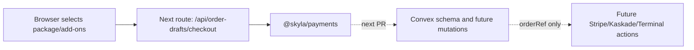

# ADR 0003: Convex Order Authority Spine

Date: 2026-06-30

## Status

Accepted as an incremental migration step.

## Context

Sky LA still has legacy checkout, admin, and POS compatibility pages. Those
pages calculate payment amounts in the browser and call Supabase Edge Functions.
That is useful for continuity, but it is not the target security model.

The migration needs a small, reviewable step that creates server-owned pricing
and order contracts before live provider payment creation moves.

## Decision

- Add `convex/schema.ts` with canonical catalog, order, POS sale, line item,
  payment event, webhook event, booking, member, inquiry, staff, config, and
  audit tables.
- Add `@skyla/payments` for deterministic pricing/order draft math.
- Add a Next route at `/api/order-drafts/checkout` that accepts selections and
  returns server-calculated totals.
- Add `bun run convex:schema:typecheck` so the root check path covers
  `convex/schema.ts` before a real Convex deployment is linked.
- Do not create Stripe, Kaskade, or Terminal provider payments from this route.
- Do not disable Supabase or point webhooks to Convex in this step.

## Consequences

- Tests can now prove that client-supplied amounts are ignored.
- Provider cutover has a safer target: stored order state and expected amounts.
- The repo has a Convex schema before the live deployment is linked.
- A future PR still needs Convex deployment setup, generated Convex types,
  mutations/actions, auth, and webhook verification.
