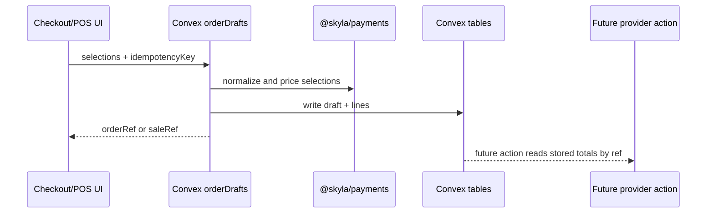

# ADR 0004: Persist Convex Order Drafts Before Payment Cutover

Date: 2026-06-30

## Status

Accepted as an incremental migration step.

## Context

The first order-spine slice introduced canonical pricing and a Convex schema, but
the live compatibility checkout and POS paths still rely on legacy browser and
Supabase payment bridges. Cutting provider payments over before stored order
state exists would keep too much trust in browser-submitted data.

## Decision

- Add Convex mutations and queries under `convex/orderDrafts.ts`.
- Persist checkout drafts to `orders` and `orderLineItems`.
- Persist staff-gated POS sale drafts to `posSales` and `posSaleLines`.
- Require `idempotencyKey` and store a normalized `draftFingerprint` so retries
  return the same draft while conflicting carts fail.
- Generate checkout refs as `SKYYYMM-XXXXXX` to match the admin search pattern.
- Generate POS refs as `SALEYYMMDD-XXXXXX`.
- Derive POS role from Convex auth and `staffUsers`; never accept role or
  totals from the browser.
- Keep live payment/provider cutover out of this step until the real Convex
  deployment and provider actions are configured.

## Consequences

- Retried draft creation is safe and auditable.
- Convex generated types are now committed and checked locally.
- The live Next route still returns transient draft totals until it is wired to a
  real Convex deployment.
- The next payment PR can accept refs only, which is the target security model.
