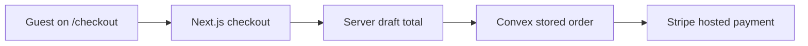

# 0007 - Primary Checkout Moves To App Router

Date: 2026-06-30

## Decision

Use the Next.js App Router for the primary `/checkout` path and keep the old
static checkout available only at `/checkout.html` during the migration.

## Why

The legacy checkout can still compute totals in the browser before calling
Supabase payment functions. That is not acceptable as the long-term payment
authority. The App Router checkout reviews the order through
`/api/order-drafts/checkout`, which uses shared server code and Convex
persistence when configured.

The Stripe step now goes through `/api/payments/stripe-checkout`. That route
accepts only a stored `orderRef` and the matching draft idempotency key, then
asks Convex to create the Stripe Checkout Session from stored order data.

## Human View

If Convex is not configured, the checkout page stops before payment and points
the guest to reservations. This is safer than charging from browser totals.

## Agent Notes

- `/checkout` is now an App Router page.
- `/checkout.html` is still present as a compatibility artifact and must be
  removed or disabled after Convex/Stripe acceptance.
- `/api/payments/stripe-checkout` should never accept amount, currency, line
  items, or product names from the browser.
- Production readiness still requires Vercel `NEXT_PUBLIC_CONVEX_URL`, Convex
  Stripe env vars, and a Stripe dashboard webhook endpoint.
