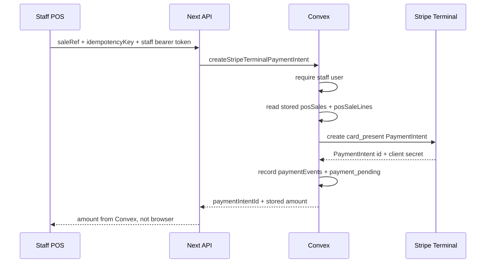

# 0009: Stripe Terminal Sale-Ref Hardening

## Status

Accepted and shipped in PR #26, merged to `main` as
`910d0fa6586f52980e95c6c5ed7ac5e9d2a69bb9`.

This decision was superseded for live reader collection by
[0010: Server-Driven Terminal Reader Handoff](0010-server-driven-terminal-reader-handoff.md),
which removed the browser's need for the Terminal `client_secret` and shipped in
PR #28.

## Plain-English Version

The old POS could ask Stripe to charge whatever total the browser sent. That is
not safe enough for a real register. The new direction is:

1. Save the POS sale first.
2. Give it a `saleRef`.
3. Ask Stripe Terminal to charge only that stored `saleRef`.
4. Record the Stripe PaymentIntent in the payment ledger.

This keeps the browser from deciding the final card amount.

## Decision

Add `payments.createStripeTerminalPaymentIntent` in Convex and expose it through
`/api/payments/stripe-terminal`.

The action accepts:

- `saleRef`
- `idempotencyKey`

It does not accept:

- `amountCents`
- `currency`
- line items
- reader IDs from the browser
- Terminal location IDs from the browser

The action requires a staff-authenticated Convex identity, reads `posSales` and
`posSaleLines`, verifies totals, creates a Stripe `card_present`
PaymentIntent, writes a `paymentEvents` row, and moves the sale to
`payment_pending`. The action returns the PaymentIntent `client_secret` to the
staff-authenticated POS route because Stripe Terminal JS needs it to collect the
payment method on the reader; the ledger stores only sanitized intent metadata.

## Diagram

## Consequences

- Legacy `/pos` Terminal card charging is disabled in the Vercel-served static
  script.
- The repo copy of legacy Supabase Terminal bridge returns `410` by default for
  browser-reachable runtime actions.
- A real POS cutover still needs staff auth, Convex envs, Stripe test reader
  verification, and final payment reconciliation after reader processing.
- Any already deployed Supabase functions must still be disabled or redeployed
  from the fail-closed repo code.
