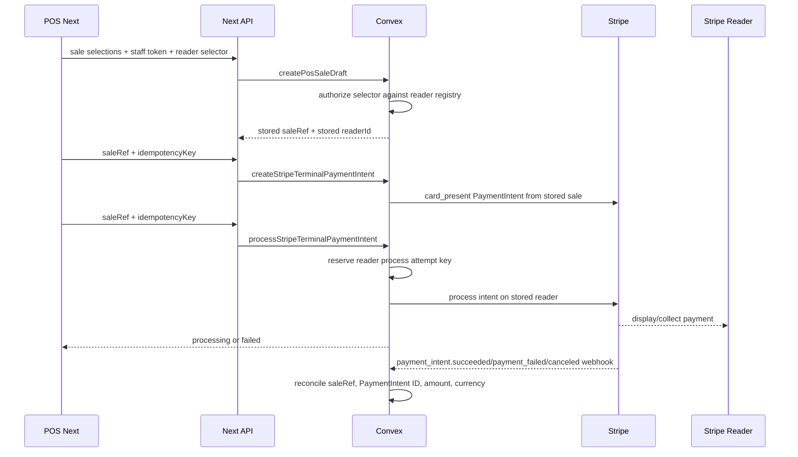

# 0010: Server-Driven Terminal Reader Handoff

## Status

Accepted in `codex/pos-terminal-reader-process` and merged in PR #28 as
`97f42be824797f681f9a7b0e6e71b4ee4fa5302c`.

## Plain-English Version

The POS should not collect cards by letting the browser drive Stripe Terminal
with a client secret. Skyla uses smart readers, so the safer direction is:

1. Store the POS sale in Convex.
2. Store the selected Stripe reader on that sale.
3. Create a Stripe Terminal PaymentIntent from the stored `saleRef`.
4. Ask Stripe to process that stored PaymentIntent on the stored reader.
5. Treat the reader handoff as pending until a signed Stripe PaymentIntent
   webhook confirms the final result.

This keeps amount, currency, lines, and reader choice tied to the persisted sale
instead of loose browser payloads.

## Decision

Add a server-driven Terminal handoff route:

- `POST /api/payments/stripe-terminal/process`
- Convex action: `payments.processStripeTerminalPaymentIntent`
- Stripe API endpoint:
  `/v1/terminal/readers/{reader}/process_payment_intent`

The public route accepts only:

- `saleRef`
- `idempotencyKey`

It does not accept:

- `amountCents`
- `currency`
- line items
- reader IDs
- Terminal location IDs

The stored POS sale must already have a trusted `readerId`. The reader handoff
uses a separate idempotency key from PaymentIntent creation:

```text
skyla:terminal-process:<saleRef>:<paymentIntentId>:<readerId>:attempt-<N>
```

## Flow



## Consequences

- `/pos-next` can now prepare a real server-driven Terminal handoff once Convex,
  staff auth, the trusted reader registry, Stripe, and a test reader are
  configured.
- The public PaymentIntent route no longer returns `clientSecret`; the browser
  does not need it for server-driven reader processing.
- Browser-entered reader IDs are selectors only. Convex will not persist them
  unless `SKYLA_TERMINAL_READER_REGISTRY` authorizes the reader and optional
  location pairing.
- Stored readers are revalidated against `SKYLA_TERMINAL_READER_REGISTRY` again
  before PaymentIntent creation and before reader processing, so revoked readers
  stop working without editing stored draft rows.
- Failed reader handoffs can be retried with a fresh server-reserved attempt
  idempotency key instead of replaying Stripe's cached failed result.
- A short reservation lock prevents duplicate process commands while one reader
  handoff attempt is in flight.
- A reader handoff response is not enough to mark a sale paid. The reader path
  records `processing` or `failed`; signed Stripe PaymentIntent webhooks
  finalize the stored sale.
- Tipping remains disabled for this path unless it is modeled server-side in a
  future decision.
- PR #28 first shipped on production deployment
  `dpl_8XKorTa795wz7RyVgvCMDN3JxANn` at
  `https://web-61n76njga-junyen-enterprises.vercel.app`. Later production
  deployments keep the same payment behavior: routes still fail closed with
  `convex_unconfigured` until Vercel and Convex are wired to the real deployment
  env vars.
