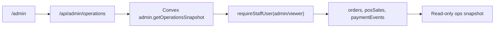

# ADR 0011: Native Admin Operations Spine

## Status

Accepted for the next migration slice.

## Context

The legacy admin page still contains several browser-owned control paths:
local password/session gates, Supabase reads and writes from the browser,
localStorage-backed state, bulk delete/clear actions, booking check-in, member
review, and config/catalog editing. Those workflows are useful, but moving them
unchanged would preserve the risky parts of the old architecture.

Convex already has target tables for orders, POS sales, payments, bookings,
members, inquiries, config, staff users, and audit events. It also has a
`requireStaffUser` helper that checks the authenticated Convex identity against
active staff records and allowed roles.

## Decision

Move `/admin` to a native App Router page first, but start with a read-only
operations snapshot:

- `/admin` renders a Next.js staff operations surface.
- `/admin.html` remains available as the noindex legacy fallback while missing
  workflows are rebuilt.
- `/api/admin/operations` accepts only a bearer token, requires a Convex URL,
  and forwards the token to Convex.
- `admin.getOperationsSnapshot` requires an active `admin` or `viewer` staff
  user before returning readiness, counts, and recent order/POS/payment rows.
- The snapshot returns secret presence booleans only; it never returns secret
  values or Stripe `clientSecret`.
- Booking mutations, member review, config writes, hard delete, reset, and
  clear-all actions stay deferred until typed validators, audit events, and
  rollback procedures are in place.

## Consequences

- Staff can start using the native route for operational visibility once Convex
  and staff users are configured.
- Legacy admin remains as a compatibility escape hatch until its workflows are
  rebuilt safely.
- The migration now has a concrete admin server boundary to extend with audited
  actions.
- The first slice does not yet replace check-in, voucher redemption, member
  review, or config/catalog editing.
