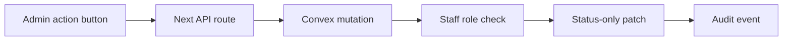

# ADR 0012: Native Admin Status Actions

## Status

Accepted for the native admin migration.

## Context

The first native `/admin` slice is a read-only staff operations snapshot. The
legacy admin page also has useful operational workflows, especially booking
check-in and member review, but it performs those actions from browser-side
code against legacy data paths.

Those workflows should move to the new architecture only when the server owns
the rules. Status changes are the narrowest useful next step because they can
be represented as small, audited state transitions without touching payment,
refund, pricing, catalog, or destructive data paths.

## Decision

Add staff-gated status actions to native `/admin`:

- `/api/admin/bookings/status` accepts `bookingRef`, an allowed status, and an
  optional note.
- `/api/admin/members/status` accepts a member id, an allowed status, and an
  optional note.
- Both routes require a bearer token before checking Convex configuration.
- Both routes fail closed when Convex is not configured.
- Both routes reject arbitrary statuses before calling Convex.
- Convex performs the real staff role check, patches status fields, and writes
  an `auditEvents` row.
- Booking check-in/undo is available to `admin` and `pos` staff.
- Booking cancellation and member review are available only to `admin` staff.

## Still Deferred

- Payment refunds and charge adjustments.
- Voucher redemption.
- Hard delete, clear all, and reset all actions.
- Pricing, menu, hours, announcement, or catalog writes.
- Any action that depends on payment/provider reconciliation.

## Consequences

- Staff get native check-in and member-review building blocks without reviving
  browser-side Supabase writes.
- The status action contract can be tested without a linked Convex deployment.
- The live site remains safe while Vercel has no Convex env vars because all
  admin action routes return `convex_unconfigured`.
- More complex admin actions now have a clear bar: typed validators, role
  checks, audit events, and rollback/reconciliation rules.
