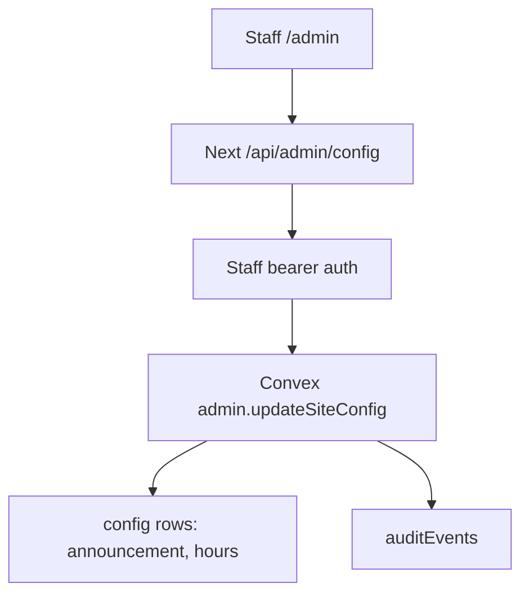

# 0013: Native Admin Config Spine

Status: Accepted for the migration slice.

## Simple Version

The new admin page can now manage low-risk site settings in Convex:

- announcement banner
- business hours

It cannot edit ticket prices, cafe prices, vouchers, refunds, deletes, or resets
yet. Those controls affect money, entitlements, or permanent records, so they
need stronger models before they move out of the legacy admin.

## Why

Checkout and POS totals are currently server-owned in `@skyla/payments`.
Letting admin edit prices before the payment catalog is Convex-backed would
make the admin screen say one price while Stripe charges another.

Hours and announcement text do not change payment totals, so they are a safe
first config slice.

## Flow



## Raw Agent Contract

- Read: `GET /api/admin/config`
- Write: `POST /api/admin/config`
- Auth: staff bearer token required before Convex is called
- Writable keys: `announcement`, `hours`
- Announcement shape:

```json
{ "active": true, "text": "Rooftop open late tonight", "type": "info" }
```

- Hours shape:

```json
{
  "Monday": { "open": "09:00", "close": "00:00", "closed": false },
  "Tuesday": { "open": "09:00", "close": "00:00", "closed": false },
  "Wednesday": { "open": "09:00", "close": "00:00", "closed": false },
  "Thursday": { "open": "09:00", "close": "00:00", "closed": false },
  "Friday": { "open": "09:00", "close": "00:00", "closed": false },
  "Saturday": { "open": "09:00", "close": "00:00", "closed": false },
  "Sunday": { "open": "09:00", "close": "00:00", "closed": false }
}
```

## Deferred

- Ticket, add-on, and cafe price edits need catalog versioning.
- Voucher redemption needs entitlement tables.
- Refunds need provider reconciliation and idempotency.
- Hard delete, clear all, and reset all need soft-delete, restore, and audit
  policy.
