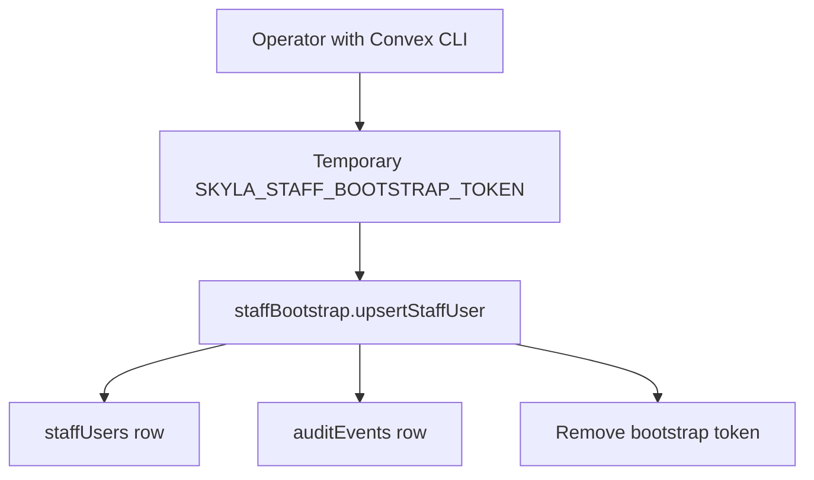

# 0014: Token-Gated Staff Bootstrap

Status: Accepted for the migration slice.

## Simple Version

Native `/admin` and `/pos-next` need Convex `staffUsers` rows before staff can
log in with real Convex auth.

Manual table edits are easy to get wrong, so the repo now has a typed bootstrap
mutation:

- `staffBootstrap.upsertStaffUser`

It only runs while a temporary Convex secret,
`SKYLA_STAFF_BOOTSTRAP_TOKEN`, is set. After the initial staff rows are seeded,
remove that token.

## Why

The new staff routes already check Convex identity subjects and staff roles.
That is safer than browser-local admin passwords, but it creates a first-user
problem: there is no admin until one is seeded.

The bootstrap mutation solves only that setup step. It does not create a
browser login, bypass staff auth, touch payment records, or enable live
checkout/POS payment.

## Flow



## Raw Agent Contract

Run after the real Convex project is linked:

```bash
PATH="$HOME/.bun/bin:$PATH" bunx convex env set SKYLA_STAFF_BOOTSTRAP_TOKEN "$SKYLA_STAFF_BOOTSTRAP_TOKEN"
PATH="$HOME/.bun/bin:$PATH" bunx convex run staffBootstrap:upsertStaffUser '{
  "bootstrapToken": "<same temporary token>",
  "subject": "<Convex auth identity subject>",
  "email": "admin@skydeckla.com",
  "role": "admin",
  "active": true,
  "note": "initial admin seed"
}'
PATH="$HOME/.bun/bin:$PATH" bunx convex env remove SKYLA_STAFF_BOOTSTRAP_TOKEN
```

Rules:

- token must be at least 32 characters
- subject is the identity anchor
- email is normalized to lowercase
- role must be `admin`, `pos`, or `viewer`
- duplicate email with a different subject is rejected
- every create/update writes an audit event

## Deferred

- Real staff sign-in/session UX
- GitHub branch protection setup
- Convex staff-management UI
- Pricing, voucher, refund, delete, and reset workflows
