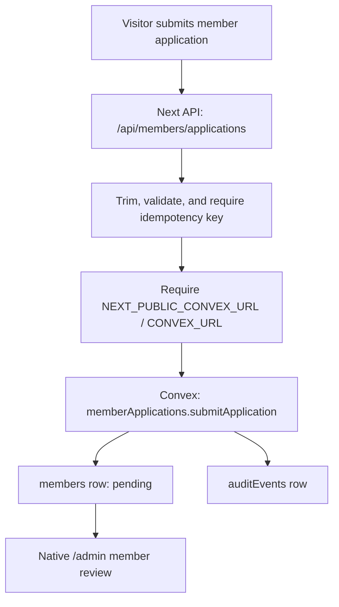

# 0015: Native Member Application Spine

Status: Accepted for the migration slice.

## Simple Version

Skyla's public member application form still lives in the legacy compatibility
page. It saves to browser localStorage first and only tries to sync to the old
cloud path afterward.

This slice adds the safer server path:

- `POST /api/members/applications`
- `memberApplications.submitApplication`
- structured fields on Convex `members`
- a compact audit event

The public `/members` page is not cut over yet. That is intentional. The native
path fails closed until the real Convex URL is wired in Vercel, so switching the
visible form before dashboard setup would turn real applications into errors.

## Why

Member applications include personal contact details and committee notes. They
should not rely on browser-local storage or best-effort public inserts.

The new path gives the app a clear rule: the application is "received" only
after the server validates it and Convex stores it.

## Flow



## Rules

- Required fields: `firstName`, `lastName`, `email`, `tier`,
  `idempotencyKey`.
- Optional fields: `phone`, `source`, `bio`.
- Tier must be `obsidian`, `gold`, or `black`.
- Email is lowercased into `emailLower` for lookup and stored with the submitted
  display form as `email`.
- Client-supplied `status`, `id`, `createdAt`, or other spoofed fields are
  ignored.
- New applications always start as `pending`.
- Exact idempotent retries return the existing application.
- Reusing an idempotency key for a different application returns a conflict.
- The audit event records email, tier, and source only. It does not store phone
  or bio in audit metadata.

## Raw Agent Contract

Use this endpoint from the future native `/members` form:

```bash
curl -sS https://skydeckla.com/api/members/applications \
  -H 'content-type: application/json' \
  -d '{
    "firstName": "Ari",
    "lastName": "Stone",
    "email": "ari@example.com",
    "tier": "gold",
    "source": "Referred by a current member",
    "bio": "Interested in private skyline events.",
    "idempotencyKey": "member_apply_20260702_ari_stone"
  }'
```

Expected states:

- Without Convex env: `503` with `code: "convex_unconfigured"`.
- First accepted write: `201` with `member.status: "pending"`.
- Exact retry: `200` with the same member and `replayed: true`.
- Conflicting retry: `409`.

## Deferred

- Cut over visible `/members` UI to the native route.
- Add a native member review detail drawer and CSV export in `/admin`.
- Backfill old `skyla_members` / Supabase rows into structured Convex fields.
- Remove legacy member localStorage/Supabase code after acceptance.
