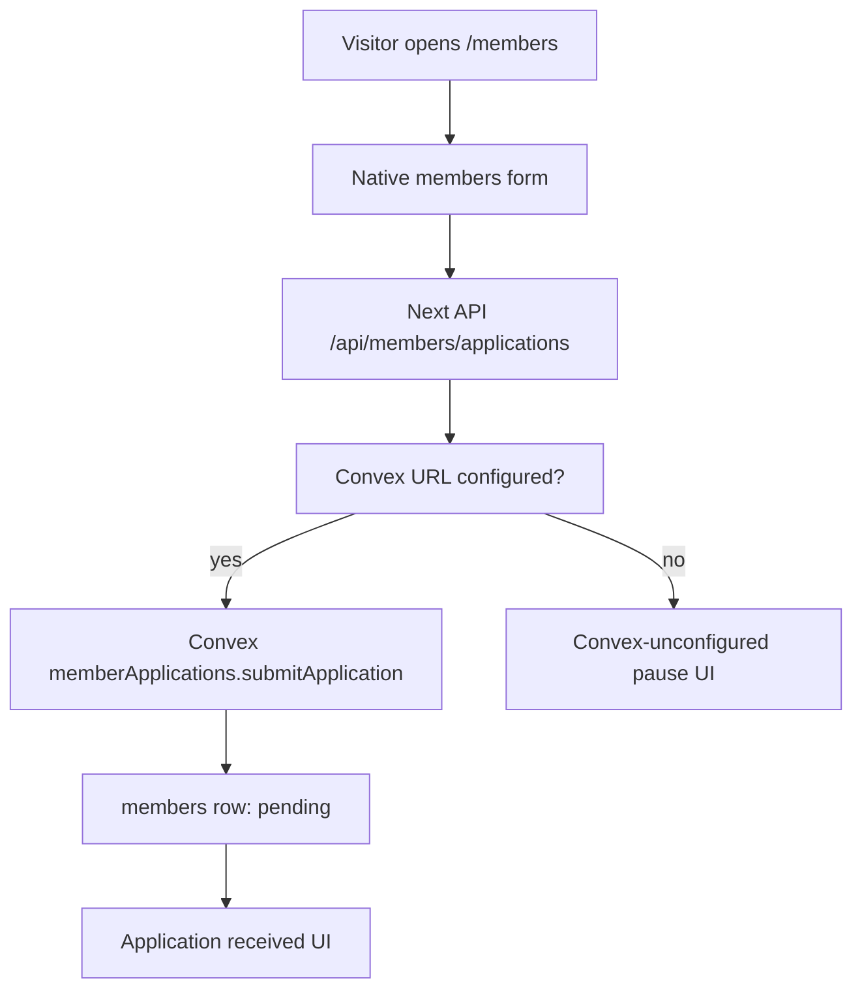

# 0017: Native Members Page Cutover

Status: Accepted for this migration slice.

## Simple Version

`/members` is now a Next.js App Router page. `/members.html` remains as a
compatibility artifact for old links, but the canonical public route no longer
uses the legacy `SkylaData.addMember` path that wrote to browser localStorage
and tried to mirror into Supabase.

The native form posts to `POST /api/members/applications` with an idempotency
key. It only shows the visitor a success state after the server accepts the
application. When Convex is not linked, it shows a clear pause message instead
of pretending the application was received.

## Why

Member applications include contact details and committee notes. The old page
made the browser the source of truth first, then tried to sync somewhere else.
That is the wrong direction for the target architecture.

The new route keeps the public experience available while moving the business
rule into the server boundary:

- the browser sends applicant fields only,
- the server validates field shape and idempotency,
- Convex is required before any application is accepted,
- the app does not create spoofable `status`, `createdAt`, or local member
  records from the client.

## Flow



## Preserved

- Public `/members` URL.
- `/members.html` compatibility URL.
- Membership tiers and pricing language.
- Private lounge, cigar lounge, members bar, and privileges content.
- Google/SkylaAds lead tracking after server-accepted submission.
- Meta Pixel page view and lead tracking after server-accepted submission.
- Five-business-day response expectation and confidentiality language.

## Intentionally Changed

- No active `/members` submission uses `shared-data.js`.
- No active `/members` submission calls `SkylaData.addMember`.
- No native success state appears unless `/api/members/applications` returns a
  member record.
- Convex-unconfigured production behavior is a visible pause, not a fake
  success.

## Raw Agent Contract

After this cutover, route ownership was:

- `legacyRoutes`: `experiences`, `pos`
- `nativePublicRoutes`: `about`, `cafe`, `checkout`, `members`, `privacy`,
  `terms`
- `/members.html`: compatibility only

Decision [0018](0018-native-experiences-inquiry-cutover.md) later moves
`experiences` into `nativePublicRoutes`.

Acceptance checks:

```bash
bun run --cwd apps/web test:unit legacy-routes.test.ts
bun run --cwd apps/web build
```

The native page should contain `MembersApplicationClient`, and the client should
call `/api/members/applications` with `idempotencyKey`.

## Deferred

- Linked Convex production acceptance.
- Native member review detail drawer and CSV export in `/admin`.
- Backfill from old `skyla_members` / Supabase rows.
- Removing `members.html` and member-related legacy helper code after traffic
  and linked Convex acceptance are verified.
