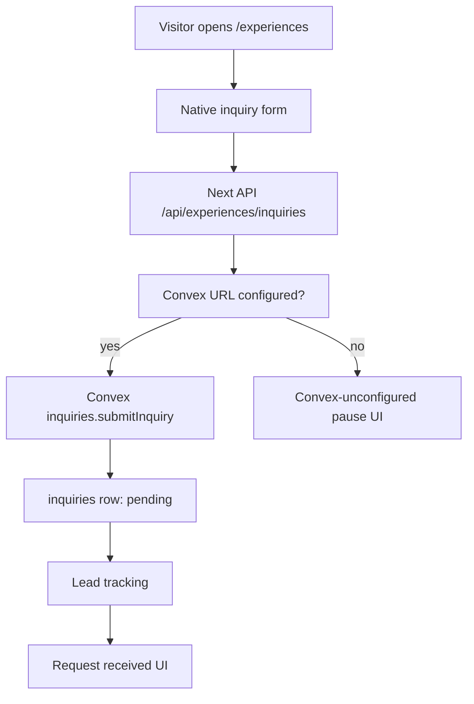

# 0018: Native Experiences Inquiry Cutover

Status: Accepted for this migration slice.

## Simple Version

`/experiences` is now a Next.js App Router page. `/experiences.html` remains as
a compatibility artifact for old links, but the canonical public route no
longer uses the legacy `SkylaData.addInquiry` path that wrote to browser
localStorage and tried to mirror into Supabase.

The native form posts to `POST /api/experiences/inquiries` with an idempotency
key. It only shows the visitor a success state after the server accepts the
inquiry. When Convex is not linked, it shows a clear pause message instead of
pretending the inquiry was received.

## Why

Experience inquiries include contact details, event dates, group sizes, and
private notes. They should not rely on browser-local storage or best-effort
public inserts.

The new route keeps the public experience content available while moving the
business rule into the server boundary:

- the browser sends inquiry fields only,
- the server validates field shape and idempotency,
- Convex is required before any inquiry is accepted,
- the app does not create spoofable `status`, `createdAt`, or local inquiry
  records from the client,
- Google/SkylaAds and Meta lead tracking only fire after server acceptance.

## Flow



## Preserved

- Public `/experiences` URL.
- `/experiences.html` compatibility URL.
- Deep-link anchors: `#the-bar`, `#date-night`, `#private-rooms`, and
  `#reserve`.
- Hero, bar, date-night, private-room, private-event, pricing, and
  `events@skylalosangeles.com` content.
- Google/SkylaAds lead tracking after server-accepted submission.
- Meta Pixel page view and lead tracking after server-accepted submission.
- 24-hour response expectation.

## Intentionally Changed

- No active `/experiences` submission uses `shared-data.js`.
- No active `/experiences` submission calls `SkylaData.addInquiry`.
- No native success state appears unless `/api/experiences/inquiries` returns an
  inquiry record.
- Convex-unconfigured production behavior is a visible pause, not a fake
  success.

## Raw Agent Contract

After this cutover, route ownership should be:

- `legacyRoutes`: `pos`
- `nativePublicRoutes`: `about`, `cafe`, `checkout`, `experiences`,
  `members`, `privacy`, `terms`
- `/experiences.html`: compatibility only

Acceptance checks:

```bash
bunx vitest run apps/web/experience-inquiries-route.test.ts convex/inquiries.test.ts apps/web/legacy-routes.test.ts
bun run convex:schema:typecheck
bun run convex:functions:typecheck
bun run --cwd apps/web build
```

The native page should contain `ExperienceInquiryClient`, and the client should
call `/api/experiences/inquiries` with `idempotencyKey`.

Expected API states:

- Without Convex env: `503` with `code: "convex_unconfigured"`.
- First accepted write: `201` with `inquiry.status: "pending"`.
- Exact retry: `200` with the same inquiry and `replayed: true`.
- Conflicting retry: `409`.

## Deferred

- Linked Convex production acceptance.
- Native inquiry review in `/admin`. The inquiry CSV export is now covered by
  [0027](0027-native-admin-csv-exports.md).
- Backfill from old `skyla_inquiries` / Supabase rows.
- Removing `experiences.html` and inquiry-related legacy helper code after
  traffic and linked Convex acceptance are verified.
