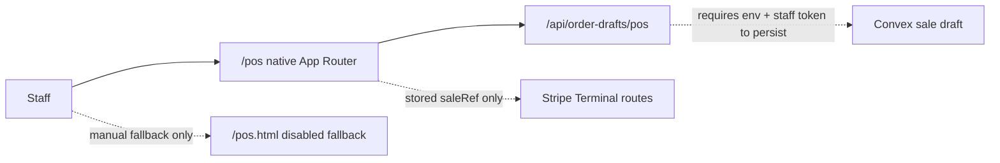

# 0021: Native POS Route Cutover

Date: 2026-07-02

## Status

Accepted for this migration slice.

## Plain-English Version

The safer POS screen was already built at `/pos-next`: it asks the server to
price the sale and can only send Stripe Terminal work through stored Convex
sale references. The risky old POS screen lived at `/pos`: it was disabled for
card-present charging, but it still loaded the old browser/localStorage/Supabase
code.

This decision moves the extensionless `/pos` route onto the native App Router
screen. At the time, the old file remained available only at `/pos.html` as a
compatibility fallback while the remaining dashboard and reader acceptance work
was finished. Decision 0025 later retired `/pos.html` to a native handoff page.

## Decision

- Add a native App Router page at `/pos`.
- Keep `/pos-next` as a compatibility URL for the same native POS shell during
  rollout.
- Remove `/pos` from the extensionless legacy rewrite list.
- Keep `/pos.html` in `apps/web/public` as a compatibility URL. Decision 0025
  later changed it from a legacy fallback into a handoff page.
- Keep `/pos`, `/pos-next`, and `/pos.html` marked `noindex, nofollow`.
- Keep live Terminal payment gated until real Convex, staff auth, Stripe
  webhooks, and Stripe test-reader acceptance pass.

## Flow

## Consequences

- Staff and production smoke tests should treat `/pos` as the native route.
- Staff compatibility checks should target `/pos.html`, not `/pos`, but should
  now verify handoff behavior and retired asset absence.
- Any future live payment acceptance must test native `/pos`; `/pos.html`
  should not be re-enabled for browser-authoritative card-present charging.
- The old `/pos-next` URL can be removed after dashboards, acceptance tests,
  and staff documentation have settled on `/pos`.
