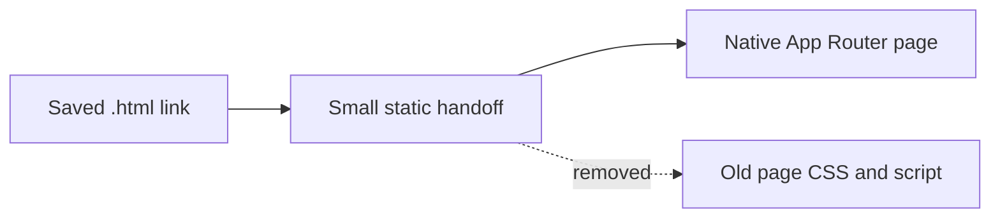

# Decision 0022: Public HTML Handoff Cleanup

## Status

Accepted for the public compatibility cleanup.

## Context

The App Router now owns the public content routes:

- `/about`
- `/cafe`
- `/experiences`
- `/members`
- `/privacy`
- `/terms`

The matching `.html` URLs still matter for older ads, bookmarks, crawlers, and
historical links, but the full legacy HTML/CSS/JS page copies were no longer
the source of truth. Keeping them around created two problems:

- stale content could drift from the native App Router pages;
- old page CSS, menu scripts, and third-party snippets stayed publicly served
  even after the routes moved into Next.js.

## Decision

Replace the public `.html` compatibility pages with small handoff pages that
preserve query strings and hashes, then remove the old public page CSS and
navigation script assets:

- `about.css`
- `cafe.css`
- `experiences.css`
- `members.css`
- `styles.css`
- `script.js`

The compatibility pages still return `200` and point visitors to the matching
native route, but they no longer ship full legacy page markup.

## Consequences

- Old `.html` links keep working.
- Public content no longer has duplicate static page implementations.
- The app serves less legacy CSS/JS from `apps/web/public`.
- Route and production-readiness tests now guard this handoff contract.
- Admin/POS fallbacks are unchanged; `/admin.html` and `/pos.html` still remain
  explicit noindex staff compatibility surfaces.
