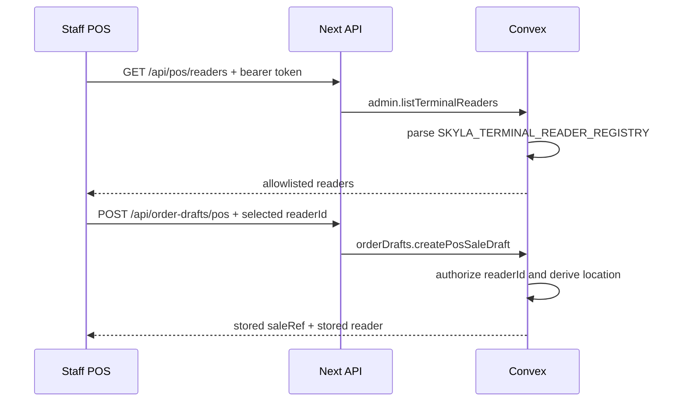

# 0026: POS Reader Registry Selector

## Status

Accepted in `codex/pos-reader-registry-selector`.

## Plain-English Version

Staff should not type Stripe Terminal reader or location IDs into the POS during
a sale. The POS now loads the trusted reader list from Convex after staff auth,
then staff choose from that list.

This is safer because the browser no longer invents reader locations. Convex is
still the final authority before a sale can be sent to a Stripe Terminal reader.

## Decision

- Add `GET /api/pos/readers`.
- Require a staff bearer token before checking Convex configuration.
- Use Convex query `admin.listTerminalReaders`.
- Read `SKYLA_TERMINAL_READER_REGISTRY` only inside Convex.
- Reject empty or duplicate reader registry entries.
- Keep `/api/order-drafts/pos` accepting only `readerId` as a selector.
- Ignore browser-sent `terminalLocationId`; Convex derives location from the
  registry before storing a POS sale.

## Flow

## Consequences

- The native POS interface no longer has free-text `tmr_...` or `tml_...`
  fields.
- The reader-list route is safe to probe in production because it returns `401`
  without staff auth and `503` when Convex is not configured.
- Payment routes still accept only stored refs and idempotency keys; reader
  selection happens before payment execution.
- Real acceptance still needs Convex linked, staff seeded, Stripe webhook
  configured, `SKYLA_TERMINAL_READER_REGISTRY` set, and
  `SKYLA_POS_TERMINAL_ACCEPTANCE=enabled` only after test-reader validation.
