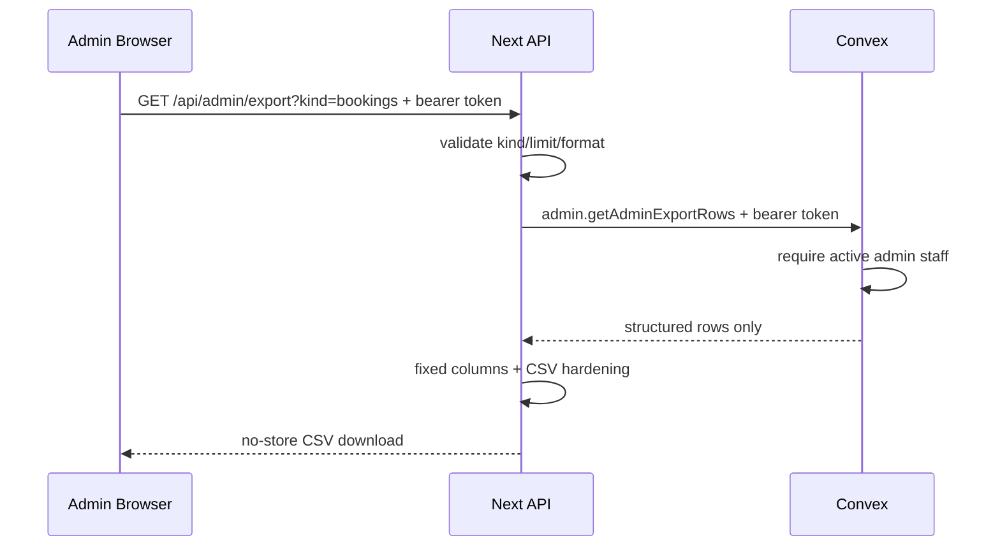

# 0027: Native Admin CSV Exports

## Status

Accepted in `codex/admin-csv-exports`.

## Plain-English Version

Admin staff can download the main operating lists from the native admin screen:
bookings, members, inquiries, orders, POS sales, and payments.

This is useful for operations and backups, but it is also sensitive because the
files include customer contact data. The export path is admin-only, avoids raw
Stripe/webhook payloads, masks payment and Terminal IDs, and protects CSV cells
from spreadsheet formulas.

## Decision

- Add `GET /api/admin/export`.
- Require a staff bearer token before checking Convex configuration.
- Use Convex query `admin.getAdminExportRows`.
- Require the Convex staff role to be `admin`.
- Cap each export at 250 newest rows.
- Export only fixed, reviewed column allowlists.
- Return `Cache-Control: no-store` and `Vary: Authorization` on every response.
- Prefix formula-like CSV cells before quoting them.
- Mask Stripe provider payment IDs, raw event IDs, Terminal reader IDs, and
  Terminal location IDs in bulk CSV files.
- Never export raw provider payloads, idempotency keys, bearer tokens, API keys,
  `clientSecret`, or `client_secret`.

## Flow

## Consequences

- Member and inquiry CSV export deferrals from earlier ADRs are resolved for the
  native admin route.
- Exports are for current operations and migration support, not a replacement
  for database backups.
- Full payment-provider reconciliation still belongs in controlled Stripe and
  Convex dashboards, not a broad CSV download.
- Refunds, hard deletes, pricing edits, and reset workflows remain deferred
  until they have typed models, audit events, and rollback instructions.
