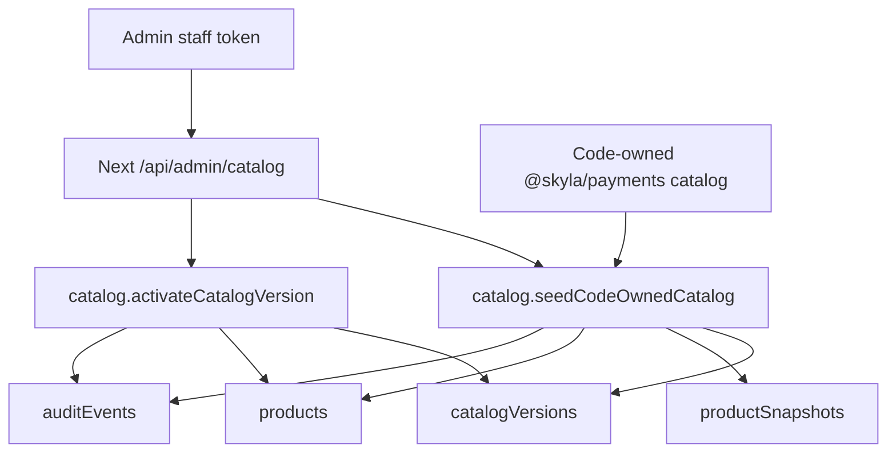

# 0028: Convex Catalog Versioning

Status: Accepted for the migration slice.

## Simple Version

Skyla now has a Convex path for catalog governance:

- seed the code-owned `@skyla/payments` catalog into Convex
- store immutable product snapshots for each catalog version
- keep one catalog version active
- reactivate an older seeded version for rollback
- audit seed and activation events

This does not make ticket, add-on, or cafe prices editable in admin yet.

## Why

Checkout and POS payment totals are intentionally server-owned. The current
runtime authority is still `@skyla/payments`, so letting staff edit prices
directly in admin would create a dangerous split: admin might show one price
while checkout or Stripe charges another.

Catalog versioning is the safer middle step. It gives the team a Convex-backed
record of exactly which code-owned prices were seeded, when they were activated,
and how to roll back to a previous known version.

## Flow



## Raw Agent Contract

- Read: `GET /api/admin/catalog`
- Seed: `POST /api/admin/catalog`
- Rollback/activate: `POST /api/admin/catalog`
- Auth: staff bearer token required before Convex is called
- Admin role required in Convex for seed and activation mutations
- Browser-submitted `products` or `prices` payloads are rejected before Convex
  is called

Seed payload:

```json
{ "action": "seedCodeOwnedCatalog", "note": "initial code-owned catalog seed" }
```

Activate payload:

```json
{
  "action": "activateVersion",
  "version": "skyla-payments-catalog-2026-07-05",
  "note": "rollback to checked catalog"
}
```

## Rollback Rules

1. Only an existing `catalogVersions` row can be activated.
2. The version must have the expected number of `productSnapshots`.
3. Reconstructed snapshot content must match the version `contentHash`.
4. Activating a version deactivates other active versions.
5. Current `products` rows are rewritten from the immutable snapshots.
6. The activation writes an audit event with the version, source, authority,
   item counts, and content hash.

## Deferred

- Admin-created catalog drafts.
- Staff price editing.
- Checkout/POS runtime reads from Convex catalog data.
- Payment acceptance that depends on Convex catalog data.

Those steps wait until the real Convex project is linked, the code-owned catalog
is seeded in Preview, and linked Convex/Stripe acceptance has passed.
