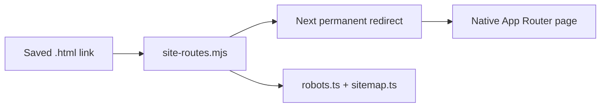

# Decision 0029: App Router Compatibility Redirects

## Status

Accepted.

## Context

Native App Router pages now own every public and staff route that previously
needed a static compatibility document. The remaining nine `.html` files did
not contain product functionality; each duplicated redirect script, metadata,
styles, and a fallback link. Keeping those files made route policy, robots
rules, sitemap entries, smoke tests, and static assets drift independently.

## Decision

Keep saved links working through one checked route registry:

- `apps/web/site-routes.mjs` owns native public routes, staff routes, saved
  `.html` redirects, robots exclusions, and sitemap entries.
- `apps/web/next.config.mjs` emits permanent redirects for public `.html`
  paths and preserves request query strings.
- `apps/web/proxy.ts` handles `/admin.html` and `/pos.html` so their 308
  responses also carry `X-Robots-Tag: noindex, nofollow`.
- `app/robots.ts` and `app/sitemap.ts` generate metadata from the registry.
- `apps/web/public` contains assets only; it no longer contains compatibility
  HTML, `robots.txt`, or `sitemap.xml`.
- The tracked-artifact guard prevents the retired static files and old route
  registry from returning.

## Consequences

- Old bookmarks and campaign links continue to resolve without duplicate page
  implementations.
- Query strings survive the redirect. URL fragments remain browser-owned and
  are not sent to the server.
- `/admin`, `/admin.html`, `/pos`, `/pos.html`, and `/pos-next` remain excluded
  from indexing.
- Route smoke tests follow redirects for user-facing availability, while the
  production-readiness smoke separately verifies redirect status, destination,
  and query preservation.
- The legacy Supabase function stubs remain until live dashboard retirement is
  proven; this decision does not remove those fail-closed controls.
