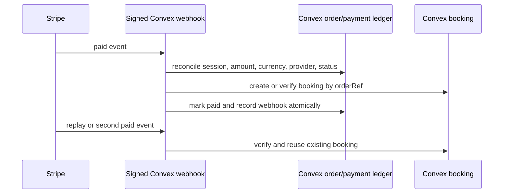

# Decision 0030: Atomic Checkout Booking Fulfillment

## Status

Accepted.

## Context

A signed paid Stripe Checkout event could previously mark its stored order paid
without creating a front-desk booking. That leaves a guest charged but absent
from operations. Browser return parameters are also not proof of payment, and
Stripe can deliver one event more than once or deliver more than one paid event
for the same Checkout Session.

## Decision

- Refuse to create a Stripe Checkout Session unless the stored online order has
  a valid customer email, visit date, `HH:mm` entry time, and at least one
  positive ticket line.
- Keep entry slots in shared server-owned code, reject past dates and unknown
  slots, and limit bookings to the next 365 days.
- On a reconciled paid webhook, derive a confirmed booking only from those
  stored fields and the stored ticket quantities.
- Use the one-to-one `orderRef` as the deterministic `bookingRef`.
- Insert the booking, fulfillment audit event, paid payment event, order update,
  and processed webhook event in one Convex mutation.
- Query bookings through `by_orderRef`. Replays reuse a matching booking and do
  not create another audit or paid-ledger row.
- Compare immutable fulfillment fields on replay, while preserving later
  operational status changes such as check-in or cancellation.
- Treat `?stripe=success` as a return from Stripe, not payment confirmation.

## Consequences

- A successful mutation cannot leave the order paid without its booking.
- Stripe retries are safe and front-desk status changes are not overwritten.
- Checkout now stores machine-readable time values while showing friendly
  12-hour labels in the browser.
- Real-card acceptance is still blocked until the Convex project, Stripe test
  webhook, and linked acceptance tests are configured through the dashboards.
