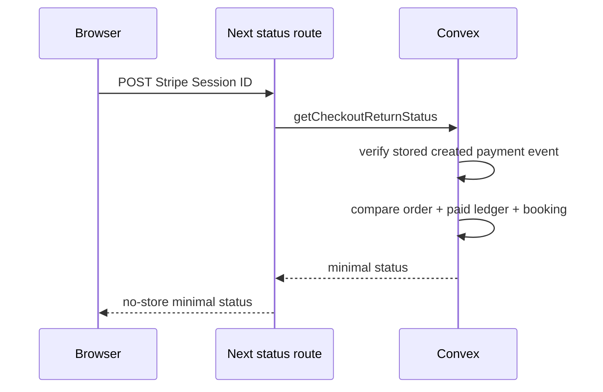

# Decision 0031: Authoritative Checkout Return Status

## Status

Accepted.

## Context

Stripe redirects the browser after hosted Checkout, but a query string is not a
signed payment event. Showing success from `?stripe=success` can mislead a guest
when the webhook is delayed, failed, or never accepted. Looking up by the
shorter order reference alone would also create an avoidable status-enumeration
surface.

## Decision

- Use the high-entropy Stripe Checkout Session ID as the only bearer capability.
- Verify the Session ID belongs to exactly one Convex-created payment event and
  derive its `orderRef` from that event rather than accepting an order lookup.
- Return only `orderRef` and one minimal state: `pending`, `confirmed`, `failed`,
  or `canceled`. Do not return email, amount, line items, or provider payloads.
- Report `confirmed` only when the order is paid, a paid payment-ledger event
  exists, and the linked booking exists.
- Expose the query through a non-cacheable POST route so polling does not repeat
  the Session ID in request URLs. Poll briefly with bounded transient retries.
- Set `Referrer-Policy: no-referrer` for Checkout and remove payment parameters
  from browser history after hydration.
- Keep unknown sessions and internal failures generic.

## Consequences

- A browser redirect cannot claim payment confirmation by itself.
- The status endpoint derives the order from a server-created event and exposes
  no guest or payment detail.
- Dashboard-linked test acceptance must prove pending becomes confirmed only
  after the signed webhook creates the booking.
