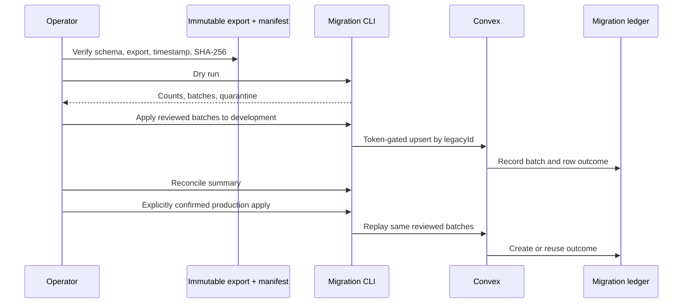

# Decision 0032: Ledgered Supabase To Convex Migration

## Status

Accepted. The implementation and local tests exist; no cloud data migration has
been performed.

## Context

Skyla has legacy guest bookings, membership applications, and event inquiries
in Supabase and, in some browser profiles, localStorage. These records need a
repeatable path into Convex. A direct one-off insert would make it difficult to
prove what moved, distinguish reruns from duplicates, or reverse one bad batch.

The old records are operational data, not a trustworthy payment ledger. A
historical booking must not manufacture an order, payment event, webhook event,
or provider status after the fact. Config data, Supabase Auth, and passwords
also have different security and ownership rules.

## Decision

- Migrate only `bookings`, `members`, and `inquiries`.
- Exclude config, catalog/menu data, Supabase Auth users and passwords, local
  admin passwords, orders, POS sales, and payment/webhook records.
- Import a verified physical-table export containing `id`, `data`, and
  `created_at` from each supported Supabase table.
- Preserve the raw legacy object in `rawLegacy` while mapping useful fields
  into the canonical Convex table.
- Give each source row a stable `legacyId`, `legacySource`, and
  `legacyFingerprint`; include the complete source namespace in `legacyId` so
  two Supabase projects cannot collide.
- Use deterministic SHA-256 manifests and batches of at most 50 rows.
- Record every applied batch in `legacyMigrationBatches` and every row outcome
  in `legacyImportRecords`.
- Maintain bounded per-source counts and per-target active batch references;
  verify every reviewed manifest batch in chunks instead of collecting the
  complete ledger in one Convex query.
- Make exact batch replay a no-op and reject a reused batch ID whose content
  changed.
- Reuse identical existing imports, but reject changed source data instead of
  overwriting operational edits.
- Require a temporary 32+ character `SKYLA_DATA_MIGRATION_TOKEN` for upsert,
  summary, and rollback functions.
- Use `ConvexHttpClient` over the selected deployment's HTTPS `convex.cloud`
  URL so PII and the migration token are request-body data, not process
  arguments.
- Require dry run, zero unresolved quarantine, development apply,
  reconciliation, and explicit production confirmation in that order.
- Require explicit confirmation for every remote apply or rollback because a
  Convex client URL does not identify its environment.
- Store PII-bearing review artifacts only under the ignored `.migration/`
  directory.
- Keep localStorage recovery in a separate source namespace and manually
  resolve overlap with Supabase before import.
- Retain Supabase read-only after reconciliation until the agreed retention and
  deletion decision.

## Rollback Decision

Rollback is intentionally per batch and conservative:

- Delete only a row created by that batch when its current fingerprint still
  matches the imported fingerprint.
- Refuse deletion when the created row changed after import.
- Report reused rows for manual review; do not delete their shared target.
- Refuse deletion while a later active batch references the same target.
- Refuse deletion of a booking after voucher redemption history exists.
- Keep rolled-back batch IDs retired so a corrected import uses a new reviewed
  batch identity.

This protects operational edits made after migration and keeps rollback from
silently overwriting newer truth.

## Consequences

- Operators can prove the source bytes, batch content, row outcome, and active
  imported counts without placing PII in summary or audit events.
- Exact retries are safe, including resuming after a process stops between
  batches.
- Remote apply, summary, and rollback need an explicit deployment label plus a
  Convex HTTPS URL. Every remote mutation needs explicit confirmation; the
  read-only summary does not.
- A changed source record stops the import for manual resolution, protecting
  staff or operational edits from stale exports.
- Supabase and localStorage identities cannot collide accidentally, but
  cross-source business duplicates must be removed during review.
- Historical bookings remain operational bookings only. Financial ledgers stay
  based on server-authoritative orders and signed provider events.
- Cloud migration remains an operator action governed by
  [the migration runbook](../runbooks/supabase-convex-data-migration.md).
