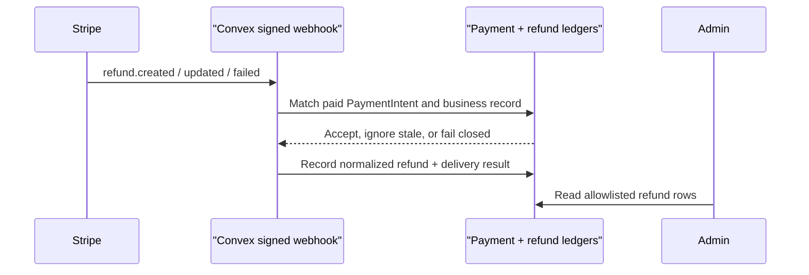

# Decision 0033: Stripe Refund Reconciliation

## Status

Accepted in code. Linked Convex/Stripe test-mode acceptance is still pending.

## Context

Stripe can create refunds outside Skyla, including from the Dashboard. Staff
need to see those outcomes without trusting browser input or inventing payment
state. A fully refunded booking must also stop producing a valid admission
credential, while a partial refund must not silently cancel the visit.

Checkout and Terminal payments already have server-authoritative order/POS
records and signed webhook ledgers. Refund reconciliation must attach to that
same authority. It must also tolerate webhook retries and out-of-order updates.

## Decision

- Accept only signed `refund.created`, `refund.updated`, and `refund.failed`
  events at the existing Convex Stripe webhook.
- Correlate a refund by Stripe PaymentIntent ID to an existing paid Checkout or
  Terminal payment event.
- Re-read the associated order or POS sale and require it to remain paid with
  the same amount, currency, and expected provider.
- Store a normalized refund allowlist. Do not persist the arbitrary Stripe
  object or expose internal Convex document fields through Admin.
- Treat `failed` and `canceled` as final refund states. A newer Stripe event may
  move `succeeded` back to `requires_action` or `failed` when returned funds or
  corrected banking details change the outcome.
- Ignore older events and exact state repeats without adding another refund
  audit event. The webhook event itself remains recorded for delivery evidence.
- Return a retryable HTTP failure without writing a final deduplication receipt
  for up to 72 hours when the paid PaymentIntent ledger has not arrived yet.
  This lets Stripe redeliver after Checkout/Terminal reconciliation wins the
  race without retrying unrelated account-wide refunds indefinitely. After the
  window, store a durable failure for operator review and acknowledge it. This
  matches Stripe's documented live webhook retry horizon while keeping the
  account-wide unknown-payment case finite.
- Reject identity conflicts and cumulative successful refunds above the
  original paid amount.
- Show refunds read-only in the native Admin Payments tab. Mask provider IDs in
  the server projection so full identifiers do not enter browser memory. Do not
  add a browser refund command in this slice.
- Leave fulfillment unchanged while cumulative succeeded refunds remain below
  the original paid amount.
- When cumulative succeeded refunds equal the original paid amount, atomically
  cancel the order or POS sale and its booking. Ticket lookup remains visible
  as cancelled, while QR, check-in, email delivery, and resend fail closed.
- Record the exact refund-owned transition in scalar audit metadata. If Stripe
  later moves a succeeded refund back to `requires_action` or `failed`, restore
  only fields that still match the refund-owned state; preserve intervening
  operator changes.

## Operational Gate

Before subscribing a Stripe endpoint to refund events:

1. Deploy this code to the target Convex deployment.
2. Check whether existing paid `paymentEvents` rows have
   `providerPaymentIntentId`. Backfill or explicitly resolve any older paid row
   before relying on refund correlation.
3. Keep Stripe in test mode and exercise partial, full, failed, duplicate, and
   out-of-order refund events.
4. Confirm a partial refund leaves fulfillment active, a cumulative full refund
   cancels the order/POS sale and booking, and the public QR returns inactive.
5. Reverse the succeeded test refund and confirm only refund-owned state is
   restored.

Stripe documents the normalized refund object and supported statuses in its
[Refund object reference](https://docs.stripe.com/api/refunds/object). The
Dashboard webhook endpoint version must support the all-refund event family;
verify that endpoint version in Workbench when adding the subscriptions.

## Consequences

- Dashboard-created refunds become visible and auditable without creating a new
  money-moving API.
- A refund cannot attach to an unknown or contradictory payment.
- Partial refunds remain an operations decision; full refunds automatically
  invalidate admission so a refunded customer cannot present an active ticket.
- Historical paid rows created before PaymentIntent linkage may need an
  explicit one-time backfill after the real Convex deployment is linked.
