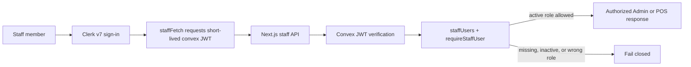

# Decision 0034: Clerk To Convex Staff Authentication

## Status

Accepted and shipped in PR #121. The code is deployed, but Clerk, Convex, and
Vercel dashboard configuration and linked acceptance are still pending.

## Context

The native Admin and POS interfaces previously asked staff to paste a bearer
token into the browser. That made a sensitive credential part of the visible UI
and encouraged operators to handle it as a long-lived secret. Skyla still needs
the existing bearer API contract for smoke tests, linked acceptance, and other
controlled automation, but human staff need a normal sign-in flow.

Authentication and authorization are separate concerns in this system:

- Clerk proves which person is signed in.
- Convex decides whether that identity is an active Skyla staff user and which
  role it has.

## Decision

- Use Clerk v7 only on the staff routes that need it: `/staff-sign-in`,
  `/admin`, `/pos`, and `/pos-next`. Public routes do not require a global Clerk
  provider.
- Remove raw pasted staff-token controls from the Admin and POS user
  interfaces.
- Obtain a short-lived Clerk JWT with the `convex` audience at request time
  inside a shared `staffFetch` wrapper. The wrapper accepts Clerk's integrated
  session token when its audience is already `convex`, otherwise it requests
  the named `convex` template. It adds the existing
  `Authorization: Bearer <token>` header without exposing the JWT through page
  state, props, local storage, or session storage. The wrapper refuses
  cross-origin destinations and non-staff API paths before requesting a token.
- Keep the API bearer contract. It remains the transport contract between the
  Next.js routes and Convex and remains available to controlled automation.
- Keep `staffUsers` and `requireStaffUser` as the role authority. A valid Clerk
  session proves identity but does not grant a Skyla role by itself. The Clerk
  user ID must match the `subject` of an active `staffUsers` row.
- Configure Convex to trust only the Clerk issuer supplied through
  `CLERK_JWT_ISSUER_DOMAIN`, with Clerk's `convex` JWT template/application ID.
- Fail closed when any required Clerk, Convex, or Vercel setting is absent.
  Staff pages may show a setup-required state, but protected APIs must not fall
  back to pasted tokens or anonymous access.
- Bootstrap the first staff row with the Clerk user ID as `subject`, using the
  temporary `SKYLA_STAFF_BOOTSTRAP_TOKEN`, and remove that token immediately
  after the row is verified.

## Required Dashboard Configuration

| Setting | Dashboard | Required Scope |
| --- | --- | --- |
| `NEXT_PUBLIC_CLERK_PUBLISHABLE_KEY` | Vercel | Preview and Production |
| `CLERK_SECRET_KEY` | Vercel | Preview and Production; server secret |
| `NEXT_PUBLIC_CONVEX_URL` | Vercel | Preview and Production |
| `CLERK_JWT_ISSUER_DOMAIN` | Convex | Matching Preview/development and Production deployments |

The Clerk application must have its Convex integration activated so it provides
the required `convex` JWT audience/template. Do
not put `CLERK_SECRET_KEY` in `NEXT_PUBLIC_*`, Convex, documentation, logs, or
acceptance output.

## Consequences

- Human staff no longer copy authentication secrets into Admin or POS.
- Tokens stay short-lived and are acquired only when a staff request is made.
- Existing API and acceptance tooling can continue using bearer credentials.
- Clerk account creation alone cannot create an admin; Convex still enforces
  active staff membership and role.
- Staff sign-in is intentionally not operational until all dashboard gates pass,
  the first Clerk identity is bootstrapped into `staffUsers`, and linked Preview
  acceptance verifies both allowed and denied roles.
