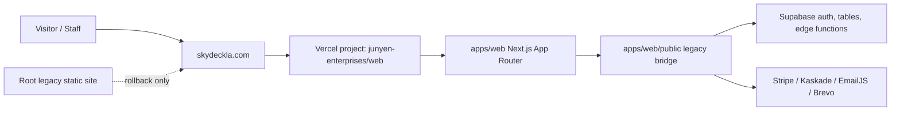
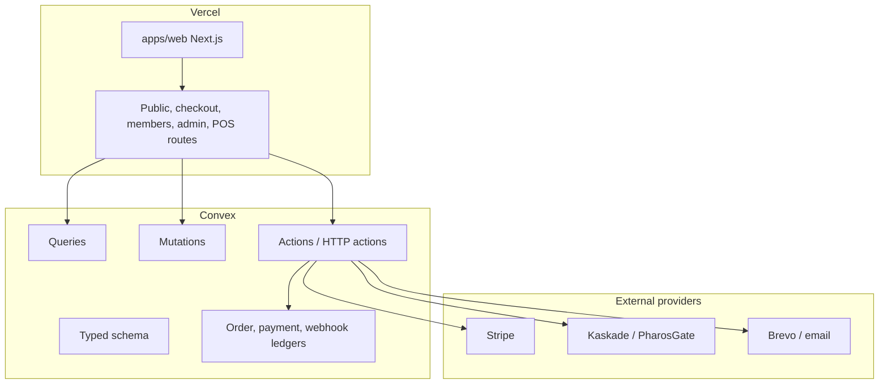

# Skyla Phase 2 Roadmap

Last updated: 2026-06-30

## Plain-English Goal

Skyla is moving from a flat static site with browser-heavy business logic into a maintainable product app:

- Vercel serves the production domain.
- Next.js owns public pages, checkout, admin, and POS.
- Convex becomes the canonical database and server logic layer.
- Stripe, Kaskade, email, admin, and POS actions become server-authoritative.
- Legacy static files are kept only as a temporary compatibility and rollback bridge.
- Bun is evaluated and adopted deliberately across local development, CI, and Vercel where it is stable enough for production.

The work should move in small PRs. Each PR should leave the site deployable, testable, and reversible.

## Current Shape



Why this is okay short term:

- It prevents broken public URLs during DNS cutover.
- It keeps the old GitHub Pages site available as rollback.
- It gives us a safe place to rebuild route-by-route instead of doing one risky rewrite.

Why this is not the final state:

- Checkout and paid booking creation are still too browser-controlled.
- Admin and POS rely heavily on client-side behavior.
- Supabase-era functions and data access are still outside the target architecture.
- Root files make the repo harder to understand and easier to accidentally deploy.

## Target Shape



Why this is better:

- Server code calculates money, roles, and state transitions.
- Webhooks become idempotent and auditable.
- Staff actions can be authorized and logged consistently.
- Tests can target real business boundaries instead of browser globals.
- The repo structure tells future contributors where things live.

## Target Repository Layout

```text
skyla/
  apps/
    web/
      app/
        (public)/
        checkout/
        members/
        admin/
        pos/
        api/ or route handlers where needed
      components/
      lib/
      public/
        images/
  packages/
    config/
    ui/
    data/              # shared types/contracts for Convex-facing data
    payments/          # shared order/payment contract helpers
    testing/           # optional shared test utilities
  convex/
    schema.ts
    bookings.ts
    members.ts
    orders.ts
    payments.ts
    webhooks.ts
    staff.ts
    http.ts
  docs/
    phase-2-roadmap.md
    migration-plan.md
    migration-progress.md
    architecture.md
    environment.md
    decisions/
    runbooks/
  legacy-static/
    public-site/       # old root pages after rollback window closes
  scripts/
    migrations/
    audits/
```

## Workstreams

Supporting detail:

- Raw discovery findings: [audits/phase-2-discovery.md](audits/phase-2-discovery.md)
- Bun decision record: [decisions/0001-bun-canary-evaluation.md](decisions/0001-bun-canary-evaluation.md)
- Legacy cleanup decision record: [decisions/0002-legacy-static-cleanup.md](decisions/0002-legacy-static-cleanup.md)

### 1. Repository Cleanup

Move the repo from "static site plus new app" to "new app plus archived legacy source."

Initial actions:

- Keep root legacy files until GitHub Pages rollback is explicitly retired.
- Move old root HTML/CSS/JS to `legacy-static/public-site/` after rollback is no longer needed.
- Keep `apps/web/public` compatibility files until their App Router replacements are live.
- Deduplicate images so canonical assets live under `apps/web/public/images`.
- Keep `output/`, `tmp/`, generated PDFs, logs, local env files, and generated CSVs ignored.

Definition of done:

- Root contains project-level files only.
- Public URLs are served by App Router routes or intentional compatibility redirects.
- Legacy source remains discoverable, but not mixed with active app entrypoints.

### 2. Bun Adoption

Bun should be adopted deliberately, not by half-switching lockfiles.

Initial actions:

- Install/upgrade canary locally with Bun's canary command: `bun upgrade --canary`.
- Generate a text `bun.lock`, not binary-only `bun.lockb`, because Turborepo needs text lockfile analysis.
- Replace `pnpm-lock.yaml` only after Bun install/build/test passes locally and in CI.
- Configure Vercel with Bun-compatible install/build commands and `bunVersion` where supported.
- Keep Node `24.x` documented while Next/Vercel function runtime behavior is validated.

Definition of done:

- CI installs with Bun.
- Vercel production deploys with the same package-manager behavior as CI.
- `bun run check` covers lint, typecheck, build, and tests.
- Rollback to pnpm is documented until Bun canary proves stable.

### 3. Convex Migration

Convex should own canonical data and business state.

Initial tables:

- `bookings`
- `members`
- `inquiries`
- `config`
- `orders`
- `paymentEvents`
- `webhookEvents`
- `staffUsers`
- `auditEvents`

Initial server boundaries:

- Public inquiry/member submissions: Convex mutations.
- Checkout/order creation: Convex mutation creates an order with canonical prices.
- Stripe/Kaskade payment creation: Convex action uses stored order state.
- Webhooks: Convex HTTP actions verify signatures, enforce expected amount/currency/status, and write idempotent events.
- Admin/POS: Convex queries/mutations enforce staff roles server-side.

Definition of done:

- Supabase reads/writes are replaced route-by-route.
- Dual-run migration has reconciled counts and sampled data.
- Supabase functions are disabled only after verification and explicit rollback decision.

### 4. Product Functionality Rebuild

Rebuild the compatibility bridge into real Next routes.

Priority order:

1. Legal and content pages: `/privacy`, `/terms`, `/about`, `/cafe`, `/experiences`.
2. Members flow: `/members`.
3. Checkout flow: `/checkout`.
4. Admin gate and dashboard: `/admin`.
5. POS flow: `/pos`.

Definition of done:

- Each route has a typed App Router implementation.
- Legacy `.html` paths redirect or rewrite intentionally.
- Reduced-motion and mobile layouts are verified.
- Admin/POS are `noindex` and authenticated.

### 5. QA, Security, And GitHub Hardening

Add safety rails before removing the old deployment surfaces.

Initial actions:

- Add route/header smoke tests for production and previews.
- Add checkout/order unit tests around canonical pricing.
- Add webhook idempotency tests.
- Add admin/POS authorization tests.
- Add dependency and secret scanning workflows.
- Protect `main`, require PRs, and require CI.
- Track and fix current bridge risks: client-authoritative payment creation, local admin password fallback, stored-XSS surfaces, POS `setup-reader` mismatch, and POS/admin date-format drift.

Definition of done:

- PRs cannot merge without checks.
- Production deploys have a repeatable smoke-test checklist.
- Security findings are tracked and fixed or explicitly accepted.

Baseline now in progress:

- `pnpm test:unit` covers shared pricing/contact constants and the temporary legacy-route bridge.
- `pnpm security:artifacts` blocks tracked generated artifacts, local env files, obvious provider keys, and private keys.
- `pnpm security:audit` fails on high or critical dependency advisories across production and dev tooling.
- `pnpm test:smoke` checks the route matrix and admin/POS `X-Robots-Tag` headers against a supplied deployment URL.
- Dependabot, CodeQL, CODEOWNERS, and `SECURITY.md` are present in repo config; GitHub dashboard protection remains a separate verification step.

## PR Ladder

1. Roadmap and tracker docs.
2. QA/security baseline branch.
3. Bun canary experiment branch.
4. Repo cleanup branch after explicit GitHub Pages rollback retirement.
5. App Router content routes.
6. Convex scaffold and schema.
7. Server-authoritative order/payment boundary.
8. Members flow.
9. Admin/POS rebuild.
10. Supabase shutdown and legacy-static cleanup.
11. GitHub Pages shutdown after explicit confirmation.

## Raw Operational Data For Agents

Current verified Vercel data:

- Team: `Junyen Enterprises`
- Team ID: `team_3kWPO8fPD6E7x39voGoNNeog`
- Project: `web`
- Project ID: `prj_fhlOjcwSbnPAuLi8tTiGbhjVomnr`
- Vercel project root: `apps/web`
- Production branch: `main`
- Current production commit observed after roadmap merge: `6891fc5acd444f8ad1c63c0cf90a7740b1a72ff9`
- Domains attached and Vercel-verified: `skydeckla.com`, `www.skydeckla.com`
- Nameservers: `ns1.vercel-dns.com`, `ns2.vercel-dns.com`

Current package baseline:

- Next.js `16.2.9`
- React `19.2.7`
- Motion `12.42.0`
- Turborepo `2.10.1`
- TypeScript `6.0.3`
- Current package manager before Bun migration: `pnpm@11.9.0`

Useful verification commands:

```bash
pnpm check
dig +short skydeckla.com NS
dig +short skydeckla.com A
dig +short www.skydeckla.com A
curl -I https://skydeckla.com
curl -I https://www.skydeckla.com
```

Vercel CLI in this environment:

```bash
CORE="/Users/jeung-yenlui/.cache/codex-runtimes/codex-primary-runtime/dependencies"
PATH="$CORE/node/bin:$CORE/bin:$PATH"
"$CORE/bin/pnpm" dlx vercel@latest ls web --scope junyen-enterprises
```

## Active Risks

- Bun canary can introduce instability; adopt with a PR-sized rollback path.
- Local DNS/browser caches can lag a nameserver cutover; the current apex and `www` smoke tests now pass without overrides.
- Root legacy files are still needed for rollback until GitHub Pages rollback is explicitly retired.
- Client-side payment/admin logic must not be treated as secure just because it is now served from Vercel.
- Convex migration should be dual-run and reconciled before Supabase shutdown.
