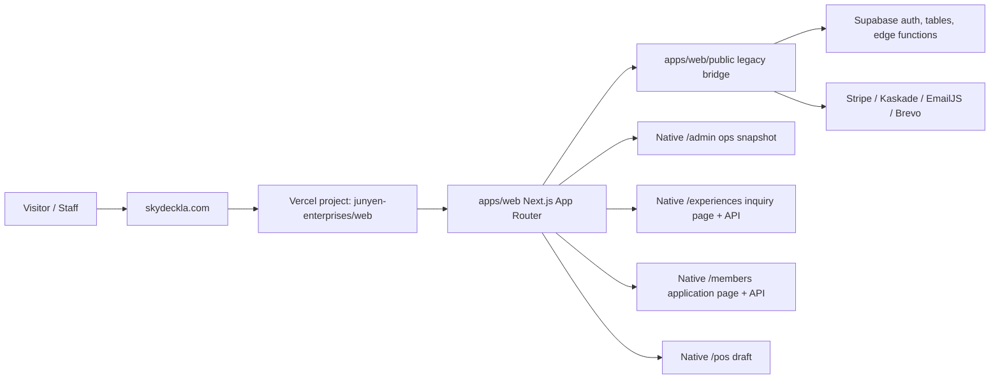
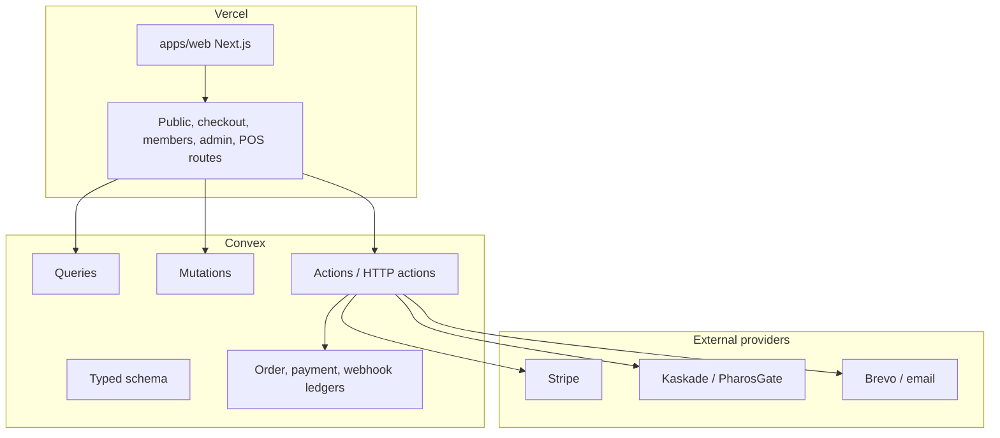

# Skyla Phase 2 Roadmap

Last updated: 2026-07-02

## Plain-English Goal

Skyla is moving from a flat static site with browser-heavy business logic into a maintainable product app:

- Vercel serves the production domain.
- Next.js owns public pages, checkout, admin, and POS.
- Convex becomes the canonical database and server logic layer.
- Stripe, Kaskade, email, admin, and POS actions become server-authoritative.
- Legacy static files are kept only as app-owned compatibility pages under `apps/web/public`.
- Bun canary is adopted deliberately across local development, CI, and Vercel builds.

The work should move in small PRs. Each PR should leave the site deployable, testable, and reversible.

## Current Shape


```mermaid
flowchart LR
  visitor["Visitor / Staff"]
  domain["skydeckla.com"]
  vercel["Vercel project: junyen-enterprises/web"]
  next["apps/web Next.js App Router"]
  bridge["apps/web/public legacy bridge"]
  admin["Native /admin ops snapshot"]
  experiences["Native /experiences inquiry page + API"]
  members["Native /members application page + API"]
  posDraft["Native /pos draft"]
  supabase["Supabase auth, tables, edge functions"]
  payments["Stripe / Kaskade / EmailJS / Brevo"]

  visitor --> domain
  domain --> vercel
  vercel --> next
  next --> bridge
  next --> admin
  next --> experiences
  next --> members
  next --> posDraft
  bridge --> supabase
  bridge --> payments
```

Why this is okay short term:

- It prevents broken public URLs during DNS cutover.
- It gives us a safe place to rebuild route-by-route instead of doing one risky rewrite.
- Hosting rollback can use previous Vercel deployments.

Why this is not the final state:

- Checkout and paid booking creation are still too browser-controlled.
- Admin and POS rely heavily on client-side behavior.
- Supabase-era functions and data access are still outside the target architecture.
- Public content compatibility files in `apps/web/public` are now handoff-only
  where typed App Router routes own the content. Staff fallbacks and remaining
  backend legacy surfaces still need typed replacements.
- `/admin` is now being cut over route-by-route: the native page is staff-token gated and has read-only operations plus audited booking/member status actions, while `/admin.html` remains available for legacy workflows until the remaining Convex admin mutations are complete.
- The native `/members` page now posts to the server application API and fails
  closed until Convex is configured. `/members.html` remains as a compatibility
  artifact while linked Convex acceptance is verified.
- The native `/experiences` page now posts to the server inquiry API and fails
  closed until Convex is configured. `/experiences.html` remains as a
  compatibility artifact while linked Convex acceptance is verified.
- The native `/pos` page now renders the server-priced App Router POS shell.
  `/pos-next` remains as a compatibility URL for the same shell, and
  `/pos.html` remains as the disabled legacy fallback until Stripe test-reader
  acceptance is complete.

## Target Shape


```mermaid
flowchart TB
  subgraph vercel["Vercel"]
    web["apps/web Next.js"]
    routes["Public, checkout, members, admin, POS routes"]
  end

  subgraph convex["Convex"]
    schema["Typed schema"]
    queries["Queries"]
    mutations["Mutations"]
    actions["Actions / HTTP actions"]
    ledgers["Order, payment, webhook ledgers"]
  end

  subgraph providers["External providers"]
    stripe["Stripe"]
    kaskade["Kaskade / PharosGate"]
    email["Brevo / email"]
  end

  web --> routes
  routes --> queries
  routes --> mutations
  routes --> actions
  actions --> stripe
  actions --> kaskade
  actions --> email
  actions --> ledgers
```

Why this is better:

- Server code calculates money, roles, and state transitions.
- Webhooks become idempotent and auditable.
- Staff actions can be authorized and logged consistently.
- Tests can target real business boundaries instead of browser globals.
- The repo structure tells future contributors where things live.

## Target Repository Layout

```text
skyla/
  apps/
    web/
      app/
        (public)/
        checkout/
        members/
        admin/
        pos/
        api/ or route handlers where needed
      components/
      lib/
      public/
        images/
  packages/
    config/
    ui/
    data/              # shared types/contracts for Convex-facing data
    payments/          # shared order/payment contract helpers
    testing/           # optional shared test utilities
  convex/
    schema.ts
    bookings.ts
    members.ts
    orders.ts
    payments.ts
    webhooks.ts
    staff.ts
    http.ts
  docs/
    phase-2-roadmap.md
    migration-plan.md
    migration-progress.md
    architecture.md
    environment.md
    decisions/
    runbooks/
  scripts/
    migrations/
    audits/
    setup/
```

## Workstreams

Supporting detail:

- Raw discovery findings: [audits/phase-2-discovery.md](audits/phase-2-discovery.md)
- Bun decision record: [decisions/0001-bun-canary-evaluation.md](decisions/0001-bun-canary-evaluation.md)
- Legacy cleanup decision record: [decisions/0002-legacy-static-cleanup.md](decisions/0002-legacy-static-cleanup.md)

### 1. Repository Cleanup

Move the repo from "static site plus new app" to "new app with explicit compatibility bridges."

Initial actions:

- Remove root legacy duplicates after Vercel custom-domain cutover is verified.
- Keep `apps/web/public` compatibility files until their App Router replacements are live.
- Deduplicate images so canonical assets live under `apps/web/public/images`.
- Keep `output/`, `tmp/`, generated PDFs, logs, local env files, and generated CSVs ignored.

Definition of done:

- Root contains project-level files only.
- Public URLs are served by App Router routes or intentional compatibility redirects.
- Legacy source remains discoverable, but not mixed with active app entrypoints.

### 2. Bun Adoption

Bun should be adopted deliberately, not by half-switching lockfiles.

Initial actions:

- Install/upgrade canary locally with Bun's canary command: `bun upgrade --canary`.
- Generate a text `bun.lock`, not binary-only `bun.lockb`, because Turborepo needs text lockfile analysis.
- Replace `pnpm-lock.yaml` only after Bun install/build/test passes locally and in CI.
- Configure Vercel with Bun-compatible install/build commands and `bunVersion` where supported.
- Keep Node `24.x` documented while Next/Vercel function runtime behavior is validated.
- Track Turbo's warning about Bun canary lockfile version 2 until that integration is resolved.

Definition of done:

- CI installs with Bun.
- Vercel production deploys with the same package-manager behavior as CI.
- `bun run check` covers lint, typecheck, build, and tests.
- Rollback to pnpm is documented until Bun canary proves stable.

### 3. Convex Migration

Convex should own canonical data and business state.

Initial tables:

- `bookings`
- `members`
- `inquiries`
- `config`
- `orders`
- `orderLineItems`
- `posSales`
- `posSaleLines`
- `paymentEvents`
- `webhookEvents`
- `products`
- `staffUsers`
- `auditEvents`

Initial server boundaries:

- Public inquiry/member submissions: Convex mutations.
- Public member application submission now has a native page, native API, and
  Convex mutation spine. Real application acceptance remains gated by real
  Convex/Vercel envs.
- Checkout/order creation: Convex mutation creates an order with canonical prices.
- Stripe/Kaskade payment creation: Convex action uses stored order state.
- Webhooks: Convex HTTP actions verify signatures, enforce expected amount/currency/status, and write idempotent events.
- Admin/POS: Convex queries/mutations enforce staff roles server-side.

Definition of done:

- Supabase reads/writes are replaced route-by-route.
- Dual-run migration has reconciled counts and sampled data.
- Supabase functions are disabled only after verification and explicit rollback decision.

### 4. Product Functionality Rebuild

Rebuild the compatibility bridge into real Next routes.

Priority order:

1. Legal and content pages: `/privacy`, `/terms`, `/about`, `/cafe`, and
   `/experiences` are native. `/experiences` now has a typed Convex-gated
   inquiry path and server-accepted lead tracking.
2. Members flow: `/members` is native; linked Convex acceptance is still
   required before treating it as live intake.
3. Checkout flow: `/checkout`.
4. Admin gate and dashboard: `/admin`.
5. POS flow: `/pos`.

Definition of done:

- Each route has a typed App Router implementation.
- Legacy `.html` paths redirect or rewrite intentionally.
- Reduced-motion and mobile layouts are verified.
- Admin/POS are `noindex` and authenticated.

Current admin cutover rule:

- `/admin` should move to native App Router functionality first.
- `/admin.html` may remain as a noindex compatibility page while missing workflows are rebuilt.
- New native admin code must use staff-gated Convex/Next server boundaries, not browser Supabase writes or local password/sessionStorage gates.
- Booking/member status actions may be added when they validate allowed states,
  enforce staff roles on the server, and write audit events.
- Destructive actions, refunds, voucher redemption, hard delete, clear all,
  config/catalog writes, and reset all settings stay out until there are typed
  validators, reconciliation rules, audit events, and rollback procedures.

### 5. QA, Security, And GitHub Hardening

Add safety rails before removing the old deployment surfaces.

Initial actions:

- Add route/header smoke tests for production and previews.
- Add checkout/order unit tests around canonical pricing.
- Add webhook idempotency tests.
- Add admin/POS authorization tests.
- Add dependency and secret scanning workflows.
- Protect `main`, require PRs, and require CI.
- Track and fix current bridge risks: client-authoritative payment creation, local admin password fallback, stored-XSS surfaces, legacy POS Terminal charge authority, and POS/admin date-format drift. POS reader setup is temporarily bridged, but it still belongs in the future staff-authorized backend.

Definition of done:

- PRs cannot merge without checks.
- Production deploys have a repeatable smoke-test checklist.
- Security findings are tracked and fixed or explicitly accepted.

Baseline now in place:

- `bun run test:unit` covers shared pricing/contact constants and the temporary legacy-route bridge.
- `@skyla/payments` now covers canonical checkout and POS draft calculations; browser-supplied totals are ignored by contract tests.
- `bun run convex:schema:typecheck` checks `convex/schema.ts` without requiring a linked Convex deployment.
- `bun run security:artifacts` blocks tracked generated artifacts, local env files, obvious provider keys, and private keys.
- `bun run security:audit` fails on high or critical dependency advisories across production and dev tooling.
- `bun run test:smoke` checks the route matrix and admin/POS `X-Robots-Tag` headers against a supplied deployment URL.
- Native admin action route tests require staff auth before Convex, fail closed
  when Convex is unconfigured, and reject arbitrary booking/member statuses
  before calling Convex.
- Native member application tests validate fail-closed Convex behavior,
  idempotency, server-side trimming, tier/email validation, and audit metadata
  that excludes phone/bio details.
- Dependabot, CodeQL, CODEOWNERS, and `SECURITY.md` are present in repo config.
- GitHub `main` branch protection is active with strict required checks:
  `ci-build`, `Analyze JavaScript and TypeScript`, and `Vercel`.

## PR Ladder

1. Roadmap and tracker docs.
2. QA/security baseline branch.
3. Bun canary and root cleanup branch.
4. App/public compatibility cleanup after App Router replacements.
5. App Router content routes.
6. Convex scaffold and schema.
7. Server-authoritative order/payment boundary.
8. Members flow.
9. Admin/POS rebuild.
10. Supabase shutdown after Convex/payment verification.
11. Compatibility bridge removal route-by-route.

## Raw Operational Data For Agents

Current verified Vercel data:

- Team: `Junyen Enterprises`
- Team ID: `team_3kWPO8fPD6E7x39voGoNNeog`
- Project: `web`
- Project ID: `prj_fhlOjcwSbnPAuLi8tTiGbhjVomnr`
- Vercel project root: `apps/web`
- Production branch: `main`
- Latest verified app-code production commit:
  `071ed79d9dd8c89c1ffca8eb849b7ec742090565` (PR #62)
- Latest verified app-code production deployment:
  `https://web-g6cp2p7an-junyen-enterprises.vercel.app`
- Latest verified app-code production deployment ID:
  `dpl_J73keiyGYXdQTtv1NKX3uhW6vDPB`
- Later docs-only merges can create newer Vercel deployments with the same app
  behavior; query Vercel before recording fresh operational evidence.
- Native member application PR: `#42`
- Native member application state: server API and Convex mutation are merged,
  tested, and deployed.
- Native `/members` cutover branch: `codex/native-members-cutover`
- Native `/members` cutover PR: `#54`
- Native `/members` cutover merge commit:
  `2d8b1a78fc7f0df3cd01218ec05a7579ebc5abf2`
- Native `/members` cutover production deployment:
  `https://web-ec9pf9hly-junyen-enterprises.vercel.app`
- Native `/members` cutover deployment ID: `dpl_EEP2DithtH52i8ixpsCtLQ5Bo9JM`
- Native `/members` cutover state: the visible page posts to
  `/api/members/applications` with an idempotency key and does not use
  `SkylaData.addMember`; application success remains gated until Convex is
  linked in Vercel.
- Staff contrast cache-bust PR: `#44`
- Staff contrast state: `/admin`, `/admin.html`, `/pos`, `/pos-next`, and
  `/pos.html` use dark staff surfaces with readable white text; legacy
  `admin.html` and `pos.html` currently reference `admin.css?v=8` and
  `pos.css?v=10`.
- Production-readiness smoke PR: `#45`
- Production-readiness state: `bun run test:production-readiness` bundles the
  route matrix, no-write payment probes, member application and experience
  inquiry no-write probes, and staff stylesheet cache-key check for custom
  domains plus an optional Vercel deployment URL.
- Payment/hosting/readability PR: `#46`
- Payment/hosting/readability state: Stripe actions require explicit
  `SKYLA_STRIPE_MODE`, Terminal no longer returns public `clientSecret`, the
  legacy Supabase Stripe webhook repo copy is fail-closed, and live admin/POS
  surfaces were rechecked in Helium after production deploy.
- Domains attached and Vercel-verified: `skydeckla.com`, `www.skydeckla.com`
- Nameservers: `ns1.vercel-dns.com`, `ns2.vercel-dns.com`
- Protected `main` required checks: `ci-build`, `Analyze JavaScript and
  TypeScript`, `Vercel`
- GitHub CodeQL open alerts after PR #40 `main` scan: none

Current order-spine state:

- Merged foundation PR: `#13`
- Merged persisted-draft PR: `#15`
- Latest persisted-draft merge commit: `10b2751099aca72834ff2a33d8d4ccd105cdf3cb`
- Merged checkout route cutover PR: `#17`
- Latest checkout route cutover merge commit: `fa0274541a822c6b09f4c3bfd629a16f1bea3425`
- Merged post-checkout-route state PR: `#18`
- Latest post-checkout-route state merge commit: `25340de194ca88280f379a16f2617952e70c41b9`
- Merged Stripe Checkout action PR: `#19`
- Latest Stripe Checkout action merge commit: `edbd1d80ad43f967680b9e96c1b60c253ed04a70`
- Existing artifacts: `convex/schema.ts`, `convex/orderDrafts.ts`, `convex/paymentInternals.ts`, `convex/payments.ts`, `convex/lib/*`, `convex/_generated/*`, `packages/payments`, `/api/order-drafts/checkout`
- Convex package: `convex@1.42.1`
- Persisted draft refs: checkout `SKYYYMM-XXXXXX`; POS `SALEYYMMDD-XXXXXX`
- Checkout route behavior: `/api/order-drafts/checkout` returns transient
  canonical totals without Convex envs, and persists through Convex when
  `NEXT_PUBLIC_CONVEX_URL` plus `idempotencyKey` are present.
- Local Convex validation: anonymous local deployment at `http://127.0.0.1:3210` when `CONVEX_AGENT_MODE=anonymous bunx convex dev --once --typecheck enable` is run
- Vercel env status checked on 2026-07-02: no environment variables configured for `junyen-enterprises/web`
- Not present yet: `convex.json`, linked cloud deployment, Vercel Convex env vars, Stripe dashboard webhook endpoint, live payment acceptance
- Stripe Checkout/webhook status: local code exists and is server-authoritative
  by stored `orderRef`, async failure events leave the order terminal instead
  of pending, and `/checkout` is the App Router path. Live card payment remains
  blocked until Vercel/Convex envs and the real Stripe dashboard endpoint are
  configured.
- Legacy compatibility checkout has been reduced to a handoff at
  `apps/web/public/checkout.html`; the old browser checkout script and
  stylesheet are no longer shipped in `apps/web/public`.
- Public content `.html` compatibility files have been reduced to handoffs for
  native App Router pages; old public page CSS and the shared navigation script
  are no longer shipped in `apps/web/public`.
- Local no-deployment Convex gate: `bun run convex:schema:typecheck`
- Convex helper gates: `bun run convex:test:unit`, `bun run convex:functions:typecheck`
- Convex env gate: `bun run convex:env:check`
- Deployment-linked Convex gate after project linking: `bun run convex:codegen`

Current package baseline:

- Next.js `16.2.10`
- React `19.2.7`
- Motion `12.42.2`
- Turborepo `2.10.2`
- TypeScript `6.0.3`
- Package manager: Bun canary with text `bun.lock`
- Last verified Bun revision: `1.4.0-canary.1+eba370b69`

Useful verification commands:

```bash
PATH="$HOME/.bun/bin:$PATH" bun run check
PATH="$HOME/.bun/bin:$PATH" bun run convex:schema:typecheck
PATH="$HOME/.bun/bin:$PATH" bun run convex:test:unit
PATH="$HOME/.bun/bin:$PATH" bun run convex:functions:typecheck
PATH="$HOME/.bun/bin:$PATH" CONVEX_AGENT_MODE=anonymous bunx convex dev --once --typecheck enable
dig +short skydeckla.com NS
dig +short skydeckla.com A
dig +short www.skydeckla.com A
curl -I https://skydeckla.com
curl -I https://www.skydeckla.com
```

Vercel CLI in this environment:

```bash
PATH="$HOME/.bun/bin:$PATH"
bunx vercel ls web --scope junyen-enterprises
```

## Active Risks

- Bun canary can introduce instability; keep the pnpm rollback path documented
  until a Vercel preview and production deployment prove the branch.
- Local DNS/browser caches can lag a nameserver cutover; the current apex and `www` smoke tests now pass without overrides.
- Root legacy files have been removed after Vercel cutover verification.
- Compatibility pages in `apps/web/public` remain until App Router replacements are tested.
- Client-side payment/admin logic must not be treated as secure just because it is now served from Vercel.
- Convex migration should be dual-run and reconciled before Supabase shutdown.
