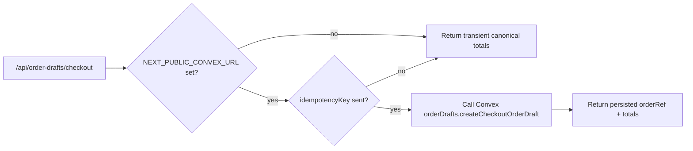
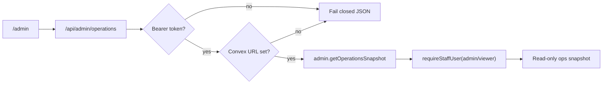
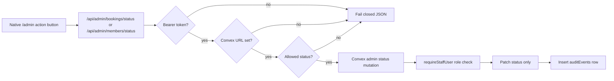

# Convex Deployment And Vercel Env Runbook

## Purpose

This runbook connects the code-side Convex order draft work to the dashboard
work that still has to happen. It is written for both humans doing dashboard
setup and agents verifying the result afterward.

## Current State

- Vercel project: `junyen-enterprises/web`
- Vercel project ID: `prj_fhlOjcwSbnPAuLi8tTiGbhjVomnr`
- Vercel team ID: `team_3kWPO8fPD6E7x39voGoNNeog`
- Local Vercel link path: `apps/web/.vercel/project.json` (ignored)
- Vercel env status checked on 2026-07-02: no environment variables exist for
  `junyen-enterprises/web`.
- Local Convex status: anonymous-only local deployment in root `.env.local`.
- Cloud Convex status: not linked yet.

## Why This Matters

Checkout draft persistence is now coded, but the route only persists when it
has a real Convex URL and the caller sends an `idempotencyKey`. Until then, it
keeps returning transient server-priced totals so the public site does not break.
The native `/admin` operations route follows the same fail-closed pattern:
without a real Convex URL it returns `convex_unconfigured`, and without a staff
bearer token it returns `staff_auth_required`. Booking and member status actions
follow the same pattern: the Next API route validates auth/config and allowed
statuses before Convex performs the staff-role check, mutation, and audit write.







## Dashboard Setup

1. Create or link the Skyla Convex project in the Convex dashboard.
2. Run Convex locally against the real project, not anonymous local mode:

```bash
PATH="$HOME/.bun/bin:$PATH" bunx convex dev --configure existing --dev-deployment cloud --typecheck enable
```

If this is a new Convex project rather than an existing one:

```bash
PATH="$HOME/.bun/bin:$PATH" bunx convex dev --configure new --dev-deployment cloud --project skyla --typecheck enable
```

3. Confirm root `.env.local` contains a non-anonymous `CONVEX_DEPLOYMENT` and
   an HTTPS `CONVEX_URL`.
4. Add the public Convex URL to Vercel:

```bash
cd apps/web
printf '%s' "$CONVEX_URL" | PATH="$HOME/.bun/bin:$PATH" bunx vercel env add NEXT_PUBLIC_CONVEX_URL production preview development
```

The value should look like `https://<deployment>.convex.cloud`.

5. Add Stripe action envs to Convex before testing payment creation:

```bash
PATH="$HOME/.bun/bin:$PATH" bunx convex env set STRIPE_SECRET_KEY "$STRIPE_SECRET_KEY"
PATH="$HOME/.bun/bin:$PATH" bunx convex env set SKYLA_PAYMENT_RETURN_ORIGINS "https://skydeckla.com,https://www.skydeckla.com"
PATH="$HOME/.bun/bin:$PATH" bunx convex env set STRIPE_WEBHOOK_SECRET "$STRIPE_WEBHOOK_SECRET"
PATH="$HOME/.bun/bin:$PATH" bunx convex env set SKYLA_TERMINAL_READER_REGISTRY "tmr_frontdesk@tml_lobby"
```

Use Stripe test-mode values for Preview/Development. Do not paste secret values
into PRs, logs, or docs.

6. Seed staff users before testing native `/admin` or `/pos-next` against the
   real deployment. Prefer the typed bootstrap mutation instead of manual table
   edits.

Create a temporary bootstrap token, set it in Convex, run the mutation, then
remove the token after staff access is verified:

```bash
export SKYLA_STAFF_BOOTSTRAP_TOKEN="<32+ character temporary token>"
PATH="$HOME/.bun/bin:$PATH" bunx convex env set SKYLA_STAFF_BOOTSTRAP_TOKEN "$SKYLA_STAFF_BOOTSTRAP_TOKEN"
PATH="$HOME/.bun/bin:$PATH" bunx convex run staffBootstrap:upsertStaffUser '{
  "bootstrapToken": "<same temporary token>",
  "subject": "<Convex auth identity subject>",
  "email": "admin@skydeckla.com",
  "role": "admin",
  "active": true,
  "note": "initial admin seed"
}'
PATH="$HOME/.bun/bin:$PATH" bunx convex env remove SKYLA_STAFF_BOOTSTRAP_TOKEN
```

The `subject` must match the Convex auth identity subject, `active` must be
`true`, and roles should be scoped:

- `admin`: dashboard and POS operations
- `viewer`: read-only admin operations snapshot
- `pos`: POS sale draft and Terminal handoff only

For the native admin action slice:

- `viewer` can load `/api/admin/operations` but cannot mutate status.
- `pos` can check bookings in and undo check-in, but cannot cancel bookings or
  change member applications.
- `admin` can check in, undo check-in, cancel bookings, and move members between
  `pending`, `approved`, `waitlisted`, and `rejected`.
- Cancel/refund/payment reconciliation, hard delete, clear-all, reset-all,
  voucher redemption, and config/catalog edits remain out of scope.

7. Pull local web envs if you want the Next route to use Convex locally:

```bash
cd apps/web
PATH="$HOME/.bun/bin:$PATH" bunx vercel env pull .env.local --yes
```

## Verification

Use this first. It prints variable presence and safety status without printing
secret values:

```bash
PATH="$HOME/.bun/bin:$PATH" bun run convex:env:check
```

Expected cloud-ready result:

```json
{
  "readyForCloudPersistence": true,
  "readyForStaffBootstrap": false
}
```

`readyForStaffBootstrap` should be `true` only while
`SKYLA_STAFF_BOOTSTRAP_TOKEN` is temporarily set. It should return to `false`
after staff seeding and token removal.

Then run:

```bash
PATH="$HOME/.bun/bin:$PATH" bun run convex:codegen
PATH="$HOME/.bun/bin:$PATH" bun run check
```

After a Vercel preview deploy, verify persistence by posting with an
`idempotencyKey`:

```bash
curl -sS -X POST "$PREVIEW_URL/api/order-drafts/checkout" \
  -H 'content-type: application/json' \
  --data '{
    "packageKey": "general",
    "adults": 2,
    "children": 1,
    "addons": { "matcha": 1 },
    "customerEmail": "guest@example.com",
    "idempotencyKey": "checkout_20260704_abc123",
    "totalCents": 1
  }'
```

Expected response markers:

- `persisted: true`
- `orderRef` starts with `SKY`
- totals are canonical: subtotal `8100`, fee `405`, total `8505`
- the fake `totalCents: 1` is ignored

## Before Stripe Cutover

Do not wire the public checkout page to Stripe through Convex until all of
these are true:

- `bun run convex:env:check` reports `readyForCloudPersistence: true`
- Vercel has `NEXT_PUBLIC_CONVEX_URL` in Preview and Production
- Convex has `STRIPE_SECRET_KEY`
- Convex has `SKYLA_PAYMENT_RETURN_ORIGINS`
- Convex has `STRIPE_WEBHOOK_SECRET`
- Stripe dashboard has a test-mode webhook endpoint for
  `https://<convex-site-url>/stripe-webhook`
- Preview `/api/order-drafts/checkout` returns `persisted: true`
- Preview `/api/admin/operations` returns `401` without a bearer token
- Preview `/api/admin/operations` returns `200` with a valid admin/viewer token
- At least one active `admin` staff row exists, created through
  `staffBootstrap.upsertStaffUser` or an equivalent audited process
- Preview `/api/admin/bookings/status` returns `401` without a bearer token
- Preview `/api/admin/bookings/status` returns `400` for arbitrary statuses
- Preview `/api/admin/bookings/status` lets admin/pos staff set `checked-in`
  and `confirmed`
- Preview `/api/admin/bookings/status` lets only admin staff set `cancelled`
- Preview `/api/admin/members/status` lets only admin staff set `pending`,
  `approved`, `waitlisted`, or `rejected`
- Admin status mutations write `auditEvents` rows and do not alter order,
  payment, or Stripe fields
- `bun run check` passes
- `bun run security:audit` passes
- A Stripe test-mode checkout can be created from a stored `orderRef`
- Webhook signature/reconciliation tests pass

Rollback is simple at this stage: leave the order draft route enabled and do
not call `payments.createStripeCheckoutSession` from the frontend.

## Agent Notes

- Do not set Vercel production to an anonymous local Convex URL.
- Do not claim cloud persistence is live until `bun run convex:env:check`
  returns ready and a preview POST returns `persisted: true`.
- `NEXT_PUBLIC_CONVEX_URL` is safe to expose; Convex auth and function guards
  still enforce protected staff flows server-side.
- Stripe Checkout session creation and webhook reconciliation now exist in
  Convex code, but they are not live until the env, Stripe dashboard, and
  frontend cutover gates above pass.
- Kaskade and Terminal actions are still separate work.
