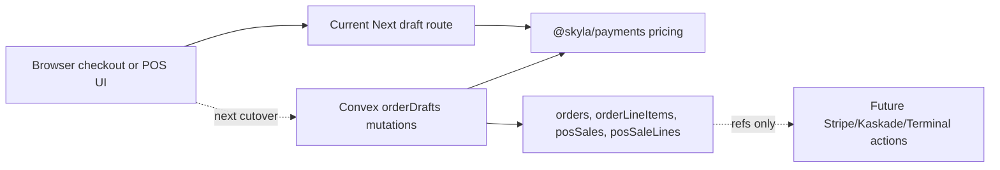

# Convex Order Spine Runbook

## Purpose

This runbook explains the new order-authority foundation for humans and agents.
It is not a live payment cutover runbook yet.

## What Exists Now

- `convex/schema.ts`: target tables and indexes for the Convex backend.
- `packages/payments`: pure TypeScript pricing and order draft contracts.
- `packages/payments/src/records.ts`: shared record mappers that omit
  `undefined` fields before Convex writes.
- `convex/orderDrafts.ts`: persisted checkout order draft and staff-gated POS
  sale draft mutations/queries.
- `convex/lib/auth.ts`: staff lookup through `ctx.auth.getUserIdentity()` and
  `staffUsers.by_subject`.
- `convex/lib/orderDraftPersistence.ts`: input normalization, bounded
  validation, idempotency fingerprints, and draft write builders.
- `convex/_generated`: generated Convex API/server/data-model types from local
  anonymous Convex validation.
- `apps/web/app/api/order-drafts/checkout/route.ts`: a server route that accepts
  product selections, returns canonical totals, and calls Convex persistence
  when `NEXT_PUBLIC_CONVEX_URL` plus `idempotencyKey` are present.

The live compatibility checkout is not cut over to Convex yet. The backend can
persist drafts, and the Next route is ready to use that path once the real
Convex deployment URL is configured in Vercel. Production payment creation still
needs provider actions and frontend integration.



## Why This Is Safer

The old payment path lets the browser send amounts to backend payment functions.
The new path starts with a server-owned order draft. The browser can ask for a
package, guest count, and add-ons, but the server calculates:

- line items
- child pricing
- booking fee
- subtotal
- total

The next payment PR should create provider intents from a stored `orderRef` or
`saleRef`, not from a browser-supplied amount.

## Agent Data

Current canonical package prices:

| Key | Name | Price cents | Bookable |
| --- | --- | ---: | --- |
| `general` | General Admission | 2900 | yes |
| `drink` | Deck + Drink | 3700 | yes |
| `date-night` | Date Night Experience | 9800 | no |
| `champagne-room` | Champagne Room | 0 plus room fee | no |
| `family-suite` | Family Suite | 0 plus room fee | no |

Current Next order draft API without Convex envs:

```http
POST /api/order-drafts/checkout
Content-Type: application/json

{
  "packageKey": "general",
  "adults": 2,
  "children": 1,
  "addons": { "matcha": 1 }
}
```

Expected response shape:

```json
{
  "draft": {
    "channel": "online",
    "status": "draft",
    "currency": "usd",
    "subtotalCents": 8100,
    "feeCents": 405,
    "totalCents": 8505,
    "lines": [
      {
        "kind": "ticket",
        "productKey": "general",
        "name": "General Admission",
        "quantity": 2,
        "unitAmountCents": 2900,
        "lineTotalCents": 5800
      },
      {
        "kind": "ticket",
        "productKey": "general",
        "name": "General Admission Child",
        "quantity": 1,
        "unitAmountCents": 1500,
        "lineTotalCents": 1500
      },
      {
        "kind": "addon",
        "productKey": "matcha",
        "name": "Ceremonial Matcha Latte",
        "quantity": 1,
        "unitAmountCents": 800,
        "lineTotalCents": 800
      }
    ]
  }
}
```

With `NEXT_PUBLIC_CONVEX_URL` configured and `idempotencyKey` supplied, the same
route calls `api.orderDrafts.createCheckoutOrderDraft` and returns:

```json
{
  "persisted": true,
  "orderRef": "SKY2607-ABC123",
  "draft": {
    "channel": "online",
    "status": "draft",
    "currency": "usd",
    "subtotalCents": 8100,
    "feeCents": 405,
    "totalCents": 8505,
    "orderRef": "SKY2607-ABC123",
    "lines": [
      {
        "kind": "ticket",
        "productKey": "general",
        "name": "General Admission",
        "quantity": 2,
        "unitAmountCents": 2900,
        "lineTotalCents": 5800
      }
    ]
  }
}
```

Current persisted Convex checkout mutation:

```ts
api.orderDrafts.createCheckoutOrderDraft({
  packageKey: "general",
  adults: 2,
  children: 1,
  addons: { matcha: 1 },
  customerEmail: "guest@example.com",
  idempotencyKey: "checkout_20260704_abc123"
});
```

Expected persisted checkout response shape:

```json
{
  "orderRef": "SKY2607-ABC123",
  "status": "draft",
  "totals": {
    "currency": "usd",
    "subtotalCents": 8100,
    "feeCents": 405,
    "totalCents": 8505
  },
  "customerEmail": "guest@example.com",
  "lines": [
    {
      "kind": "ticket",
      "productKey": "general",
      "name": "General Admission",
      "quantity": 2,
      "unitAmountCents": 2900,
      "lineTotalCents": 5800
    }
  ]
}
```

Persisted checkout read-back uses `api.orderDrafts.getCheckoutOrderDraft` with
both `orderRef` and the matching `idempotencyKey`. `orderRef` alone is not
enough to read draft details.

Current persisted POS mutation:

```ts
api.orderDrafts.createPosSaleDraft({
  idempotencyKey: "possale_20260704_abc123",
  lines: [
    { kind: "ticket", packageKey: "drink", quantity: 1 },
    { kind: "custom", name: "Locker fee", amountCents: 500, reason: "Guest requested locker" }
  ],
  readerId: "tmr_reader_123",
  terminalLocationId: "tml_location_123"
});
```

POS role is never accepted from the browser. Convex derives it from the
authenticated staff identity and the `staffUsers` table.

## Idempotency Rules

- `idempotencyKey` is required for checkout and POS draft creation.
- Same key plus same normalized cart returns the existing draft.
- Same key plus different normalized cart throws before a duplicate write.
- Fingerprints exclude browser totals and include only normalized selections,
  customer/date/time metadata, and POS terminal metadata.
- Checkout refs use `SKYYYMM-XXXXXX`, matching admin search.
- POS refs use `SALEYYMMDD-XXXXXX`.

## Local Validation

Use this on any branch, even before the real Convex deployment is linked:

```bash
bun run convex:schema:typecheck
bun run convex:functions:typecheck
bun run convex:test:unit
```

Use this local anonymous Convex validation while no cloud project is linked:

```bash
CONVEX_AGENT_MODE=anonymous bunx convex dev --once --typecheck enable
```

Use this only after `CONVEX_DEPLOYMENT` is configured by linking a real Convex
project:

```bash
bun run convex:codegen
```

## Next Steps

1. Link a real Convex deployment and set Vercel env vars for it.
2. Add Stripe/Kaskade/Terminal actions that only accept stored refs.
3. Add webhook HTTP actions that verify signatures, expected amounts, currency,
   status, and idempotency.
4. Cut the Next checkout/POS flows over to persisted draft refs.
5. Dual-run against Supabase and reconcile before cutover.
