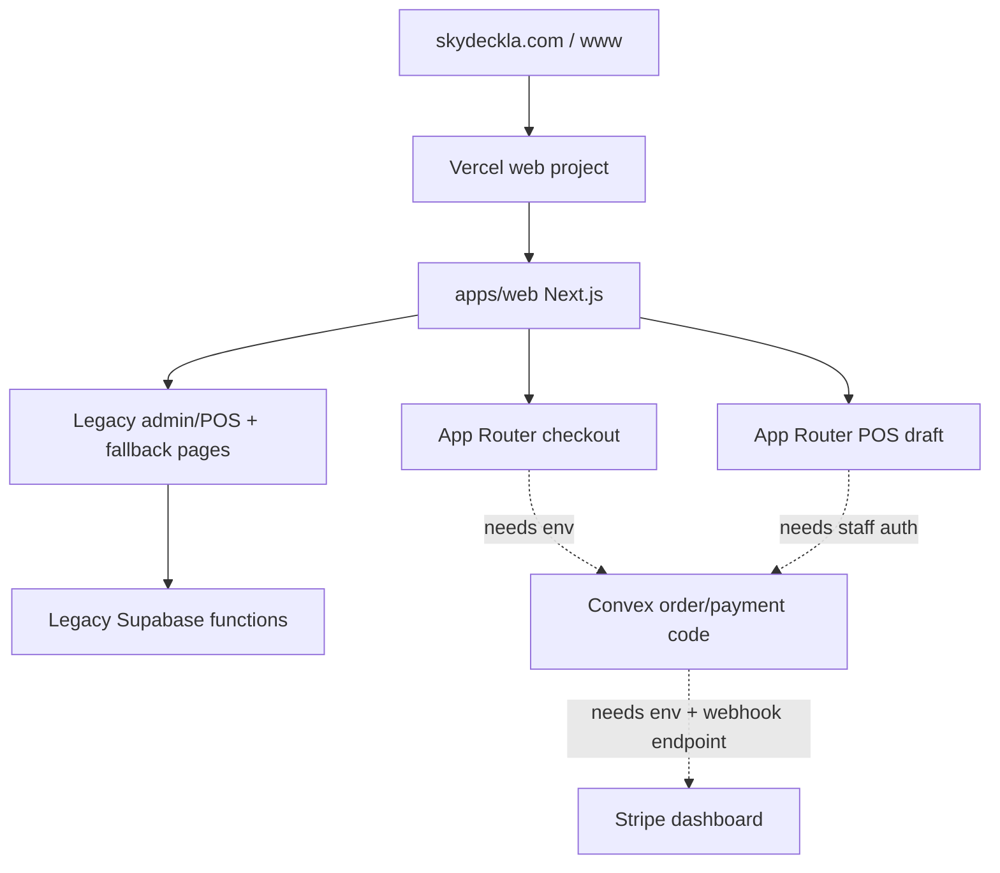

# Production Readiness Checklist

This is the simple current-state checklist for Skyla hosting, payments,
dependencies, and the remaining dashboard work.

## Simple Summary

The site is hosted on Vercel and the domain is pointed at Vercel. The public
pages load, and smoke tests pass on both `skydeckla.com` and
`www.skydeckla.com`.

The new safer payment backend is partly built in Convex code: orders and POS
sale drafts can be priced from server-owned data, Stripe Checkout sessions can
be created from a stored `orderRef`, and Stripe webhooks can verify signatures
before marking an order paid. Stripe Terminal PaymentIntents can now be created
from a stored POS `saleRef` only. The primary `/checkout` page now uses the
Next.js App Router and fails closed until the real Convex deployment, Vercel
env vars, and Stripe dashboard webhook endpoint are ready.

Live POS is still a legacy compatibility page. A native `/pos-next` draft page
exists for server-priced sale review, and the repo now has the
server-authoritative Terminal action, but reader collection is still locked
until staff auth, Convex envs, and Stripe Terminal acceptance are complete.
Native `/admin` now has a staff-token operations snapshot plus audited
booking/member status actions. `/admin.html` remains the legacy fallback until
config, voucher, refund, and destructive workflows are rebuilt safely. The old
static checkout is still reachable at `/checkout.html`, but its Stripe card
creation path is disabled in code so it cannot mint browser-priced card charges
from Vercel.

## Current Verified State

- Vercel project: `junyen-enterprises/web`
- Vercel project ID: `prj_fhlOjcwSbnPAuLi8tTiGbhjVomnr`
- Production deployment checked on 2026-07-02:
  `https://web-2vvwavkz2-junyen-enterprises.vercel.app`
- Production deployment ID checked on 2026-07-02:
  `dpl_EnTbyZLcqo49NK6adc6Eag3Vn7k6`
- Merge commit checked on 2026-07-02:
  `2b0b422f29f71deca52e0802f8235ba773b9c565`
- Custom domains checked on 2026-07-02:
  - `https://skydeckla.com`
  - `https://www.skydeckla.com`
- Vercel env status checked on 2026-07-02: no project environment variables
  are configured for `junyen-enterprises/web`.
- GitHub branch protection checked on 2026-07-02: `main` is not protected yet
  (`gh api repos/junyengit/skyla/branches/main/protection` returns `404`).
- Live API behavior checked on 2026-07-02 across the apex domain, `www`, and the
  latest Vercel deployment URL:
  - Spoofed checkout total `1` cent returned canonical server total `8610`
    cents for the probe payload.
  - Spoofed POS total/reader/location returned canonical server total `4200`
    cents for the probe payload and no reader/location fields in the transient
    draft.
  - `/api/payments/stripe-checkout`,
    `/api/payments/stripe-terminal`, and
    `/api/payments/stripe-terminal/process` returned `503` with
    `convex_unconfigured` when probed with the required fake staff auth where
    applicable.
  - `/api/payments/stripe-terminal` returned `401 staff_auth_required` before
    Convex configuration when no staff token was provided.
  - No response exposed a Stripe `clientSecret`.
- Vercel runtime errors checked on 2026-07-02: no grouped runtime errors in the
  last 2 hours.
- Bun checked locally: `1.4.0-canary.1+eba370b69`
- Dependency audit checked on 2026-07-02: `bun audit --audit-level=low` reports
  no vulnerabilities after the `postcss@8.5.16` override.
- Known deferred dependency: ESLint `10.6.0`; it currently breaks through
  `eslint-plugin-react`, so keep ESLint on `9.39.4` until the plugin stack is
  compatible.



## What Is Good Right Now

- Hosting is on Vercel.
- GoDaddy nameservers are pointed at Vercel.
- Vercel production and both custom domains pass the 23-route smoke test.
- GitHub CI, CodeQL workflow, GitHub Advanced Security CodeQL, and Vercel
  deployment checks passed for PR #33, the native admin config merge.
- Admin and POS are marked `noindex, nofollow`.
- `/admin`, `/admin.html`, `/pos`, `/pos.html`, and `/pos-next` are marked
  `noindex, nofollow` in the current code path.
- Native `/admin` uses `/api/admin/operations` to request a staff-gated Convex
  operations snapshot; it does not read or write Supabase from the browser.
- Native `/admin` can now call audited booking/member status actions through
  Next API routes and Convex mutations. The browser sends only refs, allowed
  statuses, and the staff bearer token.
- Native `/admin` can now load and save typed announcement/hours config through
  `/api/admin/config`; pricing, menu, catalog, vouchers, refunds, deletes, and
  resets remain intentionally unavailable.
- Admin and POS dark-theme text is high contrast.
- `/pos-next` reviews a server-calculated POS total without using browser totals.
- `/api/payments/stripe-terminal` accepts only `saleRef` and `idempotencyKey`,
  requires a staff bearer token, and forwards to Convex.
- The POS Terminal reader handoff uses the stored sale/reader, requires the
  Convex `SKYLA_TERMINAL_READER_REGISTRY`, and keeps the sale pending until
  Stripe final confirmation.
- Stored readers are rechecked against the registry at payment time, and
  duplicate in-flight reader handoffs are rejected by a short reservation lock.
- Production `/api/payments/stripe-checkout` currently fails closed with
  `convex_unconfigured` until Convex is connected. Terminal payment routes
  require staff bearer auth first, then fail closed with `convex_unconfigured`
  until Convex is connected.
- `/api/admin/bookings/status` and `/api/admin/members/status` require staff
  bearer auth first, fail closed when Convex is unconfigured, reject arbitrary
  statuses before calling Convex, and do not expose Stripe `clientSecret`.
- Production `/api/order-drafts/pos` ignores spoofed browser totals and returns
  the server catalog total.
- The repo copy of legacy Supabase Stripe Checkout and Terminal payment
  creation returns `410` permanently.
- `/checkout.html` no longer enables legacy Stripe card creation from browser
  totals.
- No raw card number/CVC collection was found in the app code.
- No committed Stripe secret key was found.
- Next.js `16.2.10`, React `19.2.7`, Motion `12.42.2`, Turbo `2.10.2`,
  TypeScript `6.0.3`, Vitest `4.1.9`, and Convex `1.42.1` are current.
- `eslint@10.6.0` is intentionally held because the latest available
  `eslint-plugin-react@7.37.5` crashes under ESLint 10 through Next's lint
  config.
- `bun audit` reports no vulnerabilities.

## Still Not Safe To Call Complete

- Vercel currently has no project env vars, so the deployed app behaves as
  though Convex is unconfigured and live checkout/POS payment execution remains
  intentionally blocked.
- Convex cloud is not linked yet.
- Active Convex `staffUsers` rows are not seeded yet. Native staff auth cannot
  be accepted until at least one admin is seeded.
- Stripe live/test webhook endpoint is not created in the Stripe dashboard yet.
- `/checkout` is the new App Router checkout, but live card payment is gated
  until Convex and Stripe dashboard envs exist.
- Any already deployed Supabase Stripe functions must still be disabled or
  redeployed from the permanently fail-closed repo code in the Supabase
  dashboard.
- POS legacy reader connection and charge UI should stay disabled while the
  `/pos-next` staff-authenticated Terminal flow is accepted.
- `/pos-next` is not the live register yet because reader processing and signed
  webhook reconciliation still need real Convex/staff auth/Stripe dashboard envs
  plus Stripe test-reader acceptance.
- Admin/POS are not fully rebuilt as protected App Router/Convex workflows yet.
  The native `/admin` snapshot, status actions, and announcement/hours config
  are only the first admin slices.
- Native admin intentionally does not yet do voucher redemption, refunds,
  hard delete, clear all, reset all, pricing/menu edits, or payment catalog
  changes.
- Supabase functions should not be removed until checkout, POS, admin, and data
  migration acceptance tests pass.

## Dashboard Checklist

### Vercel

- [ ] Confirm project root is `apps/web`.
- [ ] Confirm Production Branch is `main`.
- [ ] Confirm install command is
  `cd ../.. && bash scripts/setup/vercel-install-bun-canary.sh`.
- [ ] Confirm build command is
  `cd ../.. && export PATH="$HOME/.bun/bin:$PATH" && bun --revision && bun run web:build`.
- [ ] Add `NEXT_PUBLIC_CONVEX_URL` to Preview and Production after Convex is
  linked.
- [ ] Add Google Ads public env vars only when ads are ready.
- [ ] Add Convex `SKYLA_TERMINAL_READER_REGISTRY` before testing `/pos-next`
      reader handoff.
- [ ] Keep secrets out of `NEXT_PUBLIC_*`.
- [ ] Confirm `/pos-next` remains `X-Robots-Tag: noindex, nofollow` after every
      preview and production deploy.
- [ ] Confirm `/admin` and `/admin.html` remain `X-Robots-Tag: noindex,
      nofollow` after every preview and production deploy.

### Convex

- [ ] Create or link the Skyla Convex project.
- [ ] Run real project codegen, not anonymous local mode.
- [ ] Set `STRIPE_SECRET_KEY` in Convex test/preview first.
- [ ] Set `SKYLA_PAYMENT_RETURN_ORIGINS` to
  `https://skydeckla.com,https://www.skydeckla.com`.
- [ ] Set `STRIPE_WEBHOOK_SECRET` after creating the Stripe endpoint.
- [ ] Set `SKYLA_TERMINAL_READER_REGISTRY` with the Stripe test-reader IDs and
      locations that staff are allowed to use.
- [ ] Run `bun run convex:env:check`.
- [ ] Run `bun run convex:codegen`.
- [ ] Temporarily set `SKYLA_STAFF_BOOTSTRAP_TOKEN`, run
      `staffBootstrap.upsertStaffUser` for the initial admin, then remove the
      token.
- [ ] Seed active `staffUsers` records for admins/viewers/POS staff before
      using native `/admin` or `/pos-next`.
- [ ] Verify `/api/admin/operations` returns `200` with a valid staff token and
      `401`/`503` without auth or envs.
- [ ] Verify `/api/admin/bookings/status` returns `200` with a valid admin/pos
      token for `confirmed` and `checked-in`, rejects arbitrary statuses with
      `400`, and returns `503` while Convex is unconfigured.
- [ ] Verify `/api/admin/bookings/status` allows `cancelled` only for `admin`
      staff and writes an `admin.bookingStatus.update` audit event.
- [ ] Verify `/api/admin/members/status` allows only `admin` staff, accepts
      `pending`, `approved`, `waitlisted`, and `rejected`, and writes an
      `admin.memberStatus.update` audit event.
- [ ] Verify `/api/admin/config` can load and save announcement/hours with a
      valid admin token, rejects viewer/pos writes, rejects malformed shapes,
      and writes an `admin.config.update` audit event.

### Stripe

- [ ] Create a test-mode webhook endpoint:
  `https://<convex-site-url>/stripe-webhook`.
- [ ] Subscribe it to:
  - `checkout.session.completed`
  - `checkout.session.async_payment_succeeded`
  - `checkout.session.async_payment_failed`
  - `checkout.session.expired`
  - `payment_intent.succeeded`
  - `payment_intent.payment_failed`
  - `payment_intent.canceled`
- [ ] Copy the endpoint signing secret into Convex as
  `STRIPE_WEBHOOK_SECRET`.
- [ ] Use Stripe test cards only until preview checkout passes.
- [ ] Verify webhook delivery, duplicate replay behavior, amount mismatch
      rejection, and order/POS sale status transitions before live traffic.
- [ ] Create a separate live-mode endpoint only after test mode passes.
- [ ] Do not use a real credit card during verification. Use Stripe test mode
      cards and Stripe dashboard test webhooks until preview acceptance passes.
- [x] Replace the legacy Terminal create-intent path in repo code with a Convex
      action that accepts `saleRef` only and reads the stored POS sale amount.
- [x] Add signed Stripe Terminal PaymentIntent webhook reconciliation from the
      stored `saleRef`, stored Terminal PaymentIntent ID, amount, currency, and
      webhook event ID.
- [ ] Wire the POS UI to collect/process that Convex-created PaymentIntent on a
      real Stripe test reader.
- [ ] Disable or redeploy legacy Supabase Stripe functions so any live old
      functions inherit the fail-closed behavior.

### GitHub

- [ ] Protect `main`.
- [ ] Require PRs.
- [ ] Require CI, CodeQL, and Vercel preview checks.
- [ ] Block force pushes and branch deletion.
- [ ] Keep Dependabot and secret scanning enabled.

Current check: `main` is not protected yet.

## Verification Commands

```bash
PATH="$HOME/.bun/bin:$PATH" bun install --frozen-lockfile
PATH="$HOME/.bun/bin:$PATH" bun run check
PATH="$HOME/.bun/bin:$PATH" bun run security:audit
PATH="$HOME/.bun/bin:$PATH" bun audit --audit-level=low
PATH="$HOME/.bun/bin:$PATH" bun outdated --recursive
PATH="$HOME/.bun/bin:$PATH" CONVEX_AGENT_MODE=anonymous bunx convex dev --once --typecheck enable
PATH="$HOME/.bun/bin:$PATH" SMOKE_BASE_URL=https://web-2vvwavkz2-junyen-enterprises.vercel.app bun run test:smoke
PATH="$HOME/.bun/bin:$PATH" SMOKE_BASE_URL=https://skydeckla.com bun run test:smoke
PATH="$HOME/.bun/bin:$PATH" SMOKE_BASE_URL=https://www.skydeckla.com bun run test:smoke
```

Current dependency note:

- `bun audit --audit-level=low` reports no vulnerabilities.
- `bun outdated --recursive` reports only a major ESLint update (`9.39.4` to
  `10.6.0`) in `@skyla/web`. Leave that for a dedicated lint tooling slice
  because the current Next/ESLint peer graph is stable on ESLint 9 and this
  payment change does not require the major upgrade.

## Next Work Order

1. Link real Convex cloud and set Vercel `NEXT_PUBLIC_CONVEX_URL`.
2. Seed initial staff with `staffBootstrap.upsertStaffUser`, verify native
   `/admin`, then remove `SKYLA_STAFF_BOOTSTRAP_TOKEN`.
3. Verify preview checkout draft persistence returns `persisted: true`.
4. Create Stripe test webhook endpoint and set Convex Stripe env vars.
5. Set Convex/Vercel env vars so the App Router checkout can persist orders
   and start Stripe Checkout.
6. Add real Vercel/Convex envs, then accept POS Terminal reader processing on a
   Stripe test reader using stored `saleRef` and stored reader IDs.
7. Accept Stripe Terminal final webhook reconciliation in test mode with a real
   test reader and matching Convex sale.
8. Promote `/pos-next` into the live POS only after Terminal capture uses
   stored `saleRef` totals.
9. Finish native Admin beyond status actions: vouchers, refunds, config,
   catalog, exports, and any destructive action with typed validators,
   audit logs, and rollback steps.
10. Rebuild POS as the protected live App Router/Convex register.
11. Migrate remaining Supabase data and disable legacy Supabase functions only
   after acceptance tests pass.

## Plain-English Handoff

What has been done:

- The website is on Vercel and the domain is pointing there.
- The repo is organized as a Turborepo with the app under `apps/web`.
- Checkout and POS totals are now calculated by trusted code, not by whatever
  the browser sends.
- The current live site does not have the secret Convex/Stripe settings yet, so
  card-payment APIs stop safely instead of trying to charge.
- Admin, POS, and `/pos-next` use high-contrast dark staff screens.
- `/admin` is being moved into Next.js. It now has staff-gated operations plus
  booking/member status buttons; `/admin.html` remains as a fallback for the
  workflows that are not rebuilt yet.

What still needs to be done:

- Link the real Convex cloud project.
- Add the required Vercel and Convex environment variables.
- Create the Stripe webhook endpoint in the Stripe dashboard.
- Test checkout with Stripe test cards only.
- Test POS Terminal with a Stripe test reader only.
- Finish the protected Admin and POS Next.js/Convex pages, then retire the old
  compatibility pages and Supabase functions.
- Use Stripe test cards and a Stripe test Terminal reader first. Do not verify
  this migration with a real credit card.
