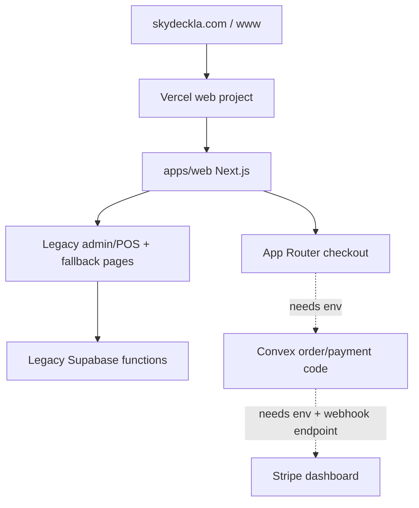

# Production Readiness Checklist

This is the simple current-state checklist for Skyla hosting, payments,
dependencies, and the remaining dashboard work.

## Simple Summary

The site is hosted on Vercel and the domain is pointed at Vercel. The public
pages load, and smoke tests pass on both `skydeckla.com` and
`www.skydeckla.com`.

The new safer payment backend is partly built in Convex code: orders can be
priced from server-owned data, Stripe Checkout sessions can be created from a
stored `orderRef`, and Stripe webhooks can verify signatures before marking an
order paid. The primary `/checkout` page now uses the Next.js App Router and
fails closed until the real Convex deployment, Vercel env vars, and Stripe
dashboard webhook endpoint are ready.

POS and admin are still legacy compatibility pages. The old static checkout is
still reachable at `/checkout.html` while the team verifies the new App Router
flow.

## Current Verified State

- Vercel project: `junyen-enterprises/web`
- Vercel project ID: `prj_fhlOjcwSbnPAuLi8tTiGbhjVomnr`
- Production deployment checked on 2026-06-30:
  `https://web-2hg4drlf9-junyen-enterprises.vercel.app`
- Custom domains checked on 2026-06-30:
  - `https://skydeckla.com`
  - `https://www.skydeckla.com`
- Vercel env vars checked on 2026-06-30: none configured.
- Bun checked locally: `1.4.0-canary.1+ffea69ae7`
- Dependency audit: clean after the `postcss@8.5.16` override.
- Known deferred dependency: ESLint `10.6.0`; it currently breaks through
  `eslint-plugin-react`, so keep ESLint on `9.39.4` until the plugin stack is
  compatible.



## What Is Good Right Now

- Hosting is on Vercel.
- GoDaddy nameservers are pointed at Vercel.
- Vercel production and both custom domains pass the 22-route smoke test.
- Admin and POS are marked `noindex, nofollow`.
- Admin and POS dark-theme text is high contrast.
- No raw card number/CVC collection was found in the app code.
- No committed Stripe secret key was found.
- Next.js `16.2.9`, React `19.2.7`, Motion `12.42.2`, Turbo `2.10.2`,
  TypeScript `6.0.3`, Vitest `4.1.9`, and Convex `1.42.1` are current.
- `bun audit` reports no vulnerabilities.

## Still Not Safe To Call Complete

- Vercel has no env vars yet, so the deployed app cannot call a real Convex
  backend.
- Convex cloud is not linked yet.
- Stripe live/test webhook endpoint is not created in the Stripe dashboard yet.
- `/checkout` is the new App Router checkout, but live card payment is gated
  until Convex and Stripe dashboard envs exist.
- `/checkout.html` still contains the legacy Supabase payment creation path and
  must be disabled after the App Router path passes preview/live acceptance.
- POS still uses a legacy Terminal bridge where browser cart totals reach the
  backend.
- Admin/POS are not rebuilt as protected App Router/Convex workflows yet.
- Supabase functions should not be removed until checkout, POS, admin, and data
  migration acceptance tests pass.

## Dashboard Checklist

### Vercel

- [ ] Confirm project root is `apps/web`.
- [ ] Confirm Production Branch is `main`.
- [ ] Confirm install command is
  `cd ../.. && bash scripts/setup/vercel-install-bun-canary.sh`.
- [ ] Confirm build command is
  `cd ../.. && export PATH="$HOME/.bun/bin:$PATH" && bun --revision && bun run web:build`.
- [ ] Add `NEXT_PUBLIC_CONVEX_URL` to Preview and Production after Convex is
  linked.
- [ ] Add Google Ads public env vars only when ads are ready.
- [ ] Keep secrets out of `NEXT_PUBLIC_*`.

### Convex

- [ ] Create or link the Skyla Convex project.
- [ ] Run real project codegen, not anonymous local mode.
- [ ] Set `STRIPE_SECRET_KEY` in Convex test/preview first.
- [ ] Set `SKYLA_PAYMENT_RETURN_ORIGINS` to
  `https://skydeckla.com,https://www.skydeckla.com`.
- [ ] Set `STRIPE_WEBHOOK_SECRET` after creating the Stripe endpoint.
- [ ] Run `bun run convex:env:check`.
- [ ] Run `bun run convex:codegen`.

### Stripe

- [ ] Create a test-mode webhook endpoint:
  `https://<convex-site-url>/stripe-webhook`.
- [ ] Subscribe it to:
  - `checkout.session.completed`
  - `checkout.session.async_payment_succeeded`
  - `checkout.session.async_payment_failed`
  - `checkout.session.expired`
- [ ] Copy the endpoint signing secret into Convex as
  `STRIPE_WEBHOOK_SECRET`.
- [ ] Use Stripe test cards only until preview checkout passes.
- [ ] Verify webhook delivery, duplicate replay behavior, amount mismatch
  rejection, and order status transitions before live traffic.
- [ ] Create a separate live-mode endpoint only after test mode passes.

### GitHub

- [ ] Protect `main`.
- [ ] Require PRs.
- [ ] Require CI, CodeQL, and Vercel preview checks.
- [ ] Block force pushes and branch deletion.
- [ ] Keep Dependabot and secret scanning enabled.

## Verification Commands

```bash
PATH="$HOME/.bun/bin:$PATH" bun install --frozen-lockfile
PATH="$HOME/.bun/bin:$PATH" bun run check
PATH="$HOME/.bun/bin:$PATH" bun audit
PATH="$HOME/.bun/bin:$PATH" bun outdated --recursive
PATH="$HOME/.bun/bin:$PATH" CONVEX_AGENT_MODE=anonymous bunx convex dev --once --typecheck enable
PATH="$HOME/.bun/bin:$PATH" SMOKE_BASE_URL=https://skydeckla.com bun run test:smoke
PATH="$HOME/.bun/bin:$PATH" SMOKE_BASE_URL=https://www.skydeckla.com bun run test:smoke
```

## Next Work Order

1. Link real Convex cloud and set Vercel `NEXT_PUBLIC_CONVEX_URL`.
2. Verify preview checkout draft persistence returns `persisted: true`.
3. Create Stripe test webhook endpoint and set Convex Stripe env vars.
4. Set Convex/Vercel env vars so the App Router checkout can persist orders
   and start Stripe Checkout.
5. Replace POS Terminal payment creation with a server-authoritative Convex
   action.
6. Rebuild Admin and POS as protected App Router/Convex workflows.
7. Migrate remaining Supabase data and disable legacy Supabase functions only
   after acceptance tests pass.
