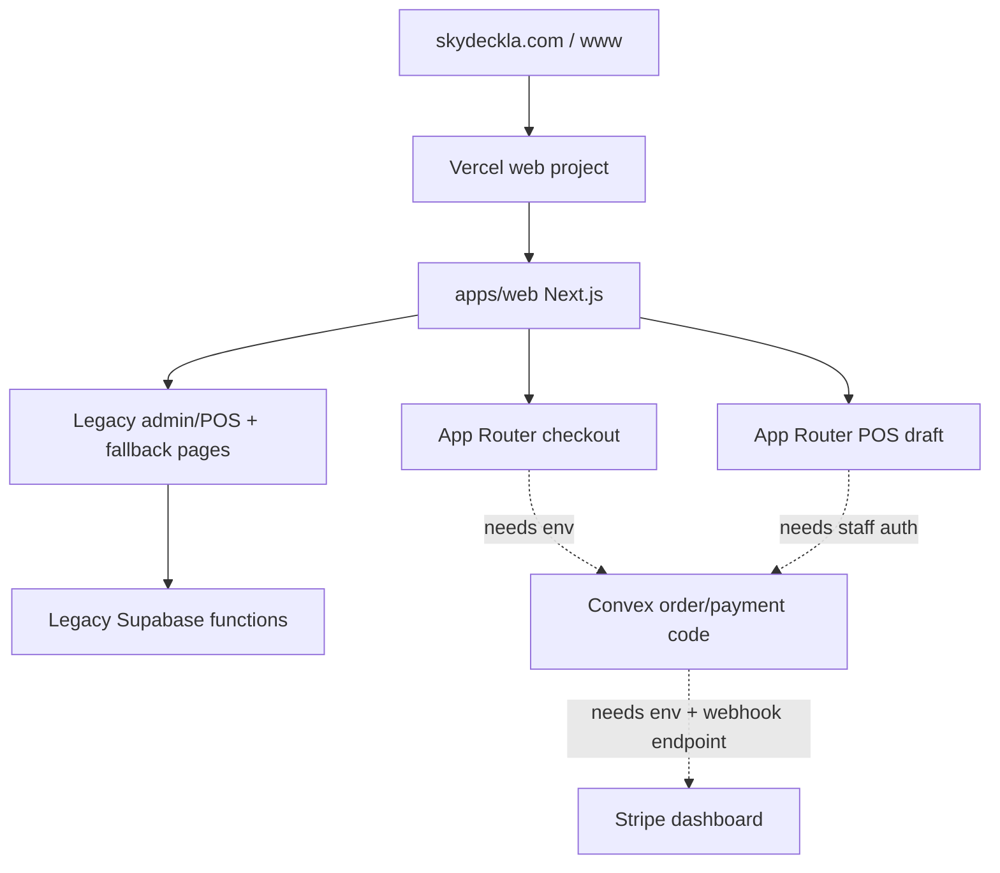

# Production Readiness Checklist

This is the simple current-state checklist for Skyla hosting, payments,
dependencies, and the remaining dashboard work.

## Simple Summary

The site is hosted on Vercel and the domain is pointed at Vercel. The public
pages load, and smoke tests pass on both `skydeckla.com` and
`www.skydeckla.com`.

The new safer payment backend is partly built in Convex code: orders and POS
sale drafts can be priced from server-owned data, Stripe Checkout sessions can
be created from a stored `orderRef`, and Stripe webhooks can verify signatures
before marking an order paid. Stripe Terminal PaymentIntents can now be created
from a stored POS `saleRef` only. The primary `/checkout` page now uses the
Next.js App Router and fails closed until the real Convex deployment, Vercel
env vars, and Stripe dashboard webhook endpoint are ready.

Live POS and admin are still legacy compatibility pages. A native `/pos-next`
draft page exists for server-priced sale review, and the repo now has the
server-authoritative Terminal action, but reader collection is still locked
until staff auth, Convex envs, and Stripe Terminal acceptance are complete. The
old static checkout is still reachable at `/checkout.html`, but its Stripe card
creation path is disabled in code so it cannot mint browser-priced card charges
from Vercel.

## Current Verified State

- Vercel project: `junyen-enterprises/web`
- Vercel project ID: `prj_fhlOjcwSbnPAuLi8tTiGbhjVomnr`
- Production deployment checked on 2026-07-01:
  `https://web-61n76njga-junyen-enterprises.vercel.app`
- Production deployment ID checked on 2026-07-01:
  `dpl_8XKorTa795wz7RyVgvCMDN3JxANn`
- Merge commit checked on 2026-07-01:
  `97f42be824797f681f9a7b0e6e71b4ee4fa5302c`
- Custom domains checked on 2026-07-01:
  - `https://skydeckla.com`
  - `https://www.skydeckla.com`
- Vercel env status checked on 2026-07-01: no project environment variables
  are configured for `junyen-enterprises/web`.
- Live API behavior checked on 2026-07-01: checkout and Terminal payment
  routes return `convex_unconfigured`, so the production app is still not wired
  to real Convex payment execution.
- Bun checked locally: `1.4.0-canary.1+52a1ddf07`
- Dependency audit checked on 2026-07-01: clean after the `postcss@8.5.16`
  override.
- Known deferred dependency: ESLint `10.6.0`; it currently breaks through
  `eslint-plugin-react`, so keep ESLint on `9.39.4` until the plugin stack is
  compatible.



## What Is Good Right Now

- Hosting is on Vercel.
- GoDaddy nameservers are pointed at Vercel.
- Vercel production and both custom domains pass the 23-route smoke test.
- GitHub CI, CodeQL workflow, GitHub Advanced Security CodeQL, and Vercel
  deployment checks passed for PR #28, the Terminal reader handoff merge.
- Admin and POS are marked `noindex, nofollow`.
- `/pos-next` is marked `noindex, nofollow`.
- Admin and POS dark-theme text is high contrast.
- `/pos-next` reviews a server-calculated POS total without using browser totals.
- `/api/payments/stripe-terminal` accepts only `saleRef` and `idempotencyKey`,
  requires a staff bearer token, and forwards to Convex.
- The POS Terminal reader handoff uses the stored sale/reader, requires the
  Convex `SKYLA_TERMINAL_READER_REGISTRY`, and keeps the sale pending until
  Stripe final confirmation.
- Stored readers are rechecked against the registry at payment time, and
  duplicate in-flight reader handoffs are rejected by a short reservation lock.
- Production `/api/payments/stripe-checkout` and
  `/api/payments/stripe-terminal` currently fail closed with
  `convex_unconfigured` until Convex is connected.
- Production `/api/order-drafts/pos` ignores spoofed browser totals and returns
  the server catalog total.
- The repo copy of legacy Supabase Stripe Checkout and Terminal payment
  creation fails closed by default.
- `/checkout.html` no longer enables legacy Stripe card creation from browser
  totals.
- No raw card number/CVC collection was found in the app code.
- No committed Stripe secret key was found.
- Next.js `16.2.9`, React `19.2.7`, Motion `12.42.2`, Turbo `2.10.2`,
  TypeScript `6.0.3`, Vitest `4.1.9`, and Convex `1.42.1` are current.
- `bun audit` reports no vulnerabilities.

## Still Not Safe To Call Complete

- Vercel currently has no project env vars, so the deployed app behaves as
  though Convex is unconfigured and live checkout/POS payment execution remains
  intentionally blocked.
- Convex cloud is not linked yet.
- Stripe live/test webhook endpoint is not created in the Stripe dashboard yet.
- `/checkout` is the new App Router checkout, but live card payment is gated
  until Convex and Stripe dashboard envs exist.
- Any already deployed Supabase Stripe functions must still be disabled or
  redeployed from the fail-closed repo code in the Supabase dashboard.
- POS legacy reader connection and charge UI should stay disabled while the
  `/pos-next` staff-authenticated Terminal flow is accepted.
- `/pos-next` is not the live register yet because reader processing still needs
  real Convex/staff auth/Stripe test-reader acceptance plus final paid
  reconciliation.
- Admin/POS are not rebuilt as protected App Router/Convex workflows yet.
- Supabase functions should not be removed until checkout, POS, admin, and data
  migration acceptance tests pass.

## Dashboard Checklist

### Vercel

- [ ] Confirm project root is `apps/web`.
- [ ] Confirm Production Branch is `main`.
- [ ] Confirm install command is
  `cd ../.. && bash scripts/setup/vercel-install-bun-canary.sh`.
- [ ] Confirm build command is
  `cd ../.. && export PATH="$HOME/.bun/bin:$PATH" && bun --revision && bun run web:build`.
- [ ] Add `NEXT_PUBLIC_CONVEX_URL` to Preview and Production after Convex is
  linked.
- [ ] Add Google Ads public env vars only when ads are ready.
- [ ] Add Convex `SKYLA_TERMINAL_READER_REGISTRY` before testing `/pos-next`
      reader handoff.
- [ ] Keep secrets out of `NEXT_PUBLIC_*`.
- [ ] Confirm `/pos-next` remains `X-Robots-Tag: noindex, nofollow` after every
      preview and production deploy.

### Convex

- [ ] Create or link the Skyla Convex project.
- [ ] Run real project codegen, not anonymous local mode.
- [ ] Set `STRIPE_SECRET_KEY` in Convex test/preview first.
- [ ] Set `SKYLA_PAYMENT_RETURN_ORIGINS` to
  `https://skydeckla.com,https://www.skydeckla.com`.
- [ ] Set `STRIPE_WEBHOOK_SECRET` after creating the Stripe endpoint.
- [ ] Set `SKYLA_TERMINAL_READER_REGISTRY` with the Stripe test-reader IDs and
      locations that staff are allowed to use.
- [ ] Run `bun run convex:env:check`.
- [ ] Run `bun run convex:codegen`.

### Stripe

- [ ] Create a test-mode webhook endpoint:
  `https://<convex-site-url>/stripe-webhook`.
- [ ] Subscribe it to:
  - `checkout.session.completed`
  - `checkout.session.async_payment_succeeded`
  - `checkout.session.async_payment_failed`
  - `checkout.session.expired`
- [ ] Copy the endpoint signing secret into Convex as
  `STRIPE_WEBHOOK_SECRET`.
- [ ] Use Stripe test cards only until preview checkout passes.
- [ ] Verify webhook delivery, duplicate replay behavior, amount mismatch
      rejection, and order status transitions before live traffic.
- [ ] Create a separate live-mode endpoint only after test mode passes.
- [ ] Do not use a real credit card during verification. Use Stripe test mode
      cards and Stripe dashboard test webhooks until preview acceptance passes.
- [x] Replace the legacy Terminal create-intent path in repo code with a Convex
      action that accepts `saleRef` only and reads the stored POS sale amount.
- [ ] Wire the POS UI to collect/process that Convex-created PaymentIntent on a
      real Stripe test reader.
- [ ] Disable or redeploy legacy Supabase Stripe functions so any live old
      functions inherit the fail-closed behavior.

### GitHub

- [ ] Protect `main`.
- [ ] Require PRs.
- [ ] Require CI, CodeQL, and Vercel preview checks.
- [ ] Block force pushes and branch deletion.
- [ ] Keep Dependabot and secret scanning enabled.

## Verification Commands

```bash
PATH="$HOME/.bun/bin:$PATH" bun install --frozen-lockfile
PATH="$HOME/.bun/bin:$PATH" bun run check
PATH="$HOME/.bun/bin:$PATH" bun audit
PATH="$HOME/.bun/bin:$PATH" bun outdated --recursive
PATH="$HOME/.bun/bin:$PATH" CONVEX_AGENT_MODE=anonymous bunx convex dev --once --typecheck enable
PATH="$HOME/.bun/bin:$PATH" SMOKE_BASE_URL=https://web-61n76njga-junyen-enterprises.vercel.app bun run test:smoke
PATH="$HOME/.bun/bin:$PATH" SMOKE_BASE_URL=https://skydeckla.com bun run test:smoke
PATH="$HOME/.bun/bin:$PATH" SMOKE_BASE_URL=https://www.skydeckla.com bun run test:smoke
```

## Next Work Order

1. Link real Convex cloud and set Vercel `NEXT_PUBLIC_CONVEX_URL`.
2. Verify preview checkout draft persistence returns `persisted: true`.
3. Create Stripe test webhook endpoint and set Convex Stripe env vars.
4. Set Convex/Vercel env vars so the App Router checkout can persist orders
   and start Stripe Checkout.
5. Add real Vercel/Convex envs, then accept POS Terminal reader processing on a
   Stripe test reader using stored `saleRef` and stored reader IDs.
6. Add Stripe Terminal final paid reconciliation through webhook or polling.
7. Promote `/pos-next` into the live POS only after Terminal capture uses
   stored `saleRef` totals.
8. Rebuild Admin and POS as protected App Router/Convex workflows.
9. Migrate remaining Supabase data and disable legacy Supabase functions only
   after acceptance tests pass.
