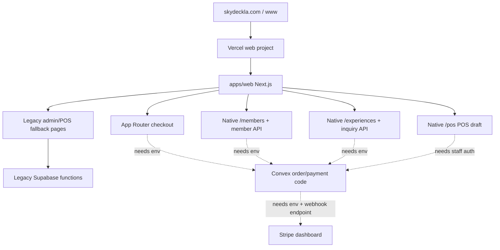

# Production Readiness Checklist

This is the simple current-state checklist for Skyla hosting, payments,
dependencies, and the remaining dashboard work.

## Simple Summary

The site is hosted on Vercel and the domain is pointed at Vercel. The public
pages load, and smoke tests pass on both `skydeckla.com` and
`www.skydeckla.com`.

The new safer payment backend is partly built in Convex code: orders and POS
sale drafts can be priced from server-owned data, Stripe Checkout sessions can
be created from a stored `orderRef`, and Stripe webhooks can verify signatures
before marking an order paid. Stripe Terminal PaymentIntents can now be created
from a stored POS `saleRef` only. The primary `/checkout` page now uses the
Next.js App Router and fails closed until the real Convex deployment, Vercel
env vars, and Stripe dashboard webhook endpoint are ready.

The extensionless `/pos` route is now the native server-priced POS shell. The
older `/pos-next` URL still renders that native shell during rollout, and
`/pos.html` is now a compatibility handoff to `/pos`; it no longer loads the
old POS browser app, Stripe Terminal SDK, or shared data facade. Reader
collection is still locked until staff auth, Convex envs, Stripe webhooks, and
Stripe Terminal test-reader acceptance are complete. Native `/admin` now has a
staff-token operations snapshot plus audited booking/member status actions.
`/admin.html` is now a compatibility handoff to `/admin`; it no longer loads
the old admin browser app or shared data facade. The old
static checkout URL is still reachable at `/checkout.html`, but it is now only
a compatibility handoff to `/checkout`; the old browser checkout script and
stylesheet are no longer shipped.

The native `/members` page now uses the server member application API instead
of the legacy localStorage/Supabase write path. It correctly refuses to accept
applications when Convex is not configured, so the page is safe to serve but
real application intake still depends on the dashboard setup below.

The native `/experiences` page now uses the server event inquiry API instead
of the legacy localStorage/Supabase write path. It correctly refuses to accept
event inquiries when Convex is not configured, so the page is safe to serve but
real event intake still depends on the dashboard setup below.

## Plain-English Next Checklist

1. Link the real Skyla Convex project.
2. Add `NEXT_PUBLIC_CONVEX_URL` in Vercel Preview and Production.
3. Add Stripe secrets in Convex, not Vercel browser env vars.
4. Keep Stripe in test mode first.
5. Create the Stripe webhook endpoint after Convex gives you the site URL.
6. Use Stripe test cards and a test Terminal reader only.
7. Keep `SKYLA_POS_TERMINAL_ACCEPTANCE` unset until the test reader passes.
8. Seed the first staff admin, then remove the bootstrap token.
9. Confirm member and event forms save into Convex in Preview.
10. Confirm checkout and POS stay server-priced with test payments.
11. Disable or redeploy old Supabase payment functions from the fail-closed
    repo copies.
12. Finish the native admin/POS rebuild and test-reader acceptance before
    removing the remaining compatibility handoffs.
13. After each merge, rerun route, payment, readiness, dependency, and CodeQL
    checks and record the production deployment URL here.

## Current Verified State

- Vercel project: `junyen-enterprises/web`
- Vercel project ID: `prj_fhlOjcwSbnPAuLi8tTiGbhjVomnr`
- Latest app-code production deployment checked on 2026-07-05:
  `https://web-7s20mwxo9-junyen-enterprises.vercel.app`
- Latest app-code deployment ID checked on 2026-07-05:
  `dpl_AVbzMd2HR6bKp8JLDWcaM2BvSBjk`
- Latest app-code merge commit checked on 2026-07-05:
  `1a4b52a0993ba8c69ad20456716246dc3d24370b` (PR #67)
- Docs-only follow-up merges may create newer Vercel deployments with the same
  app behavior. Use Vercel for the newest deployment URL before recording new
  evidence.
- Custom domains checked on 2026-07-05:
  - `https://skydeckla.com`
  - `https://www.skydeckla.com`
- Vercel/Convex env behavior checked on 2026-07-05: `vercel env ls` for
  `junyen-enterprises/web` found no project environment variables. Production
  still behaves as Convex-unconfigured, so checkout/POS/member/experience
  server writes and payment execution are safely blocked.
- DNS TXT records checked by subagent on 2026-07-02: authoritative Vercel DNS
  did not return the older Apple/Brevo TXT values documented in the domain
  runbook. Restore them in Vercel DNS if those services are still needed, or
  update the domain runbook after confirming they are intentionally removed.
- GitHub branch protection checked on 2026-07-02: `main` is protected with
  strict required checks `ci-build`, `Analyze JavaScript and TypeScript`, and
  `Vercel`; force pushes, branch deletion, and unresolved conversations are
  blocked.
- GitHub CodeQL PR check passed on 2026-07-05 for native voucher redemption
  PR #67. The Code Scanning open-alert API returned `404` for the local `gh`
  token during this docs pass, so use the GitHub Security tab to refresh the
  open-alert count before recording a new alert-list audit.
- GitHub security toggles checked on 2026-07-02: Dependabot vulnerability
  alerts are enabled, automated security fixes are enabled, and the repo
  homepage points to `https://skydeckla.com`.
- GitHub Pages was disabled on 2026-07-02 after Vercel custom-domain production
  was verified. The old `https://junyengit.github.io/skyla/` surface should
  stay off unless Vercel rollback is unavailable and a deliberate Pages rollback
  is planned.
- Live API behavior checked on 2026-07-05 across the checked Vercel production
  deployment, apex domain, and `www` with `bun run test:payments`:
  - Spoofed checkout total `1` cent returned canonical server total `8505`
    cents for the probe payload.
  - Spoofed POS total/reader/location returned canonical server total `9700`
    cents for the probe payload and no reader/location fields in the transient
    draft.
  - `/api/payments/stripe-checkout`,
    `/api/payments/stripe-terminal`, and
    `/api/payments/stripe-terminal/process` returned `503` with
    `convex_unconfigured` when probed with the required fake staff auth where
    applicable.
  - `/api/payments/stripe-terminal` returned `401 staff_auth_required` before
    Convex configuration when no staff token was provided.
  - No response exposed a Stripe `clientSecret`.
- Member application API checked on 2026-07-05 across the apex domain, `www`,
  and the latest Vercel deployment URL with an empty no-write payload:
  `/api/members/applications` returned `503` with `convex_unconfigured`, so it
  is safely blocked until Convex is linked.
- Experience inquiry API checked on 2026-07-05 across the apex domain, `www`,
  and the latest Vercel deployment URL with an empty no-write payload:
  `/api/experiences/inquiries` returned `503` with `convex_unconfigured`, so it
  is safely blocked until Convex is linked.
- Vercel production runtime errors checked on 2026-07-05 after smoke probes:
  no error/fatal logs for deployment `dpl_AVbzMd2HR6bKp8JLDWcaM2BvSBjk` in
  the fetched log window.
- Bun checked locally: `1.4.0-canary.1+fb50cce92`
- Dependency audit checked on 2026-07-05: `bun audit --audit-level=low` reports
  no vulnerabilities after the `postcss@8.5.16` override.
- Dependency freshness checked on 2026-07-05: `bun outdated --recursive` only
  listed ESLint `10.6.0`.
- Known deferred dependency: ESLint `10.6.0`; it currently breaks through
  `eslint-plugin-react`, so keep ESLint on `9.39.4` until the plugin stack is
  compatible.


```mermaid
flowchart TD
  domain["skydeckla.com / www"]
  vercel["Vercel web project"]
  next["apps/web Next.js"]
  checkout["App Router checkout"]
  members["Native /members + member API"]
  experiences["Native /experiences + inquiry API"]
  pos["Native /pos POS draft"]
  legacy["Legacy admin/POS fallback pages"]
  supabase["Legacy Supabase functions"]
  convex["Convex order/payment code"]
  stripe["Stripe dashboard"]

  domain --> vercel --> next --> checkout
  next --> members
  next --> experiences
  next --> pos
  next --> legacy --> supabase
  checkout -. "needs env" .-> convex
  members -. "needs env" .-> convex
  experiences -. "needs env" .-> convex
  pos -. "needs staff auth" .-> convex
  convex -. "needs env + webhook endpoint" .-> stripe
```

## What Is Good Right Now

- Hosting is on Vercel.
- GoDaddy nameservers are pointed at Vercel.
- Vercel production and both custom domains pass the 23-route smoke test.
- The 23-route smoke test passed on 2026-07-05 for
  `https://web-7s20mwxo9-junyen-enterprises.vercel.app`,
  `https://skydeckla.com`, and `https://www.skydeckla.com`.
- GitHub `main` is protected with required `ci-build`,
  `Analyze JavaScript and TypeScript`, and `Vercel` checks.
- GitHub CodeQL open-alert list is empty.
- Admin and POS are marked `noindex, nofollow`.
- `/admin`, `/admin.html`, `/pos`, `/pos.html`, and `/pos-next` are marked
  `noindex, nofollow` in the current code path.
- Native `/admin` uses `/api/admin/operations` to request a staff-gated Convex
  operations snapshot; it does not read or write Supabase from the browser.
- Native `/admin` can now call audited booking/member status actions through
  Next API routes and Convex mutations. The browser sends only refs, allowed
  statuses, and the staff bearer token.
- Native `/admin` can now look up a booking reference or exact guest email
  through `/api/admin/bookings/lookup`, then check in or undo check-in through
  the same audited status route. It still fails closed until Convex is linked.
- Native `/admin` can now load and save typed announcement/hours config through
  `/api/admin/config`; pricing, menu, catalog, vouchers, refunds, deletes, and
  resets remain intentionally unavailable.
- Legacy `/admin.html` is now retired to a native handoff. The old
  `admin.js`, `admin.css`, and `shared-data.js` staff browser assets are absent
  from `apps/web/public`, so missing workflows must move into native Convex
  routes instead of reviving browser Supabase writes.
- `/api/members/applications` is the new server-durable member application path.
  It validates applicant fields, requires Convex before accepting, dedupes exact
  retries with an idempotency key, and writes a pending Convex `members` row plus
  a compact audit event.
- Native `/members` posts to that API with an idempotency key and no longer
  writes applications through `SkylaData.addMember`, browser localStorage, or
  the legacy Supabase mirror.
- `/api/experiences/inquiries` is the new server-durable event inquiry path.
  It validates public inquiry fields, requires Convex before accepting, dedupes
  exact retries with an idempotency key, and writes a pending Convex
  `inquiries` row plus a compact audit event.
- Native `/experiences` posts to that API with an idempotency key and no longer
  writes event inquiries through `SkylaData.addInquiry`, browser localStorage,
  or the legacy Supabase mirror.
- Admin and POS dark-theme text is high contrast. Staff compatibility pages
  `/admin.html` and `/pos.html` are self-contained handoffs to the native
  routes, and production readiness checks fail if retired staff assets are
  served again.
- Prior Helium visual QA on 2026-07-02 confirmed `/admin` and `/pos-next` were
  readable on the black staff surfaces. In this later audit, macOS window
  capture returned only the desktop wallpaper, so the current slice relies on
  automated route/payment/readiness smokes plus direct rendered HTML/CSS
  assertions until Helium capture is available again.
- Native `/pos` and compatibility `/pos-next` review a server-calculated POS
  total without using browser totals.
- Legacy `/pos.html` is now retired to a native handoff. The repo copy of the
  old Supabase Terminal function returns `410` for `setup-reader` as well as
  the old charge/reader bridge actions.
- `/api/payments/stripe-terminal` accepts only `saleRef` and `idempotencyKey`,
  requires a staff bearer token, and forwards to Convex.
- Convex Stripe actions now require `SKYLA_STRIPE_MODE`, and they reject a
  Stripe secret key whose `sk_test_` or `sk_live_` prefix does not match it.
- Convex Stripe webhooks now reject events whose `livemode` flag does not match
  `SKYLA_STRIPE_MODE`.
- The POS Terminal reader handoff uses the stored sale/reader, requires the
  Convex `SKYLA_TERMINAL_READER_REGISTRY`, and keeps the sale pending until
  Stripe final confirmation.
- Stored readers are rechecked against the registry at payment time, and
  duplicate in-flight reader handoffs are rejected by a short reservation lock.
- Production `/api/payments/stripe-checkout` currently fails closed with
  `convex_unconfigured` until Convex is connected. Terminal payment routes
  require staff bearer auth first, then fail closed with `convex_unconfigured`
  until Convex is connected.
- `bun run test:payments` now checks the payment API fail-closed behavior on
  any supplied base URL without using a real card or writing Convex data.
- `bun run test:production-readiness` now bundles route, noindex, payment
  no-write, member no-write, experience inquiry no-write, and staff
  compatibility handoff checks for the custom domains.
- `/api/admin/bookings/status` and `/api/admin/members/status` require staff
  bearer auth first, fail closed when Convex is unconfigured, reject arbitrary
  statuses before calling Convex, and do not expose Stripe `clientSecret`.
- Production `/api/order-drafts/pos` ignores spoofed browser totals and returns
  the server catalog total.
- The repo copy of legacy Supabase Stripe Checkout, Terminal payment creation,
  and Stripe webhook handling returns `410` permanently.
- The checkout compatibility handoff no longer ships Kaskade/crypto or the old
  browser checkout script, and the repo copy of legacy Supabase Kaskade
  payment/webhook functions now returns `410` permanently.
- `/checkout.html` now points to `/checkout` and no longer serves legacy Stripe
  card creation code from browser totals.
- Public `.html` compatibility pages for `/about`, `/cafe`, `/experiences`,
  `/members`, `/privacy`, and `/terms` now point to the native App Router
  pages and no longer serve old page CSS, shared navigation JS, or third-party
  tracking snippets.
- Public static compatibility-page ticket links now point to `/checkout`, the
  App Router checkout path, instead of `checkout.html`.
- No raw card number/CVC collection was found in the app code.
- No committed Stripe secret key was found.
- Next.js `16.2.10`, React `19.2.7`, Motion `12.42.2`, Turbo `2.10.3`,
  TypeScript `6.0.3`, Vitest `4.1.9`, and Convex `1.42.1` are current for
  this stack.
- `eslint@10.6.0` is intentionally held because the latest available
  `eslint-plugin-react@7.37.5` crashes under ESLint 10 through Next's lint
  config.
- `bun audit` reports no vulnerabilities.

## Still Not Safe To Call Complete

- Vercel currently has no project env vars, so the deployed app behaves as
  though Convex is unconfigured and live checkout/POS payment execution remains
  intentionally blocked.
- Convex cloud is not linked yet.
- Active Convex `staffUsers` rows are not seeded yet. Native staff auth cannot
  be accepted until at least one admin is seeded.
- Stripe live/test webhook endpoint is not created in the Stripe dashboard yet.
- `/checkout` is the new App Router checkout, but live card payment is gated
  until Convex and Stripe dashboard envs exist.
- `/members` is native, but live application acceptance is still gated until
  `/api/members/applications` can write to a linked Convex deployment in preview
  and production.
- `/experiences` is native, but live event inquiry acceptance is still gated
  until `/api/experiences/inquiries` can write to a linked Convex deployment in
  preview and production.
- `/about`, `/cafe`, `/privacy`, and `/terms` are native App Router pages with
  `.html` compatibility URLs. Native `/cafe` uses the shared
  `@skyla/payments` catalog for public menu prices.
- Any already deployed Supabase payment functions must still be disabled or
  redeployed from the permanently fail-closed repo code in the Supabase
  dashboard. Check `stripe-checkout`, `stripe-terminal`, `stripe-webhook`,
  `kaskade-payment`, and `kaskade-webhook`.
- Legacy `/pos.html` reader connection and charge UI should stay disabled while
  the native `/pos` staff-authenticated Terminal flow is accepted.
- Native `/pos` is not safe for live card-present payment yet because reader
  processing and signed webhook reconciliation still need real
  Convex/staff auth/Stripe dashboard envs plus Stripe test-reader acceptance.
- Admin/POS are not fully rebuilt as protected App Router/Convex workflows yet.
  The native `/admin` snapshot, booking lookup/check-in, status actions, and
  announcement/hours config are the first admin slices; voucher redemption now
  uses the native event-ledger slice.
- Native admin intentionally does not yet do refunds, hard delete, clear all,
  reset all, pricing/menu edits, or payment catalog changes.
- Supabase functions should not be removed until checkout, POS, admin, and data
  migration acceptance tests pass.

## Dashboard Checklist

### Vercel

- [ ] Confirm project root is `apps/web`.
- [ ] Confirm Production Branch is `main`.
- [ ] After every merge, record the production deployment URL, deployment ID,
      commit SHA, and aliases for `skydeckla.com` and `www.skydeckla.com`.
- [ ] Confirm install command is
  `cd ../.. && bash scripts/setup/vercel-install-bun-canary.sh`.
- [ ] Confirm build command is
  `cd ../.. && export PATH="$HOME/.bun/bin:$PATH" && bun --revision && bun run web:build`.
- [ ] Add `NEXT_PUBLIC_CONVEX_URL` to Preview and Production after Convex is
      linked.
- [ ] Confirm only public browser config is in Vercel. Stripe secrets,
      webhook secrets, staff bootstrap token, and Terminal reader registry
      belong in Convex, not `NEXT_PUBLIC_*`.
- [ ] Add Google Ads public env vars only when ads are ready.
- [ ] Keep secrets out of `NEXT_PUBLIC_*`.
- [ ] Confirm `/pos` and `/pos-next` remain `X-Robots-Tag: noindex, nofollow`
      after every preview and production deploy.
- [ ] Confirm `/admin` and `/admin.html` remain `X-Robots-Tag: noindex,
      nofollow` after every preview and production deploy.
- [ ] Confirm `/admin.html` and `/pos.html` are handoff-only pages that preserve
      query/hash, point to `/admin` and `/pos`, and do not serve the retired
      `admin.js`, `pos.js`, or `shared-data.js` assets.
- [ ] In Vercel DNS, confirm required TXT records still exist for Apple/Brevo or
      other external services. The 2026-07-02 live check did not see the older
      Apple/Brevo TXT values.

### Convex

- [ ] Create or link the Skyla Convex project.
- [ ] Run real project codegen, not anonymous local mode.
- [ ] Set `SKYLA_STRIPE_MODE` to `test` for Preview/test acceptance. Use `live`
      only after test cards, test webhooks, and test reader acceptance pass.
- [ ] Set `STRIPE_SECRET_KEY` in Convex test/preview first.
- [ ] Set `SKYLA_PAYMENT_RETURN_ORIGINS` to
  `https://skydeckla.com,https://www.skydeckla.com`.
- [ ] Set `STRIPE_WEBHOOK_SECRET` after creating the Stripe endpoint.
- [ ] Set `SKYLA_TERMINAL_READER_REGISTRY` with the Stripe test-reader IDs and
      locations that staff are allowed to use.
- [ ] Keep `SKYLA_POS_TERMINAL_ACCEPTANCE` unset until Stripe test-reader
      acceptance passes, then set it to `enabled` in the matching
      Vercel/Convex runtime scopes.
- [ ] Run `bun run convex:env:check`.
- [ ] Run `bun run convex:codegen`.
- [ ] Temporarily set `SKYLA_STAFF_BOOTSTRAP_TOKEN`, run
      `staffBootstrap.upsertStaffUser` for the initial admin, then remove the
      token.
- [ ] Seed active `staffUsers` records for admins/viewers/POS staff before
      using native `/admin`, `/pos`, or `/pos-next`.
- [ ] Verify `/api/admin/operations` returns `200` with a valid staff token and
      `401`/`503` without auth or envs.
- [ ] Verify `/api/admin/bookings/status` returns `200` with a valid admin/pos
      token for `confirmed` and `checked-in`, rejects arbitrary statuses with
      `400`, and returns `503` while Convex is unconfigured.
- [ ] Verify `/api/admin/bookings/status` allows `cancelled` only for `admin`
      staff and writes an `admin.bookingStatus.update` audit event.
- [ ] Verify `/api/admin/members/status` allows only `admin` staff, accepts
      `pending`, `approved`, `waitlisted`, and `rejected`, and writes an
      `admin.memberStatus.update` audit event.
- [ ] Verify `/api/admin/config` can load and save announcement/hours with a
      valid admin token, rejects viewer/pos writes, rejects malformed shapes,
      and writes an `admin.config.update` audit event.
- [ ] Verify `/api/members/applications` returns `503 convex_unconfigured`
      before env wiring, then returns `201` for a new preview application,
      `200` for an exact idempotent retry, and `409` for a conflicting retry.
- [ ] Verify the created member appears in native `/admin` with name, email,
      phone, source, tier, bio, pending status, and timestamps.

### Stripe

- [ ] Record the Stripe mode (`test` or `live`), endpoint ID, endpoint URL,
      subscribed events, and signing-secret rotation date for each webhook
      endpoint.
- [ ] Keep this work in Stripe test mode until the preview checkout and POS
      Terminal acceptance tests pass. Do not use a real credit card for this
      migration validation.
- [ ] Confirm the Stripe account has no live webhook endpoint still pointing at
      Supabase payment functions before live traffic is allowed.
- [ ] Confirm the live publishable key is domain-restricted in Stripe where
      available, and that only publishable keys appear in browser code.
- [ ] Create a test-mode webhook endpoint:
  `https://<convex-site-url>/stripe-webhook`.
- [ ] Subscribe it to:
  - `checkout.session.completed`
  - `checkout.session.async_payment_succeeded`
  - `checkout.session.async_payment_failed`
  - `checkout.session.expired`
  - `payment_intent.succeeded`
  - `payment_intent.payment_failed`
  - `payment_intent.canceled`
- [ ] Copy the endpoint signing secret into Convex as
  `STRIPE_WEBHOOK_SECRET`.
- [ ] Use Stripe test cards only until preview checkout passes.
- [ ] Verify webhook delivery, duplicate replay behavior, amount mismatch
      rejection, and order/POS sale status transitions before live traffic.
- [ ] Create a separate live-mode endpoint only after test mode passes.
- [ ] Do not use a real credit card during verification. Use Stripe test mode
      cards and Stripe dashboard test webhooks until preview acceptance passes.
- [x] Replace the legacy Terminal create-intent path in repo code with a Convex
      action that accepts `saleRef` only and reads the stored POS sale amount.
- [x] Add signed Stripe Terminal PaymentIntent webhook reconciliation from the
      stored `saleRef`, stored Terminal PaymentIntent ID, amount, currency, and
      webhook event ID.
- [ ] Wire native `/pos` to collect/process that Convex-created PaymentIntent
      on a real Stripe test reader, then set `SKYLA_POS_TERMINAL_ACCEPTANCE`
      to `enabled`.
- [ ] Disable or redeploy legacy Supabase Stripe functions so any live old
      functions inherit the fail-closed behavior.

### Supabase Legacy

- [ ] In Supabase Edge Functions, confirm whether `stripe-checkout` is deployed.
      It should be disabled or redeployed from the repo copy that returns `410`
      for browser-authoritative payment creation.
- [ ] In Supabase Edge Functions, confirm whether `stripe-terminal` is deployed.
      It should be disabled or redeployed from the repo copy that returns `410`
      for browser-authoritative Terminal charges and legacy reader setup.
- [ ] In Supabase Edge Functions, confirm whether `stripe-webhook` is deployed.
      It should be disabled or redeployed from the repo copy that returns `410`.
      Stripe dashboard endpoints should point to Convex, not Supabase, before
      live payment acceptance.
- [ ] In Supabase Edge Functions, confirm whether `kaskade-payment` and
      `kaskade-webhook` are deployed. They should be disabled or redeployed from
      the repo copies that return `410`.
- [ ] Record the deployed status, last deployment time, and rollback decision
      for each legacy function before deleting anything.

### GitHub

- [x] Protect `main`.
- [x] Require PRs.
- [x] Require strict `ci-build`, `Analyze JavaScript and TypeScript`, and
      `Vercel` checks.
- [x] Block force pushes and branch deletion.
- [x] Require conversation resolution before merge.
- [x] Keep Dependabot vulnerability alerts enabled.
- [x] Keep Dependabot automated security fixes enabled.
- [ ] Confirm secret scanning/secret protection in GitHub's Security dashboard.
- [x] Disable the old GitHub Pages deployment after Vercel cutover verification.

Current check: `main` protection is active through GitHub branch protection.
The CI job is named `ci-build` so it cannot be confused with other GitHub or
hosting integration checks named `build`. GitHub Pages is no longer an active
deployment surface for this repo.

## Verification Commands

```bash
PATH="$HOME/.bun/bin:$PATH" bun install --frozen-lockfile
PATH="$HOME/.bun/bin:$PATH" bun run check
PATH="$HOME/.bun/bin:$PATH" bun run security:audit
PATH="$HOME/.bun/bin:$PATH" bun audit --audit-level=low
PATH="$HOME/.bun/bin:$PATH" bun outdated --recursive
PATH="$HOME/.bun/bin:$PATH" bun run convex:env:check
PATH="$HOME/.bun/bin:$PATH" SMOKE_BASE_URL=<latest-production-url> bun run test:smoke
PATH="$HOME/.bun/bin:$PATH" SMOKE_BASE_URL=https://skydeckla.com bun run test:smoke
PATH="$HOME/.bun/bin:$PATH" SMOKE_BASE_URL=https://www.skydeckla.com bun run test:smoke
PATH="$HOME/.bun/bin:$PATH" PAYMENT_SMOKE_BASE_URL=<latest-production-url> bun run test:payments
PATH="$HOME/.bun/bin:$PATH" PAYMENT_SMOKE_BASE_URL=https://skydeckla.com bun run test:payments
PATH="$HOME/.bun/bin:$PATH" PAYMENT_SMOKE_BASE_URL=https://www.skydeckla.com bun run test:payments
PATH="$HOME/.bun/bin:$PATH" PRODUCTION_READINESS_BASE_URLS=<latest-production-url>,https://skydeckla.com,https://www.skydeckla.com bun run test:production-readiness
PATH="$HOME/.bun/bin:$PATH" bunx vitest run apps/web/member-applications-route.test.ts convex/memberApplications.test.ts
```

`bun run convex:env:check` is expected to fail until the real Convex/Vercel
environment variables are present. Treat that failure as the dashboard setup
check, not as a reason to bypass the fail-closed payment behavior.

The production-readiness smoke is safe before and after dashboard wiring because
its payment probes are no-write by default: draft routes omit idempotency/auth
write prerequisites, and payment execution routes stop at validation or missing
staff auth before any Stripe action can run. It checks the route matrix, noindex
headers, server-owned totals, checkout handoff/retired asset checks, the native
POS no-legacy check, the member application no-write gate, the experience
inquiry no-write gate, and staff handoff/retired asset checks across the custom
domains plus an optional `VERCEL_PRODUCTION_URL`.

Current dependency note:

- `bun audit --audit-level=low` reports no vulnerabilities.
- `bun outdated --recursive` reports only a major ESLint update (`9.39.4` to
  `10.6.0`) in `@skyla/web`. I retested that upgrade on 2026-07-05; lint fails
  because `eslint-plugin-react@7.37.5` is not compatible with ESLint 10 through
  the current Next lint stack. Keep ESLint on `9.39.4` until the upstream lint
  plugin stack supports ESLint 10.

## Next Work Order

1. Link real Convex cloud and set Vercel `NEXT_PUBLIC_CONVEX_URL`.
2. Seed initial staff with `staffBootstrap.upsertStaffUser`, verify native
   `/admin`, then remove `SKYLA_STAFF_BOOTSTRAP_TOKEN`.
3. Verify native `/members` applications persist through
   `/api/members/applications` in preview and production after Convex is linked.
4. Verify preview checkout draft persistence returns `persisted: true`.
5. Create Stripe test webhook endpoint and set Convex Stripe env vars.
6. Set Convex/Vercel env vars so the App Router checkout can persist orders
   and start Stripe Checkout.
7. Add real Vercel/Convex envs, then accept native `/pos` Terminal reader processing on a
   Stripe test reader using stored `saleRef` and stored reader IDs.
8. Accept Stripe Terminal final webhook reconciliation in test mode with a real
   test reader and matching Convex sale.
9. Allow staff to use native `/pos` for card-present payment only after
   Terminal capture uses stored `saleRef` totals and signed webhooks reconcile
   final state.
10. Finish native Admin beyond lookup/status/config/voucher actions: refunds,
   catalog, exports, and any destructive action with typed validators, audit
   logs, and rollback steps.
11. Rebuild POS as the protected live App Router/Convex register.
12. Migrate remaining Supabase data and disable legacy Supabase functions only
   after acceptance tests pass.

## Plain-English Handoff

What has been done:

- The website is on Vercel and the domain is pointing there.
- The repo is organized as a Turborepo with the app under `apps/web`.
- Checkout and POS totals are now calculated by trusted code, not by whatever
  the browser sends.
- The current live site does not have the secret Convex/Stripe settings yet, so
  card-payment APIs stop safely instead of trying to charge.
- Stripe mode is now an explicit setting, so test keys/webhooks and live
  keys/webhooks cannot be mixed silently.
- There is now a repeatable payment smoke command to check that fail-closed
  behavior on the Vercel URL, `skydeckla.com`, and `www.skydeckla.com`.
- There is also a one-command production-readiness smoke that bundles route,
  payment no-write, member no-write, experience inquiry no-write, and staff
  compatibility handoff checks.
- `/members` is now a Next.js page. Its form does not save locally; it only
  succeeds after the server accepts the application.
- Admin, native POS, `/pos-next`, and staff compatibility handoffs use
  high-contrast dark staff screens.
- `/admin` is being moved into Next.js. It now has staff-gated operations,
  booking/member status buttons, announcement/hours config, and voucher
  redemption code; `/admin.html` now hands off to the native route.
- `/pos` is now the native server-priced POS screen. `/pos.html` now hands off
  to the native route while Stripe Terminal test-reader acceptance is completed.
  The old reader setup bridge is retired in repo code too.

What still needs to be done:

- Link the real Convex cloud project.
- Add the required Vercel and Convex environment variables.
- Test the native `/members` application form in preview after Convex is linked.
- Create the Stripe webhook endpoint in the Stripe dashboard.
- Test checkout with Stripe test cards only.
- Test native `/pos` Terminal with a Stripe test reader only.
- Finish the protected Admin and POS Next.js/Convex pages, then retire the old
  compatibility pages and Supabase functions.
- Use Stripe test cards and a Stripe test Terminal reader first. Do not verify
  this migration with a real credit card.
