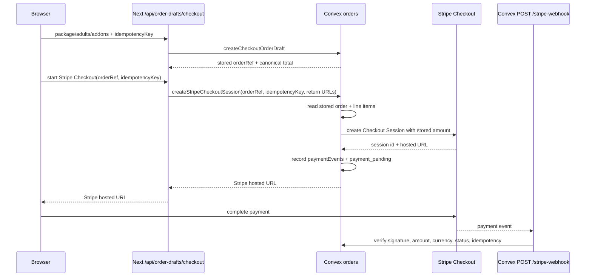

# Stripe Checkout Cutover Runbook

This runbook explains the new Stripe Checkout direction in simple terms, then
lists the exact technical checks agents should use.

## Plain-English Version

The old payment path lets the browser tell the backend how much to charge. That
is risky because browsers are easy to edit. The new path stores the order in
Convex first, then Stripe is asked to charge only that stored order.

What changed in this slice:

- Convex now has a public action named
  `payments.createStripeCheckoutSession`.
- The action takes `orderRef`, the draft `idempotencyKey`, `successUrl`, and
  `cancelUrl`.
- It does not accept browser totals, line items, currency, booking refs, or
  product data.
- It reads the stored Convex order and line items, builds Stripe Checkout
  line items from that stored data, and records a `paymentEvents` ledger entry.
- It marks the stored order as `payment_pending` with `expectedProvider:
  "stripe"` after Stripe returns a session.
- Convex now has a `POST /stripe-webhook` HTTP action that verifies Stripe's
  raw-body signature, dedupes event IDs, and marks stored orders paid only
  after amount, currency, provider, and status reconciliation.

The primary `/checkout` page now uses the App Router and calls the server draft
route first. It shows a closed payment state until the real Convex deployment,
Stripe envs, and Stripe dashboard webhook endpoint exist. The old static
checkout remains at `/checkout.html` only as a legacy reference during the
cutover; its Stripe card creation path is disabled in code.

POS is a separate payment surface. `/pos-next` can review server-priced POS sale
drafts, and the Terminal backend now creates payment intents from stored
`saleRef` records only. Do not treat POS as cut over until the staff UI can
collect/process those intents on a real test reader.

## Flow



## Required Env Before Frontend Cutover

Use [docs/reference/environment.md](../reference/environment.md) as the source
of truth. Minimum required values:

- Vercel: `NEXT_PUBLIC_CONVEX_URL`
- Convex: `STRIPE_SECRET_KEY`
- Convex: `SKYLA_PAYMENT_RETURN_ORIGINS`
- Convex: `STRIPE_WEBHOOK_SECRET`
- Stripe dashboard webhook endpoint:
  `https://<convex-site-url>/stripe-webhook`

## Safe API Checks

These checks do not use a real credit card.

1. Confirm the order route persists:

```bash
curl -sS -X POST "$PREVIEW_URL/api/order-drafts/checkout" \
  -H 'content-type: application/json' \
  --data '{
    "packageKey": "general",
    "adults": 2,
    "children": 1,
    "addons": { "matcha": 1 },
    "customerEmail": "guest@example.com",
    "idempotencyKey": "checkout_20260704_api_check",
    "totalCents": 1
  }'
```

Expected:

- `persisted: true`
- `orderRef` starts with `SKY`
- totals are canonical and ignore `totalCents: 1`

2. Confirm Stripe action contract in code:

```bash
rg -n "createStripeCheckoutSession|amountCents|totalCents|line_items" convex apps/web/public/checkout.js supabase/functions
```

Expected:

- New Convex action accepts `orderRef`, not `amountCents`.
- `/checkout` calls the Next/Convex route.
- `/checkout.html` has `STRIPE_ENABLED = false`.
- Old Supabase payment creation actions return `410` permanently in repo code.

3. Confirm the webhook route exists after the real Convex deployment is linked:

```bash
curl -sS "https://<convex-site-url>/stripe-webhook"
```

Expected:

- JSON response with `ok: true`

4. Use Stripe test mode only after the real Convex deployment is linked. Use
   Stripe dashboard/test cards, never a real card, for the preview cutover.

5. Confirm the POS draft route ignores browser totals:

```bash
curl -sS -X POST "$PREVIEW_URL/api/order-drafts/pos" \
  -H 'content-type: application/json' \
  --data '{
    "lines": [
      { "kind": "ticket", "packageKey": "drink", "quantity": 2 },
      { "kind": "cafe", "itemKey": "b1", "quantity": 3 },
      {
        "kind": "custom",
        "name": "Service recovery",
        "amountCents": 500,
        "reason": "Manager approved"
      }
    ],
    "idempotencyKey": "pos_20260704_api_check",
    "totalCents": 1
  }'
```

Expected:

- total is `9700`, not `1`
- `persisted` is `false` until staff auth and Convex are configured
- Terminal payment requires a stored `saleRef`

6. Confirm the Terminal route ignores browser totals:

```bash
curl -sS -X POST "$PREVIEW_URL/api/payments/stripe-terminal" \
  -H 'content-type: application/json' \
  -H "authorization: Bearer $STAFF_TEST_JWT" \
  --data '{
    "saleRef": "SALE260704-ABC123",
    "idempotencyKey": "pos_20260704_api_check",
    "amountCents": 1,
    "readerId": "tmr_browser_supplied"
  }'
```

Expected before Convex is wired:

- `503` with `code: "convex_unconfigured"`, or `401` if no staff token is sent

Expected after Convex is wired:

- amount comes back from stored Convex sale data, not `amountCents: 1`

## Acceptance Checklist

- [ ] Convex cloud project is linked.
- [ ] Vercel preview has `NEXT_PUBLIC_CONVEX_URL`.
- [ ] Convex env has `STRIPE_SECRET_KEY`.
- [ ] Convex env has `SKYLA_PAYMENT_RETURN_ORIGINS`.
- [ ] Convex env has `STRIPE_WEBHOOK_SECRET`.
- [ ] Stripe dashboard has a test-mode endpoint pointing to Convex
      `/stripe-webhook`.
- [ ] Preview order draft POST returns `persisted: true`.
- [ ] `/checkout` shows a persisted `orderRef` after review.
- [ ] Stripe Checkout action rejects missing/incorrect `idempotencyKey`.
- [ ] Stripe Checkout action rejects return URLs outside the allowlist.
- [ ] Stripe Checkout action creates sessions from stored Convex totals only.
- [ ] `paymentEvents` records Stripe session id, amount, currency, and idempotency key.
- [ ] Webhook verifies raw-body signatures and records duplicate event IDs
      idempotently.
- [ ] Paid webhook events reconcile session id, order ref, amount, currency,
      provider, and order status before marking the order paid.
- [ ] Home page checkout links resolve to the App Router `/checkout` page, not
      the legacy static rewrite.
- [x] Legacy Supabase Stripe card and Terminal payment creation fail closed by
      default in repo code.
- [ ] Confirm any already deployed legacy Supabase functions are redeployed from
      fail-closed code or disabled in the dashboard.
- [x] POS Terminal create-intent accepts `saleRef` only before `/pos-next`
      replaces the live `/pos` path.
- [ ] `/pos-next` can collect/process the Convex-created PaymentIntent on a
      Stripe test reader.
- [ ] No real cards are used during preview verification.

## Rollback

If Stripe cutover fails, keep `/api/order-drafts/checkout` returning canonical
drafts and turn off the frontend call to `payments.createStripeCheckoutSession`.
Do not delete legacy Supabase payment functions until the Convex payment and
webhook path has passed preview and production checks.
