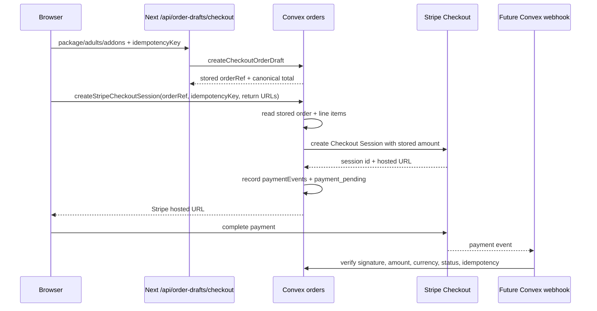

# Stripe Checkout Cutover Runbook

This runbook explains the new Stripe Checkout direction in simple terms, then
lists the exact technical checks agents should use.

## Plain-English Version

The old payment path lets the browser tell the backend how much to charge. That
is risky because browsers are easy to edit. The new path stores the order in
Convex first, then Stripe is asked to charge only that stored order.

What changed in this slice:

- Convex now has a public action named
  `payments.createStripeCheckoutSession`.
- The action takes `orderRef`, the draft `idempotencyKey`, `successUrl`, and
  `cancelUrl`.
- It does not accept browser totals, line items, currency, booking refs, or
  product data.
- It reads the stored Convex order and line items, builds Stripe Checkout
  line items from that stored data, and records a `paymentEvents` ledger entry.
- It marks the stored order as `payment_pending` with `expectedProvider:
  "stripe"` after Stripe returns a session.

This is not fully live yet. The public checkout page still needs a follow-up
frontend cutover after the real Convex deployment and Stripe envs exist.

## Flow



## Required Env Before Frontend Cutover

Use [docs/reference/environment.md](../reference/environment.md) as the source
of truth. Minimum required values:

- Vercel: `NEXT_PUBLIC_CONVEX_URL`
- Convex: `STRIPE_SECRET_KEY`
- Convex: `SKYLA_PAYMENT_RETURN_ORIGINS`
- Convex later webhook step: `STRIPE_WEBHOOK_SECRET`

## Safe API Checks

These checks do not use a real credit card.

1. Confirm the order route persists:

```bash
curl -sS -X POST "$PREVIEW_URL/api/order-drafts/checkout" \
  -H 'content-type: application/json' \
  --data '{
    "packageKey": "general",
    "adults": 2,
    "children": 1,
    "addons": { "matcha": 1 },
    "customerEmail": "guest@example.com",
    "idempotencyKey": "checkout_20260704_api_check",
    "totalCents": 1
  }'
```

Expected:

- `persisted: true`
- `orderRef` starts with `SKY`
- totals are canonical and ignore `totalCents: 1`

2. Confirm Stripe action contract in code:

```bash
rg -n "createStripeCheckoutSession|amountCents|totalCents|line_items" convex apps/web/public/checkout.js supabase/functions
```

Expected:

- New Convex action accepts `orderRef`, not `amountCents`.
- Legacy Supabase payment bridges still show client totals until the frontend
  cutover removes or disables them.

3. Use Stripe test mode only after the real Convex deployment is linked. Use
   Stripe dashboard/test cards, never a real card, for the preview cutover.

## Acceptance Checklist

- [ ] Convex cloud project is linked.
- [ ] Vercel preview has `NEXT_PUBLIC_CONVEX_URL`.
- [ ] Convex env has `STRIPE_SECRET_KEY`.
- [ ] Convex env has `SKYLA_PAYMENT_RETURN_ORIGINS`.
- [ ] Preview order draft POST returns `persisted: true`.
- [ ] Stripe Checkout action rejects missing/incorrect `idempotencyKey`.
- [ ] Stripe Checkout action rejects return URLs outside the allowlist.
- [ ] Stripe Checkout action creates sessions from stored Convex totals only.
- [ ] `paymentEvents` records Stripe session id, amount, currency, and idempotency key.
- [ ] Webhook cutover is implemented before claiming paid orders are fully Convex-owned.
- [ ] Legacy Supabase Stripe/Kaskade/Terminal payment paths are disabled only after replacement acceptance.

## Rollback

If Stripe cutover fails, keep `/api/order-drafts/checkout` returning canonical
drafts and turn off the frontend call to `payments.createStripeCheckoutSession`.
Do not delete legacy Supabase payment functions until the Convex payment and
webhook path has passed preview and production checks.
