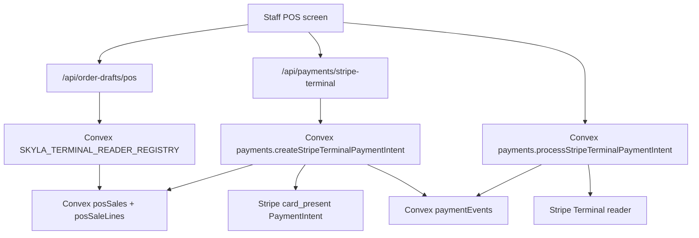

# Stripe Terminal Cutover Runbook

This is the operational checklist for moving in-person card payments from the
legacy POS bridge to the new Convex sale-ref flow.

## Simple Version

The old POS card path let the browser tell Stripe the amount. The new path makes
Convex the source of truth:

- POS creates or retrieves a stored sale.
- The stored sale has a `saleRef`.
- The stored sale has a Stripe Terminal `readerId` authorized by Convex's
  trusted reader registry.
- Stripe Terminal receives an amount only after Convex reads the stored sale.
- Stripe receives the reader handoff from Convex, not browser-side amount data.
- Staff auth is required before the payment intent can be created.

No real card should be used for verification. Use Stripe test mode and a Stripe
test reader until the full flow passes.

## Flow



## Required Dashboard State

As of July 1, 2026, production correctly returns `convex_unconfigured` for this
route because Vercel is not wired to a real Convex deployment yet.

- Vercel has `NEXT_PUBLIC_CONVEX_URL`.
- Convex has `STRIPE_SECRET_KEY`.
- Convex has `SKYLA_TERMINAL_READER_REGISTRY` with entries like
  `tmr_frontdesk@tml_lobby`.
- Staff auth provider is configured for Convex.
- At least one active `staffUsers` row exists with role `admin` or `pos`.
- Stripe test-mode reader is registered and available.
- Legacy Supabase Terminal bridge is disabled or redeployed from fail-closed
  repo code.
- Final paid reconciliation is wired through Stripe webhook handling or a safe
  polling job before live acceptance.

## API Checks

### Fail Closed Without Convex

```bash
curl -i -X POST "$PREVIEW_URL/api/payments/stripe-terminal" \
  -H 'content-type: application/json' \
  --data '{"saleRef":"SALE260704-ABC123","idempotencyKey":"pos_20260704_api_check"}'
```

Expected:

- `503` with `code: "convex_unconfigured"` if Convex is not wired, or
- `401` with `code: "staff_auth_required"` if Convex is wired but no staff
  bearer token is sent.

### Ignore Browser Amounts

```bash
curl -i -X POST "$PREVIEW_URL/api/payments/stripe-terminal" \
  -H 'content-type: application/json' \
  -H "authorization: Bearer $STAFF_TEST_JWT" \
  --data '{
    "saleRef": "SALE260704-ABC123",
    "idempotencyKey": "pos_20260704_api_check",
    "amountCents": 1,
    "readerId": "tmr_browser_supplied",
    "terminalLocationId": "tml_browser_supplied"
  }'
```

Expected after Convex is wired:

- The response amount matches the stored Convex sale.
- The response includes the PaymentIntent ID and stored amount, but does not
  return a `clientSecret`.
- The browser-sent `amountCents`, `readerId`, and `terminalLocationId` are
  not used by the payment route.
- A `paymentEvents` row exists with provider `terminal`, status
  `requires_payment`, and the stored amount.

### Process On Stored Reader

```bash
curl -i -X POST "$PREVIEW_URL/api/payments/stripe-terminal/process" \
  -H 'content-type: application/json' \
  -H "authorization: Bearer $STAFF_TEST_JWT" \
  --data '{
    "saleRef": "SALE260704-ABC123",
    "idempotencyKey": "pos_20260704_api_check",
    "amountCents": 1,
    "readerId": "tmr_browser_supplied"
  }'
```

Expected after Convex and a test reader are wired:

- The reader used by Stripe is the stored sale reader, not the browser-sent
  `readerId`.
- Stripe's response echoes a `process_payment_intent` action for the stored
  PaymentIntent before Convex records the handoff.
- The response is `processing` or `failed`; it is not treated as paid.
- Failed handoff retries reserve a fresh server-side attempt idempotency key.
- Concurrent duplicate handoffs are rejected while a short server-side
  reservation is still active.
- `paymentEvents.status` moves to `processing` or `failed`.
- `posSales.status` stays `payment_pending` until Stripe final confirmation.

## Acceptance Checklist

- [ ] POS draft is persisted in real Convex and returns `saleRef`.
- [ ] POS draft stores only a Stripe Terminal `readerId` authorized by
      `SKYLA_TERMINAL_READER_REGISTRY`.
- [ ] Terminal route requires staff bearer auth.
- [ ] Terminal route does not accept browser amount/currency/line data.
- [ ] Convex action creates Stripe `card_present` PaymentIntent from stored sale
      only.
- [ ] The public route does not return `clientSecret` for the server-driven
      reader flow.
- [ ] Duplicate PaymentIntent and reader-process requests use separate stable
      idempotency keys safely.
- [ ] Failed reader handoff retries use a fresh server-reserved process attempt
      idempotency key.
- [ ] Duplicate in-flight reader handoffs are rejected by the reservation lock.
- [ ] Stripe test reader can process the stored intent.
- [ ] Successful reader payment records/updates the stored sale and ledger.
- [ ] Canceled/failed reader payment records a safe failure state.
- [ ] `/pos-next` is promoted only after the test-reader path passes.
- [ ] Legacy `/pos` and Supabase Terminal bridge are removed or permanently
      disabled after acceptance.

## Rollback

If the new Terminal path fails during preview, keep `/pos-next` locked and do
not promote it over `/pos`. Do not re-enable browser-authoritative payment
creation except as an explicit short-lived emergency decision with a written
rollback time.
