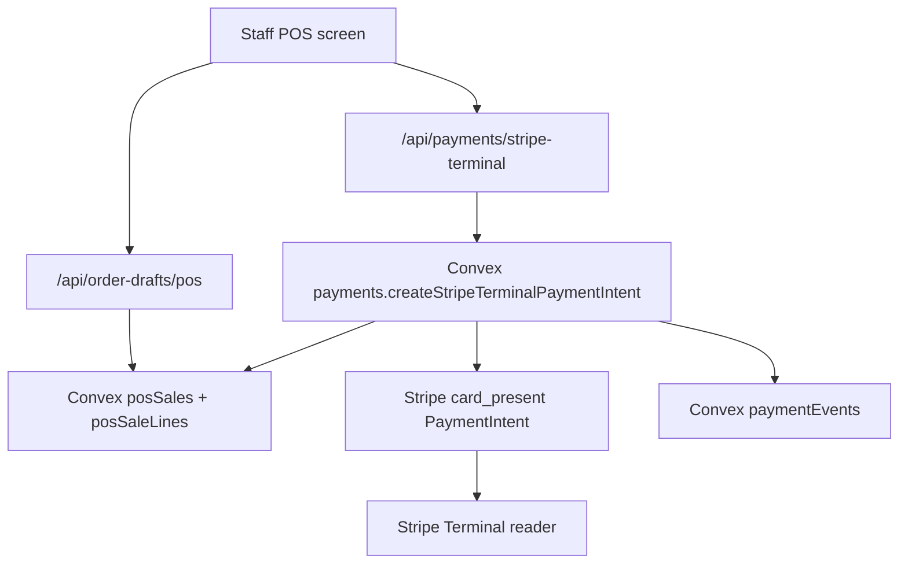

# Stripe Terminal Cutover Runbook

This is the operational checklist for moving in-person card payments from the
legacy POS bridge to the new Convex sale-ref flow.

## Simple Version

The old POS card path let the browser tell Stripe the amount. The new path makes
Convex the source of truth:

- POS creates or retrieves a stored sale.
- The stored sale has a `saleRef`.
- Stripe Terminal receives an amount only after Convex reads the stored sale.
- Staff auth is required before the payment intent can be created.

No real card should be used for verification. Use Stripe test mode and a Stripe
test reader until the full flow passes.

## Flow



## Required Dashboard State

As of July 1, 2026, production correctly returns `convex_unconfigured` for this
route because Vercel is not wired to a real Convex deployment yet.

- Vercel has `NEXT_PUBLIC_CONVEX_URL`.
- Convex has `STRIPE_SECRET_KEY`.
- Staff auth provider is configured for Convex.
- At least one active `staffUsers` row exists with role `admin` or `pos`.
- Stripe test-mode reader is registered and available.
- Legacy Supabase Terminal bridge is disabled or redeployed from fail-closed
  repo code.

## API Checks

### Fail Closed Without Convex

```bash
curl -i -X POST "$PREVIEW_URL/api/payments/stripe-terminal" \
  -H 'content-type: application/json' \
  --data '{"saleRef":"SALE260704-ABC123","idempotencyKey":"pos_20260704_api_check"}'
```

Expected:

- `503` with `code: "convex_unconfigured"` if Convex is not wired, or
- `401` with `code: "staff_auth_required"` if Convex is wired but no staff
  bearer token is sent.

### Ignore Browser Amounts

```bash
curl -i -X POST "$PREVIEW_URL/api/payments/stripe-terminal" \
  -H 'content-type: application/json' \
  -H "authorization: Bearer $STAFF_TEST_JWT" \
  --data '{
    "saleRef": "SALE260704-ABC123",
    "idempotencyKey": "pos_20260704_api_check",
    "amountCents": 1,
    "readerId": "tmr_browser_supplied",
    "terminalLocationId": "tml_browser_supplied"
  }'
```

Expected after Convex is wired:

- The response amount matches the stored Convex sale.
- The response includes a PaymentIntent `clientSecret` for Stripe Terminal JS
  reader collection.
- The browser-sent `amountCents`, `readerId`, and `terminalLocationId` are
  ignored.
- A `paymentEvents` row exists with provider `terminal`, status
  `requires_payment`, and the stored amount.

## Acceptance Checklist

- [ ] POS draft is persisted in real Convex and returns `saleRef`.
- [ ] Terminal route requires staff bearer auth.
- [ ] Terminal route does not accept browser amount/currency/line data.
- [ ] Convex action creates Stripe `card_present` PaymentIntent from stored sale
      only.
- [ ] POS receives the PaymentIntent `clientSecret` only through the
      staff-authenticated route.
- [ ] Duplicate requests reuse the same idempotency key safely.
- [ ] Stripe test reader can collect and process the intent.
- [ ] Successful reader payment records/updates the stored sale and ledger.
- [ ] Canceled/failed reader payment records a safe failure state.
- [ ] `/pos-next` is promoted only after the test-reader path passes.
- [ ] Legacy `/pos` and Supabase Terminal bridge are removed or permanently
      disabled after acceptance.

## Rollback

If the new Terminal path fails during preview, keep `/pos-next` locked and do
not promote it over `/pos`. Do not re-enable browser-authoritative payment
creation except as an explicit short-lived emergency decision with a written
rollback time.
