# Supabase To Convex Legacy Data Migration

This runbook moves the three supported legacy datasets into Convex without
turning historical records into payment history. The tooling exists in the
repository, but no Supabase export has been applied to a cloud Convex
deployment yet.

## Scope

Included:

- `bookings`
- `members`
- `inquiries`

Excluded:

- `config`, packages, add-ons, menu, hours, and announcements
- Supabase Auth users, sessions, password hashes, and the old local admin
  password
- orders, POS sales, payment events, webhook events, and provider payloads
- Stripe or Kaskade reconstruction

Historical bookings become Convex `bookings` records only. They do not create
`orders`, `orderLineItems`, `paymentEvents`, or `webhookEvents`. This avoids
inventing financial evidence that the legacy source does not contain.

```mermaid
flowchart LR
  sql["Supabase SQL export: id, data, created_at"]
  immutable["Immutable JSON + timestamp + SHA-256"]
  dry["Local dry run"]
  quarantine["Quarantine review"]
  dev["Convex development apply"]
  reconcile["Counts + sample reconciliation"]
  confirm["Human production confirmation"]
  prod["Convex production apply"]
  retain["Supabase retained read-only"]

  sql --> immutable --> dry --> quarantine
  quarantine -->|"zero rejected rows"| dev
  dev --> reconcile --> confirm --> prod --> retain
  quarantine -->|"repair export"| immutable
```



## Safety Rules

1. Keep the original export immutable. Never repair it in place.
2. Treat the export, quarantine file, and batch files as sensitive PII.
3. Use one stable `source`, normally `supabase:<project-ref>`.
4. Use the same export bytes and `exportedAt` value for dry run and apply.
5. Apply to a Convex development deployment over its HTTPS `.convex.cloud`
   URL before production.
6. Stop if quarantine is non-empty or counts do not reconcile.
7. Set a temporary random `SKYLA_DATA_MIGRATION_TOKEN` in Convex only for the
   migration window, then remove it.
8. Keep Supabase read-only after confirmation. Do not delete the source as part
   of this runbook.

The importer accepts batches of 1-50 rows. The CLI defaults to 25. It gives
each source row a stable legacy identity and records every batch and row in
`legacyMigrationBatches` and `legacyImportRecords`.

## 1. Identify And Verify The Supabase Schema

Open the old Skyla project in the Supabase Dashboard SQL Editor. Confirm the
project ref from the dashboard URL and record it in the operator log.

The legacy browser code used physical tables named `public.bookings`,
`public.members`, and `public.inquiries`, with `id`, `data`, and `created_at`
columns. **Verify that shape in the actual project before running the export.**
Do not rename columns or guess around schema drift.

```sql
select
  table_schema,
  table_name,
  column_name,
  data_type,
  is_nullable
from information_schema.columns
where table_schema = 'public'
  and table_name in ('bookings', 'members', 'inquiries')
  and column_name in ('id', 'data', 'created_at')
order by table_name, ordinal_position;
```

Expected result: three columns for each of the three physical tables. Confirm
that `data` is JSON/JSONB, every `id` is populated, and every `created_at` is a
valid timestamp. If the result differs, stop and update the reviewed migration
plan before exporting.

Record source counts separately:

```sql
select 'bookings' as kind, count(*) as source_count from public.bookings
union all
select 'members' as kind, count(*) as source_count from public.members
union all
select 'inquiries' as kind, count(*) as source_count from public.inquiries
order by kind;
```

## 2. Export One Immutable JSON Snapshot

After schema verification, run this exact statement in the SQL Editor. Because
it is one PostgreSQL statement, its subqueries share one statement snapshot.

```sql
select jsonb_build_object(
  'bookings', coalesce(
    (
      select jsonb_agg(
        jsonb_build_object(
          'id', b.id,
          'data', b.data,
          'created_at', b.created_at
        )
        order by b.created_at, b.id
      )
      from public.bookings as b
    ),
    '[]'::jsonb
  ),
  'members', coalesce(
    (
      select jsonb_agg(
        jsonb_build_object(
          'id', m.id,
          'data', m.data,
          'created_at', m.created_at
        )
        order by m.created_at, m.id
      )
      from public.members as m
    ),
    '[]'::jsonb
  ),
  'inquiries', coalesce(
    (
      select jsonb_agg(
        jsonb_build_object(
          'id', i.id,
          'data', i.data,
          'created_at', i.created_at
        )
        order by i.created_at, i.id
      )
      from public.inquiries as i
    ),
    '[]'::jsonb
  )
) as skyla_legacy_export;
```

Store only the JSON object from the `skyla_legacy_export` cell as
`legacy-export.json`. Do not pass a CSV wrapper or the SQL Editor's outer
result-array wrapper to the CLI.

Immediately record the UTC export time and a SHA-256 sidecar. Keep the source
export in a private directory outside the repository:

```bash
umask 077
export EXPORT_DIR="/private/path/skyla-data-migration/<utc-timestamp>"
mkdir -p "$EXPORT_DIR"
export EXPORTED_AT="<exact-ISO-8601-UTC-export-time>"
shasum -a 256 "$EXPORT_DIR/legacy-export.json" \
  > "$EXPORT_DIR/legacy-export.json.sha256"
chmod 400 "$EXPORT_DIR/legacy-export.json" \
  "$EXPORT_DIR/legacy-export.json.sha256"
```

The file checksum protects the source bytes. The CLI also writes a PII-free
`manifest.json` containing `inputHash`, `planHash`, counts, batch size, source,
`exportedAt`, and each batch's ID, kind, record count, and input hash.

## 3. Dry Run And Quarantine

Use the project ref from the verified Supabase dashboard. The source must stay
identical through development and production.

```bash
export SOURCE="supabase:<project-ref>"
export REVIEW_DIR="$PWD/.migration/supabase-<utc-timestamp>"

bun run migration:legacy -- \
  --input "$EXPORT_DIR/legacy-export.json" \
  --source "$SOURCE" \
  --exported-at "$EXPORTED_AT" \
  --out "$REVIEW_DIR"
```

Review:

- `manifest.json`: source, export time, input hash, plan hash, and counts
- `quarantine.json`: must be `[]`
- each batch file: correct kind, stable batch ID, and no unexpected fields
- source counts: must equal manifest accepted counts when quarantine is empty

The CLI quarantines rows with missing IDs, missing timestamps, invalid shapes,
duplicate IDs, or raw records larger than 64 KiB. It writes the review artifacts
and then exits non-zero when quarantine is non-empty. Repair the source problem,
create a new immutable export with a new timestamp and SHA, and dry-run again.
Never apply a partial plan by deleting rejected rows merely to make the command
pass.

The CLI requires `--out` to be a private subdirectory of the repository's
ignored `.migration/` tree. The security guard also forbids that tree from Git.
This keeps the reviewed PII files close to the command without making them
commit candidates.

## 4. Apply To Convex Development First

The Convex schema and migration functions must already be deployed to the
selected development deployment. Record its client URL, which must use HTTPS
on `convex.cloud`. Generate a temporary token with at least 32 characters and
no whitespace; 32 random bytes encoded as hex gives 64 characters.

```bash
export CONVEX_URL="https://<development-deployment>.convex.cloud"
export SKYLA_DATA_MIGRATION_TOKEN="$(openssl rand -hex 32)"
bunx convex env set SKYLA_DATA_MIGRATION_TOKEN --deployment dev

bun run migration:legacy -- \
  --input "$EXPORT_DIR/legacy-export.json" \
  --source "$SOURCE" \
  --exported-at "$EXPORTED_AT" \
  --out "$REVIEW_DIR" \
  --apply \
  --deployment dev \
  --confirm-production
```

The `convex env set` form above prompts for the value; enter the same value held
in the shell variable. Do not add the token as a command argument, print it, put
it in a command transcript, commit it, or place it in Vercel.

The migration CLI uses `ConvexHttpClient` directly over HTTPS. Export rows and
the token are sent in the request body to the token-gated migration mutation,
not placed in `bunx convex run` process arguments. `--deployment` is an audit
label; the client URL must also be supplied through
`--convex-url https://<deployment>.convex.cloud` or `CONVEX_URL`.
Because a Convex URL does not reveal whether it is development or production,
every remote apply or rollback requires `--confirm-production`, including this
development-first apply. Read that flag as confirmation of the exact remote
target, not permission to use payment production.

Exact batch replay is a no-op. Reusing a batch ID with different content is
rejected. A new batch may reuse an identical imported row, but changed source
data is rejected instead of overwriting the canonical row. Resolve that
conflict manually and create a fresh reviewed export.

## 5. Reconcile Development

Run the PII-free summary:

```bash
bun run migration:legacy -- \
  --summary \
  --source "$SOURCE" \
  --out "$REVIEW_DIR" \
  --deployment dev
```

Confirm all of the following:

- `counts.bookings`, `counts.members`, and `counts.inquiries` equal the
  reviewed manifest counts.
- `uniqueRecordCount` equals the sum of those three counts.
- aggregate counts match, the display's `recentBatches` look correct, and the
  command reports that every manifest batch ID/hash is active. The display is
  limited to the latest 100, while manifest verification runs in bounded
  50-batch queries and covers the complete reviewed plan.
- created and reused totals are understood.
- a sample from each kind matches source IDs, timestamps, status, and visible
  business fields in the Convex dashboard.
- historical bookings have no generated `orderRef` and created no order or
  payment records.

`ledgerRecordCount` can exceed `uniqueRecordCount` after an identical record is
reused under a new batch ID. Reconcile unique source identities, not ledger-row
count alone.

Remove the development token when the development decision is complete:

```bash
bunx convex env remove SKYLA_DATA_MIGRATION_TOKEN --deployment dev
unset SKYLA_DATA_MIGRATION_TOKEN CONVEX_URL
```

## 6. Roll Back One Batch When Needed

Rollback is per batch, not per export:

```bash
export CONVEX_URL="https://<development-deployment>.convex.cloud"
export SKYLA_DATA_MIGRATION_TOKEN="$(openssl rand -hex 32)"
bunx convex env set SKYLA_DATA_MIGRATION_TOKEN --deployment dev

bun run migration:legacy -- \
  --rollback "<batch-id-from-manifest-or-summary>" \
  --deployment dev \
  --confirm-production

bunx convex env remove SKYLA_DATA_MIGRATION_TOKEN --deployment dev
unset SKYLA_DATA_MIGRATION_TOKEN CONVEX_URL
```

The rollback deletes only rows that batch created and that have not changed
since import. Reused rows are reported as `manualReviewCount`; the tool does not
delete them. It refuses to delete a created row that changed after import or is
referenced by a later active batch. Roll back dependent batches in reverse
order first. A rolled-back batch ID cannot be imported again, so a corrected
import needs a new export and new content-derived batch ID.

For a production rollback, use the production HTTPS URL and add the same
explicit confirmation required by production apply:

```bash
bun run migration:legacy -- \
  --rollback "<production-batch-id>" \
  --deployment prod \
  --convex-url "https://<production-deployment>.convex.cloud" \
  --confirm-production
```

## 7. Confirm And Apply To Production

Production requires a human confirmation recorded with:

- Supabase project ref and source counts
- immutable export path, UTC timestamp, and SHA-256
- reviewed manifest `inputHash` and `planHash`
- zero quarantined rows
- development deployment and reconciliation result
- production rollback owner and batch order

Generate a fresh production-only token, set it only in Convex, and use the
explicit production confirmation flag:

```bash
export CONVEX_URL="https://<production-deployment>.convex.cloud"
export SKYLA_DATA_MIGRATION_TOKEN="$(openssl rand -hex 32)"
bunx convex env set SKYLA_DATA_MIGRATION_TOKEN --deployment prod

bun run migration:legacy -- \
  --input "$EXPORT_DIR/legacy-export.json" \
  --source "$SOURCE" \
  --exported-at "$EXPORTED_AT" \
  --out "$REVIEW_DIR" \
  --apply \
  --deployment prod \
  --confirm-production

bun run migration:legacy -- \
  --summary \
  --source "$SOURCE" \
  --out "$REVIEW_DIR" \
  --deployment prod
```

Repeat the development count and sample reconciliation against production.
Then remove the token immediately, including after a failed apply:

```bash
bunx convex env remove SKYLA_DATA_MIGRATION_TOKEN --deployment prod
unset SKYLA_DATA_MIGRATION_TOKEN CONVEX_URL
```

Production summary is read-only, so it requires the deployment label, HTTPS
URL, and migration token but not `--confirm-production`. Every remote apply and
rollback requires the flag; this prevents a mislabeled URL from bypassing the
confirmation gate.

If an apply stops between batches, do not invent a clean-up query. Use the
summary to identify completed batches. Exact replay safely reuses completed
batches and continues with the reviewed remaining batches; use per-batch
rollback only when the operator has decided to reverse those completed writes.

## 8. Retain Supabase Read-Only

After production reconciliation:

1. Disable legacy application writes and revoke operator write access that is
   no longer needed.
2. Keep `bookings`, `members`, and `inquiries` readable for the agreed audit and
   rollback retention window.
3. Record the retention owner, review date, and deletion approval requirement.
4. Keep payment-function retirement separate from data retention.
5. Do not delete Supabase tables, Auth users, or storage as part of this data
   migration run.

## LocalStorage Recovery Is Separate

Some old browser profiles may contain `skyla_bookings`, `skyla_members`, or
`skyla_inquiries`. Treat those caches as recovery evidence, not as the
authoritative Supabase export. Do not export `skyla_admin_pwd`, config, menu,
packages, add-ons, hours, or announcements.

From the old browser profile's developer console, the three supported arrays
can be shaped for review with:

```js
copy(JSON.stringify({
  bookings: JSON.parse(localStorage.getItem("skyla_bookings") || "[]"),
  members: JSON.parse(localStorage.getItem("skyla_members") || "[]"),
  inquiries: JSON.parse(localStorage.getItem("skyla_inquiries") || "[]")
}, null, 2));
```

Preserve that output as a separate immutable file and use a distinct source,
for example `localStorage:<operator-export-label>`. Before dry run, compare IDs
against the Supabase export and include only records proven missing from the
authoritative source. The importer intentionally keeps Supabase and
localStorage namespaces distinct; it does not automatically deduplicate the
same business record across those two sources.

Use the same dry-run, quarantine, development-first, reconciliation,
production-confirmation, rollback, and token-removal controls. A localStorage
row still needs a stable `id` and `createdAt`/`created_at`; missing timestamps
are quarantined rather than guessed.

## Implementation Reference

- `scripts/migration/legacy-data-cli.mjs`: dry run, immutable artifact
  verification, HTTPS `ConvexHttpClient` apply/summary/rollback, and production
  confirmation gates
- `scripts/migration/legacy-data.mjs`: source validation, normalization,
  quarantine, deterministic batching, and SHA-256 manifests
- `convex/legacyMigration.ts`: token-gated create/reuse, aggregate and
  manifest-driven reconciliation, ledger, audit, and per-batch rollback
  functions
- `convex/lib/legacyMigration.ts`: field normalization and stable fingerprints
- `convex/schema.ts`: legacy identity fields, migration ledgers, source
  aggregates, and bounded active-target reference counts
